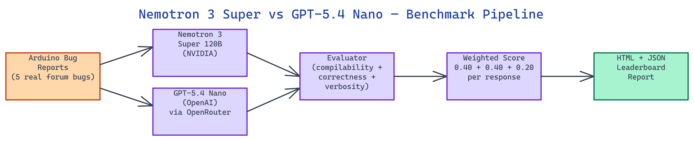

# Nemotron 3 Super vs GPT-5.4 Nano: Arduino Firmware Bug Benchmark

[](https://github.com/dakshjain-1616/nemotron3-super-vs-gpt54-nano)



## The Problem

> Most LLM benchmarks use clean, self-contained programming puzzles that don't reflect real engineering problems. Embedded firmware debugging involves register conflicts that require reading datasheets, timing failures that depend on bus capacitance, and memory corruption from string handling on 2 KB of SRAM. Developers need to know which model actually helps when debugging an I2C bus hang or a WDT misfire, not when solving a textbook algorithm exercise.

NEO built this benchmark to run [NVIDIA Nemotron 3 Super (120B)](https://huggingface.co/nvidia/NVIDIA-Nemotron-3-Super-120B-A12B-BF16) and OpenAI GPT-5.4 Nano head-to-head on five bugs sourced directly from real Arduino forum threads. The results: GPT-5.4 Nano wins all five bugs, scoring 0.860 average versus Nemotron's 0.599, primarily because GPT produces complete, compilable sketches while Nemotron outputs partial responses with TODO stubs.

## The Five Bug Categories

The benchmark draws from five embedded failure modes that appear repeatedly in Arduino forum threads.

**I2C bus hang** occurs when `Wire.endTransmission(true)` is omitted or called incorrectly, leaving SDA held low and hanging all subsequent bus transactions. A useful model response must reference the SDA release mechanism and correct endTransmission usage.

**Buffer overflow in `dtostrf()`** involves an off-by-one array indexing error that overflows into adjacent stack variables on the Uno's 2 KB SRAM. Correct responses mention SRAM constraints and the sizeof idiom for buffer sizing.

**Timer1/Timer2 register conflict** arises when the Servo library and IRremote both reconfigure the same hardware timers. The last write wins silently, breaking whichever library initialized first. A correct response must identify the specific TCCR registers and interrupt vectors in conflict.

**WDT misfire during EEPROM write** happens because `EEPROM.write()` takes more than 8 milliseconds, and the watchdog timer fires before the write completes, causing a reboot loop. The model must reference the WDT timeout and EEPROM write timing.

**`millis()` drift inside an ISR** occurs when interrupts are disabled inside an ISR, preventing the timer interrupt that increments the millis counter from firing. Calling `millis()` in that context returns stale timestamps.

## Scoring Formula

Every model response receives a score between 0.0 and 1.0 on three dimensions, combined into a weighted total:

```
total = (compilability × 0.40) + (correctness × 0.40) + (verbosity × 0.20)
```

**Compilability** (40%) uses heuristic checks: presence of code blocks tagged `cpp`, `arduino`, or `c`; `void setup()` and `void loop()` definitions; no TODO comments or placeholder stubs; at least one `#include` header. A response with a complete, runnable sketch scores near 1.0. A response with pseudocode or prose only scores near 0.0.

**Correctness** (40%) uses keyword matching per bug category. Each bug has a set of required technical terms that demonstrate the model understood the specific failure mode. For the I2C bug, the scorer looks for Wire, SDA, SCL, endTransmission, and pull-up. For the memory bug, it looks for overflow, buffer, dtostrf, SRAM, and sizeof.

**Verbosity** (20%) rewards structured, diagnostic-quality responses. The scorer checks for word count in the 100 to 500 range, numbered lists and section headings, inline code blocks, and hardware debugging vocabulary like oscilloscope, logic analyser, and probe.

## Results on Five Real Bugs

Running both models against all five seed bugs via OpenRouter's live API produced these results:

| Bug | Nemotron | GPT-5.4 Nano | Winner |
|:----|----------:|-------------:|:-------|
| I2C bus hang | 0.455 | 0.560 | GPT |
| Buffer overflow in dtostrf() | 0.800 | 0.960 | GPT |
| Timer1/Timer2 conflict | 0.520 | 0.940 | GPT |
| WDT misfire during EEPROM write | 0.720 | 0.920 | GPT |
| millis() drift inside ISR | 0.500 | 0.920 | GPT |

GPT-5.4 Nano wins on compilability (70% vs 28%) and verbosity (0.90 vs 0.45). Both models score comparably on correctness, above 99%, meaning both understand the failure modes. The deciding factor is whether the model produces a complete, runnable sketch or a partial response with gaps.

## How to Build This with NEO

Open NEO in VS Code or Cursor and describe what you want to build. A good starting prompt for this project:

> "Build a head-to-head LLM benchmark that tests [NVIDIA Nemotron 3 Super (120B)](https://huggingface.co/nvidia/NVIDIA-Nemotron-3-Super-120B-A12B-BF16) and OpenAI GPT-5.4 Nano on five real Arduino firmware bugs via OpenRouter: I2C bus hang, dtostrf buffer overflow, Timer1/Timer2 register conflict, WDT misfire during EEPROM write, and millis() drift inside an ISR. Score each response 0.0-1.0 using a weighted formula of compilability (0.40, checks for void setup/loop, no TODO stubs, at least one #include), correctness (0.40, keyword matching per bug), and verbosity (0.20, word count 100-500, numbered lists, hardware debugging vocabulary). Write results to JSON and render an HTML report with per-bug breakdowns and side-by-side response diffs."

<a href="https://heyneo.so/dashboard?section=new-chat&prompt=Build%20a%20head-to-head%20LLM%20benchmark%20that%20tests%20NVIDIA%20Nemotron%203%20Super%20%28120B%29%20and%20OpenAI%20GPT-5.4%20Nano%20on%20five%20real%20Arduino%20firmware%20bugs%20via%20OpenRouter%3A%20I2C%20bus%20hang%2C%20dtostrf%20buffer%20overflow%2C%20Timer1%2FTimer2%20register%20conflict%2C%20WDT%20misfire%20during%20EEPROM%20write%2C%20and%20millis%28%29%20drift%20inside%20an%20ISR.%20Score%20each%20response%200.0-1.0%20using%20a%20weighted%20formula%20of%20compilability%20%280.40%2C%20checks%20for%20void%20setup%2Floop%2C%20no%20TODO%20stubs%2C%20at%20least%20one%20%23include%29%2C%20correctness%20%280.40%2C%20keyword%20matching%20per%20bug%29%2C%20and%20verbosity%20%280.20%2C%20word%20count%20100-500%2C%20numbered%20lists%2C%20hardware%20debugging%20vocabulary%29.%20Write%20results%20to%20JSON%20and%20render%20an%20HTML%20report%20with%20per-bug%20breakdowns%20and%20side-by-side%20response%20diffs." style="display:inline-block;background:#1e40af;color:#ffffff;padding:10px 22px;border-radius:6px;text-decoration:none;font-weight:600;font-size:14px;">Build with NEO →</a>

NEO generates the project structure and core implementation. From there you iterate — ask it to add a mock mode that runs without an API key in seconds, add `--workers` flag support to parallelize both model calls per bug, or extend the correctness scorer with additional keyword sets for new bug categories.

To run the finished project:

```bash
git clone https://github.com/dakshjain-1616/nemotron3-super-vs-gpt54-nano
cd nemotron3-super-vs-gpt54-nano
python3 -m venv .venv && source .venv/bin/activate
pip3 install -r requirements.txt
python3 -m nemotron_bench.battle --mock --count 5
```

Open `results/battle_report.html` to see the leaderboard with per-bug score breakdowns and side-by-side response diffs without spending any API credits.

NEO built this benchmark to measure exactly where large and small LLMs differ on embedded systems debugging, producing reproducible scores across compilability, correctness, and verbosity. See what else NEO ships at [heyneo.so](https://heyneo.so/).

---

## Try NEO in Your IDE

Install the NEO extension to bring AI-powered development directly into your workflow:

- **VS Code**: [NEO in VS Code](https://marketplace.visualstudio.com/items?itemName=NeoResearchInc.heyneo)
- **Cursor**: <a href="cursor://extension/NeoResearchInc.heyneo" style="color:#0066FF;font-weight:bold;">Install NEO for Cursor →</a>

---
