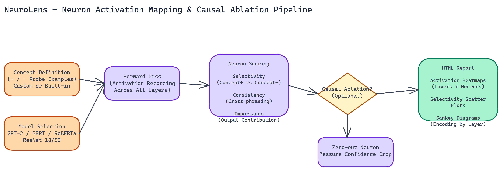

# Neuron Activation Mapper: Finding Which Neurons Encode Specific Concepts in Neural Networks

[](https://github.com/dakshjain-1616/Neuron-Activation-Mapper)



## The Problem

> Neural networks learn representations we didn't explicitly program — neurons that respond to royalty-related tokens, neurons that fire on negations, neurons that track grammatical tense. These are measurable properties, but identifying them manually is tedious enough that most teams skip it entirely. The result: we deploy models we don't fully understand, and when they fail in unexpected ways, we lack the mechanistic picture to diagnose why.

NEO built NeuroLens to automate the process of finding those neurons, validating that they actually encode the concept rather than just correlating with it, and presenting the results in a format useful for both research and engineering decisions.

## How Neuron Discovery Works

The tool runs targeted probes against a model and scores individual neurons based on three properties.

**Selectivity** measures how much more strongly a neuron responds to concept-positive examples compared to concept-negative ones. A highly selective neuron fires reliably when the concept is present and stays quiet when it isn't.

**Consistency** measures whether the neuron's response is stable across different phrasings and contexts of the same concept. A neuron that responds to "king" but not "monarch" or "sovereign" is less interesting than one that generalizes across the concept.

**Importance** measures the neuron's contribution to the model's output on concept-relevant inputs. High activation doesn't necessarily mean high importance. This score separates neurons that are active during concept processing from neurons that are actually driving it.

The combination of these three scores gives you a ranked list of candidates that are genuinely encoding the concept, not just correlating with surface features of your probe examples.

## Causal Ablation for Validation

Scoring gives you candidates. Ablation gives you confirmation. NeuroLens supports causal ablation testing: zeroing out a neuron's activation and measuring the drop in model confidence on concept-related tasks.

If ablating neuron 847 in layer 6 causes a consistent confidence drop on tasks that require tracking grammatical tense, that's evidence the neuron is causally involved in tense encoding, not just correlated with it. That distinction matters if you're trying to understand the model well enough to make targeted modifications.

Ablation is optional. It's slower than scoring alone, but for any neuron you're seriously considering as a candidate for intervention or further study, it's worth running.

## Supported Architectures

NeuroLens works with GPT-2 small and medium, BERT, RoBERTa, and ResNet 18 and 50.

The language model support covers the most commonly used transformer architectures for research and fine-tuning. The ResNet support is less obvious but valuable: vision models also develop concept-encoding neurons, and the same probing and ablation logic applies. You can find neurons in ResNet that respond selectively to specific visual features, object categories, or scene properties.

Cross-architecture comparison is a supported use case. Running the same concept probe across BERT and RoBERTa and comparing which layers and neurons score highest reveals how the two architectures organize semantic representations differently.

## Interactive HTML Reports

Results compile into HTML reports with three visualization types.

**Heatmaps** show activation patterns across layers and neurons for each concept probe. High-scoring neurons stand out immediately.

**Scatter plots** plot neurons by selectivity and consistency score, making it easy to identify candidates that score well on both dimensions, and candidates that are selective but inconsistent, or vice versa.

**Sankey diagrams** show how concept encoding is distributed across layers. These are particularly useful for understanding whether a concept is encoded early in the network, late, or spread across multiple layers. The distribution pattern has implications for where to intervene if you want to modify the model's handling of the concept.

The reports are designed to be readable by people who haven't run the analysis themselves. A researcher can share a report with a colleague and have a meaningful conversation about the findings without requiring them to re-run the tool.

## Custom Probe Support

The built-in concepts cover common cases, but the most valuable use of the tool is often for domain-specific concepts. NeuroLens supports custom probe definitions. You provide positive and negative examples for your concept, the tool handles the rest.

This is what makes the tool practically useful beyond academic cases like "royalty" and "negation." A team working on a medical language model can probe for concepts like disease severity, treatment recommendations, or anatomical specificity. A team working on a content moderation model can probe for how toxicity-related concepts are encoded across layers.

## Why Mechanistic Understanding Matters

The argument for mechanistic interpretability used to be mostly academic. That's changed. Regulatory pressure, safety requirements, and the increasing deployment of models in high-stakes contexts are creating real demand for the ability to explain and validate model behavior at the level of internal mechanisms, not just outputs.

NeuroLens doesn't solve interpretability. But it makes one important part of it, finding and validating concept-encoding neurons, fast enough to be part of a regular development workflow rather than a specialized research exercise.

NEO built this because the gap between ML engineering and ML understanding needs to close. Tools that make internal model analysis accessible are part of how that happens.

## How to Build This with NEO

Open NEO in VS Code or Cursor and describe what you want to build. A good starting prompt for this project:

> "Build a neuron activation mapper called NeuroLens that probes [GPT-2](https://huggingface.co/openai-community/gpt2), BERT, RoBERTa, and ResNet-18/50 for concept-encoding neurons. Score each neuron on three dimensions: selectivity (how much more it activates on concept-positive vs concept-negative examples), consistency (stability across different phrasings of the same concept), and importance (contribution to model output on concept-relevant inputs). Support causal ablation that zeros out candidate neurons and measures confidence drop. Generate HTML reports with activation heatmaps across layers and neurons, scatter plots of selectivity vs consistency, and Sankey diagrams showing how concept encoding distributes across layers."

<a href="https://heyneo.so/dashboard?section=new-chat&prompt=Build%20a%20neuron%20activation%20mapper%20called%20NeuroLens%20that%20probes%20GPT-2%2C%20BERT%2C%20RoBERTa%2C%20and%20ResNet-18%2F50%20for%20concept-encoding%20neurons.%20Score%20each%20neuron%20on%20three%20dimensions%3A%20selectivity%20%28how%20much%20more%20it%20activates%20on%20concept-positive%20vs%20concept-negative%20examples%29%2C%20consistency%20%28stability%20across%20different%20phrasings%20of%20the%20same%20concept%29%2C%20and%20importance%20%28contribution%20to%20model%20output%20on%20concept-relevant%20inputs%29.%20Support%20causal%20ablation%20that%20zeros%20out%20candidate%20neurons%20and%20measures%20confidence%20drop.%20Generate%20HTML%20reports%20with%20activation%20heatmaps%20across%20layers%20and%20neurons%2C%20scatter%20plots%20of%20selectivity%20vs%20consistency%2C%20and%20Sankey%20diagrams%20showing%20how%20concept%20encoding%20distributes%20across%20layers." style="display:inline-block;background:#1e40af;color:#ffffff;padding:10px 22px;border-radius:6px;text-decoration:none;font-weight:600;font-size:14px;">Build with NEO →</a>

NEO generates the project structure and core implementation. From there you iterate — ask it to add custom probe support that accepts a JSON file with positive and negative example lists, add `--top-k` filtering to run ablation only on the highest-scoring candidates, or add cross-architecture comparison output that aligns layer indices between BERT and RoBERTa results.

To run the finished project:

```bash
git clone https://github.com/dakshjain-1616/Neuron-Activation-Mapper
cd Neuron-Activation-Mapper
pip install -r requirements.txt
python neuro_lens.py --model gpt2 --concept royalty --layers 6 7 8 --ablate --top-k 10
```

Results write to `reports/` as a self-contained HTML file — open it to explore which neurons encode your concept and which layers carry the most weight.

NEO built a neuron activation mapper where selectivity scoring and causal ablation turn the question "which neurons encode this concept?" from a manual research exercise into an automated, reproducible analysis. See what else NEO ships at [heyneo.so](https://heyneo.so()).

---

## Try NEO in Your IDE

Install the NEO extension to bring AI-powered development directly into your workflow:

- **VS Code**: [NEO in VS Code](https://marketplace.visualstudio.com/items?itemName=NeoResearchInc.heyneo)
- **Cursor**: <a href="cursor://extension/NeoResearchInc.heyneo" style="color:#0066FF;font-weight:bold;">Install NEO for Cursor →</a>

---
