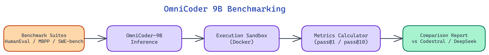

# OmniCoder-9B Benchmarking: Measuring a Mid-Size Code Model Against the Field

[](https://github.com/dakshjain-1616/OmniCoder-9B-Benchmark-)



## The Problem

> Model cards and leaderboard numbers rarely answer the question that actually matters for a team choosing a model for production: how does this model perform on our specific type of task, at the latency and cost we can afford? Published benchmarks measure performance on standardized tasks under standardized conditions. Real workloads are not standardized. A thorough benchmarking process needs to cover both standard benchmarks (for cross-model comparability) and custom task suites (for deployment-specific signal).

NEO built this benchmarking suite to give [OmniCoder-9B](https://huggingface.co/Tesslate/OmniCoder-9B) a complete evaluation — one that produces numbers you can actually use to make deployment decisions.

## Benchmark Suite Design

The evaluation framework covers four distinct benchmark categories, each measuring a different capability dimension.

### HumanEval and MBPP: Function-Level Code Synthesis

HumanEval (164 problems) and MBPP (374 problems) are the standard function-level synthesis benchmarks. Both present a natural language description and a function signature; the model must produce a correct implementation. Correctness is evaluated by executing the generated code against a hidden test suite.

The primary metric is **pass@1** — the probability that a single sample from the model is correct. For deployment scenarios where you run the model once and use the result, pass@1 is the number that matters. The framework also computes **pass@10** (probability that at least one of ten samples is correct), which is relevant for scenarios with a verifier or where multiple candidates are generated and ranked.

OmniCoder-9B scores competitively at the function level. The interesting finding from the benchmark is not the headline numbers but the error distribution: the model fails predominantly on problems requiring precise handling of edge cases in string manipulation and floating-point comparison, while performing strongly on algorithmic problems involving sorting, search, and graph traversal. This error profile differs from CodeLlama-13B, which fails more on problems requiring multi-step reasoning about data structure transformations.

### SWE-bench: Repository-Level Bug Fixing

SWE-bench is substantially harder than HumanEval. Each problem presents a real GitHub issue from a real Python repository, along with the repository context, and requires generating a patch that resolves the issue and passes the associated tests. This tests multi-file reasoning, understanding of existing code conventions, and the ability to make targeted changes without breaking unrelated functionality.

The benchmark measures **execution accuracy** — whether the generated patch passes the test suite — rather than syntactic similarity to the reference fix. A patch that solves the problem differently from the reference answer but passes the tests scores the same as the reference.

OmniCoder-9B's SWE-bench results highlight the gap between function synthesis and repository-level understanding. The model shows strong performance on issues that can be resolved by modifying a single function but struggles with issues requiring changes across multiple files or understanding of complex class hierarchies. This is consistent with the model's parameter count — the 9B scale is at the lower bound of where models begin to reliably handle multi-file context windows.

### Custom Task Suite: Domain-Specific Coding

The custom task suite consists of 200 problems drawn from three domains: data processing pipelines (pandas, Polars, SQL transformations), API integration patterns (REST client code, authentication flows, error handling), and infrastructure-as-code (Dockerfile generation, GitHub Actions YAML, Terraform snippets).

These domains were chosen because they represent real engineering work that is neither captured by algorithmic benchmarks nor by the Python library tasks in MBPP. The evaluation is hybrid — automatic execution where tests can be written, manual scoring on a rubric for tasks that require human judgment (e.g., "is this Dockerfile following security best practices?").

OmniCoder-9B performs well on data processing tasks and API integration, and shows weakness on infrastructure-as-code generation, particularly around correct Terraform syntax and GitHub Actions conditional logic. This suggests the model's training data may under-represent infrastructure tooling relative to application code.

## Hardware and Latency Measurements

Inference latency was measured on three hardware configurations: CPU-only (32-core AMD EPYC, no GPU), consumer GPU (NVIDIA RTX 4090, 24GB VRAM), and cloud GPU (A100 80GB). All measurements use 4-bit quantization on CPU and consumer GPU, and full BF16 precision on A100.

The results reveal a sharp transition. On CPU, OmniCoder-9B at 4-bit quantization generates at approximately 8-12 tokens/second — too slow for interactive use but viable for batch evaluation or offline code generation. On the RTX 4090, throughput jumps to 65-80 tokens/second, which is responsive for function-level generation. On A100, the model reaches 140+ tokens/second.

Latency comparison against the other models in the suite is revealing. GPT-4o-mini (cloud API) has lower latency for short outputs due to infrastructure optimization but higher latency for long-form generation. CodeLlama-13B at 4-bit quantization is slower than OmniCoder-9B on equivalent hardware due to the larger parameter count. Deepseek-Coder-6.7B is faster but shows consistently lower quality on the custom task suite.

## Comparative Analysis

The model comparison table across all benchmarks surfaces a clear picture. OmniCoder-9B occupies a specific niche: it outperforms Deepseek-Coder-6.7B on code quality across all benchmarks while using fewer parameters than CodeLlama-13B with competitive or better benchmark scores. Against GPT-4o-mini, it trades quality (lower pass@1 on most tasks) for cost and privacy (fully local deployment).

The practical implication is that OmniCoder-9B is the right choice for teams that need fully local deployment with good function-level synthesis quality and can tolerate weaker performance on complex repository-level tasks. Teams with strong data processing use cases in particular will find the model punches above its weight class.

## How to Build This with NEO

Open NEO in VS Code or Cursor and describe what you want to build. A good starting prompt for this project:

> "Build a benchmarking suite for OmniCoder-9B that evaluates it on HumanEval (164 problems, pass@1 and pass@10), MBPP (374 problems), SWE-bench execution accuracy on real GitHub issues, and a 200-problem custom task suite covering pandas/Polars data pipelines, REST API integration patterns, and Terraform/GitHub Actions infrastructure-as-code. Compare against GPT-4o-mini, CodeLlama-13B, and Deepseek-Coder-6.7B. Measure tokens-per-second on CPU, RTX 4090, and A100. Use 4-bit quantization by default on CPU and consumer GPU. Auto-detect available hardware and report it in the results header."

<a href="https://heyneo.so/dashboard?section=new-chat&prompt=Build%20a%20benchmarking%20suite%20for%20OmniCoder-9B%20that%20evaluates%20it%20on%20HumanEval%20%28164%20problems%2C%20pass%401%20and%20pass%4010%29%2C%20MBPP%20%28374%20problems%29%2C%20SWE-bench%20execution%20accuracy%20on%20real%20GitHub%20issues%2C%20and%20a%20200-problem%20custom%20task%20suite%20covering%20pandas%2FPolars%20data%20pipelines%2C%20REST%20API%20integration%20patterns%2C%20and%20Terraform%2FGitHub%20Actions%20infrastructure-as-code.%20Compare%20against%20GPT-4o-mini%2C%20CodeLlama-13B%2C%20and%20Deepseek-Coder-6.7B.%20Measure%20tokens-per-second%20on%20CPU%2C%20RTX%204090%2C%20and%20A100.%20Use%204-bit%20quantization%20by%20default%20on%20CPU%20and%20consumer%20GPU.%20Auto-detect%20available%20hardware%20and%20report%20it%20in%20the%20results%20header." style="display:inline-block;background:#1e40af;color:#ffffff;padding:10px 22px;border-radius:6px;text-decoration:none;font-weight:600;font-size:14px;">Build with NEO →</a>

NEO generates the project structure and core implementation. From there you iterate — ask it to add a Markdown comparison table with per-benchmark pass@1, latency, and cost columns, add human-scoring rubric output for infrastructure-as-code tasks that can't be auto-evaluated, or add `--compare` flag support to run all models in parallel with configurable worker count.

To run the finished project:

```bash
git clone https://github.com/dakshjain-1616/OmniCoder-9B-Benchmark-
cd OmniCoder-9B-Benchmark-
pip install -r requirements.txt
python run_benchmark.py --benchmark humaneval --model omnicoder-9b
```

Results write to `results/` as JSON and Markdown — the comparison table shows exactly where OmniCoder-9B wins, ties, or trails each competitor across every benchmark category.

NEO built this benchmarking suite to produce actionable numbers, not just leaderboard entries — so deployment decisions can be made on evidence. See what else NEO ships at [heyneo.so](https://heyneo.so/).

---

## Try NEO in Your IDE

Install the NEO extension to bring AI-powered development directly into your workflow:

- **VS Code**: [NEO in VS Code](https://marketplace.visualstudio.com/items?itemName=NeoResearchInc.heyneo)
- **Cursor**: <a href="cursor://extension/NeoResearchInc.heyneo" style="color:#0066FF;font-weight:bold;">Install NEO for Cursor →</a>

---
