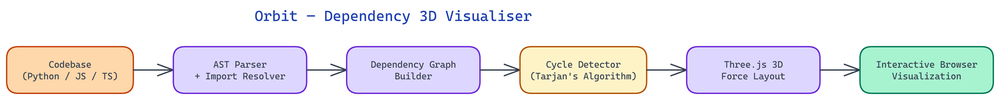

# Orbit: Explore Your Codebase's Dependency Graph in 3D

[](https://github.com/dakshjain-1616/Orbit-dependency-visualised)



## The Problem

> Dependency graphs in large codebases are too complex to reason about as flat text. A module list tells you what exists. A flat 2D graph tells you what connects to what. Neither tells you the shape of the system: which modules are central load-bearing nodes, which are isolated islands, and which clusters have formed that should have stayed separate. At scale, these architectural problems are invisible until they cause outages or make refactoring nearly impossible.

NEO built Orbit to make dependency structure visible and explorable — not as a static diagram, but as an interactive 3D environment.

## The Analysis Layer: Parsing Import Graphs

Orbit starts with static analysis of the codebase. For Python, it uses the `ast` module to parse every `.py` file and extract import statements — both `import x` and `from x import y` forms. It resolves relative imports using the package structure, so `from ..utils import helpers` is correctly attributed to the right module rather than treated as an unresolved reference.

For JavaScript and TypeScript, Orbit uses the TypeScript compiler API to parse `import` and `require` statements, resolving path aliases from `tsconfig.json` and `jsconfig.json`. This handles the common pattern of projects that alias `@/components` to `src/components` — Orbit resolves these correctly rather than showing them as external dependencies.

The output of the analysis layer is a directed graph: nodes are modules, edges are import relationships. Edge direction matters — A importing B means B is a dependency of A, not the reverse. Both forms are tracked and stored so visualization can show either direction.

The graph is serialized to JSON and cached with a hash of the source files. Subsequent runs that have not changed files skip re-analysis entirely, making Orbit fast enough to run on file-save in watch mode.

## The 3D Rendering Layer: Three.js Force-Directed Graph

The visualization is built on Three.js using a force-directed graph layout algorithm. Force-directed layout is the right choice for dependency graphs because it produces a visual arrangement that reflects the underlying structure: tightly coupled clusters pull together, loosely connected modules drift apart, and the overall shape of the system becomes apparent.

Each node is rendered as a sphere. Node size scales with in-degree — modules that many other modules import appear larger. This makes central shared utilities immediately visible. Node color encodes module type: application code, test files, configuration, and external dependencies each get a distinct color.

Edges are rendered as directional lines with arrowheads indicating dependency direction. Edge color encodes relationship type: regular imports appear in a neutral gray, circular dependencies are highlighted in red, and cross-layer dependencies (a UI component importing a database layer directly, for example) appear in orange when architectural rules are configured.

The camera can orbit (hence the name), zoom, and pan using mouse controls. Clicking a node highlights it and its immediate neighbors — all other nodes fade to reduce visual noise. This "focus mode" makes it possible to trace the dependency chain of a specific module without losing spatial context.

## Detecting Architectural Problems

Orbit's analysis layer runs several structural checks beyond basic graph construction.

**Circular dependency detection** uses Tarjan's strongly connected components algorithm. Any set of modules that form a cycle is flagged and highlighted in red in the visualization. The sidebar shows the cycle as an ordered list of modules so it can be resolved. Circular dependencies are a common source of import errors, difficult-to-test code, and subtle initialization order bugs.

**Orphaned module detection** identifies modules that are not imported by any other module in the project. These are candidates for deletion or may indicate dead code that accumulated over time.

**High fan-in analysis** identifies modules with unusually high in-degree (many modules depend on them). These are architectural chokepoints — changing them requires coordinating updates across many parts of the codebase. Orbit highlights these and provides a list of all dependents, making the blast radius of a change immediately quantifiable.

**Layer violation detection** is configurable via a `.orbit.json` config file. If the project has defined architectural layers (e.g., `ui`, `service`, `repository`, `model`), Orbit can enforce that dependencies only flow in the permitted directions and highlight violations.

## Practical Use Cases

The most common use case for Orbit is architectural review before a major refactor. When a team needs to extract a module into a separate package, Orbit shows exactly which modules will need to change their imports — not as a surprise during the extraction, but as a planned list beforehand.

Onboarding is another high-value use case. A new developer can load Orbit on a codebase they have never seen and, within minutes, understand where the core business logic lives, which utilities are shared across the project, and which areas of the code are most interconnected. This understanding typically takes days to build from reading code alone.

During code review, Orbit in watch mode can show whether a PR is adding new circular dependencies or creating unexpected cross-layer couplings before the code merges.

## Performance at Scale

Orbit handles large codebases through progressive rendering. Projects with thousands of modules render a coarser-grained view initially — showing packages or directories as nodes rather than individual files — with the ability to expand a cluster into its constituent modules on demand. This keeps the visualization navigable even when the underlying graph has 10,000+ nodes.

## How to Build This

Clone the repo and install dependencies:

```bash
git clone https://github.com/dakshjain-1616/Orbit-dependency-visualised
cd Orbit-dependency-visualised
pip install -r requirements.txt
```

Python 3.9 or later is required. For JavaScript and TypeScript projects, Node.js must also be installed so Orbit can access the TypeScript compiler API.

Point Orbit at a codebase to analyze:

```bash
python orbit.py --path /path/to/your/project --language python
```

For JavaScript or TypeScript:

```bash
python orbit.py --path /path/to/your/project --language typescript
```

The analysis runs, builds the dependency graph, caches it, and opens the 3D visualization in your default browser. The graph uses a force-directed layout where tightly coupled modules cluster together. Node size reflects in-degree: shared utilities appear as large spheres. Click any node to highlight it and its immediate neighbors.

The sidebar lists detected circular dependencies, orphaned modules, and high fan-in candidates. For projects with defined architectural layers, add a `.orbit.json` config file to enable layer violation detection:

```json
{"layers": {"ui": ["src/components"], "service": ["src/services"], "repository": ["src/db"]}, "allowed_direction": "down"}
```

Run in watch mode to update the graph as files change:

```bash
python orbit.py --path /path/to/your/project --watch
```

For very large projects, Orbit starts in package-level view and lets you expand individual clusters on demand.

NEO built Orbit to make the invisible architecture of a codebase something you can see, explore, and reason about spatially. See what else NEO ships at [heyneo.so](https://heyneo.so/).

---

## Try NEO in Your IDE

Install the NEO extension to bring AI-powered development directly into your workflow:

- **VS Code**: [NEO in VS Code](https://marketplace.visualstudio.com/items?itemName=NeoResearchInc.heyneo)
- **Cursor**: <a href="cursor://extension/NeoResearchInc.heyneo" style="color:#0066FF;font-weight:bold;">Install NEO for Cursor →</a>

---
