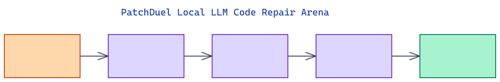

# PatchDuel: A Local LLM Code Repair Arena with SQLite Leaderboards

[](https://github.com/dakshjain-1616/patchduel-local-llm-code-repair)



## The Problem

> Choosing between two local models for a code repair task usually means running each one manually, reading the outputs, and making a judgment call. There is no systematic way to accumulate evidence about which model performs better across many bugs over time.

NEO built PatchDuel to make this comparison rigorous. Two models run simultaneously on the same buggy snippet, each gets a quality score, and every result is stored in SQLite. Over time you build a real leaderboard, not a one-off impression.

## The Arena Model

PatchDuel runs as a Gradio web app at `http://localhost:7860`. The interface has three tabs: arena, leaderboard, and history.

In the **arena tab**, you pick two models (called Model A and Model B), select a built-in bug scenario or paste your own code, and click Run. Both models generate fixes simultaneously. The result is a split-screen view with a git-style diff for each model, showing exactly which lines changed. Below each diff you see timing in seconds, estimated token count, and the quality score.

The **leaderboard tab** shows wins, losses, and ties per model sorted by win count. The **history tab** shows every past duel with full reproducibility data: both patches, both diffs, the winner, and any judge notes.

This structure means each duel contributes to a running evidence base. After 50 duels, the leaderboard reflects real performance data rather than vibes.

## Quality Scoring

Each patch receives a **quality score** from 0 to 100 based on how much of the file changed relative to an expected fix.

An exact match with the expected fix scores 100. A surgical fix that changes less than 5% of the file scores 90. A moderate fix at 5 to 15% scores 80. A large rewrite at 15 to 40% scores 65. A full rewrite above 40% scores 40. A model that returns the code unchanged scores 0.

A +15 bonus applies if the patch closely approximates the expected fix (within 10 characters), capped at 100. The heuristic winner is the model with the higher score. When both patches are identical, a tie is declared.

```python
from patchduel_local_llm_ import compute_quality_score, heuristic_winner

buggy    = "def add(a, b):\n    return a - b  # Bug"
expected = "def add(a, b):\n    return a + b"

patch_a = repair_code("llama3.2", buggy)
patch_b = repair_code("mistral",  buggy)

score_a = compute_quality_score(buggy, patch_a, expected)
score_b = compute_quality_score(buggy, patch_b, expected)
winner  = heuristic_winner(buggy, patch_a, patch_b, expected)
```

The scoring function is deterministic and has no LLM calls. You can run it offline to re-score historical patches if you change the expected fix.

## Eight Built-In Bug Scenarios

The tool ships eight hand-crafted Python bugs tagged by difficulty. These cover the most common categories of code repair tasks.

Easy scenarios include an arithmetic operator bug (`-` instead of `+`) and a wrong guard return. Medium scenarios cover off-by-one loop errors (`range(len+1)`), missing None checks, wrong logical operators (`and` vs `or`), string vs integer comparison, and wrong string method (`.strip()` called on a list). The hard scenario is a mutable default argument, the classic Python gotcha where a list or dict default is shared across all calls.

You can paste any custom code directly in the UI. The expected fix is optional for custom inputs. Without it, the quality score uses file change percentage only, without the exact-match bonus.

## Three Providers

**Ollama** is the primary local provider. Pull any model and point PatchDuel at it. No API cost, fully private, no data leaves the machine.

**OpenRouter** gives access to cloud models including GPT-4o, Claude, and Mistral via a single API key. You can duel a local Ollama model against a cloud model to benchmark the capability gap at a given task.

**Mock** runs with no setup. It produces deterministic patches and is the recommended provider for first-run testing and CI.

```bash
# Set up Ollama
ollama pull llama3.2
ollama pull mistral

# Set up OpenRouter (optional)
echo "OPENROUTER_API_KEY=sk-or-..." > .env

python app.py
# Open http://localhost:7860
```

## SQLite Persistence

Every duel is stored in `patchduel.db` with 18 columns: timestamp, model names, buggy code, both patches, rendered HTML diffs, winner, judge notes, latency per model, token counts, providers, and scenario ID. The schema stores everything needed to reproduce any past duel exactly.

```python
from patchduel_local_llm_ import export_runs_csv, get_leaderboard

# Export all runs to CSV
csv_data = export_runs_csv()
with open("runs.csv", "w") as f:
    f.write(csv_data)

# Print leaderboard
for row in get_leaderboard():
    print(row["model"], row["wins"], row["win_rate"])
```

## How to Build This

Clone and install:

```bash
git clone https://github.com/dakshjain-1616/patchduel-local-llm-code-repair
cd patchduel-local-llm-code-repair
pip install -r requirements.txt
```

Run in mock mode with no setup:

```bash
python app.py
```

Open `http://localhost:7860`, select Mock as the provider for both models, choose a scenario, and click Run. For Ollama:

```bash
ollama pull llama3.2
ollama pull mistral
python app.py
```

Select Ollama as the provider, pick the two models, and run the arena. For programmatic access without the UI:

```python
from patchduel_local_llm_ import repair_code, save_run

buggy = "def multiply(a, b):\n    return a + b  # Bug"
patch_a = repair_code("llama3.2", buggy)
patch_b = repair_code("mistral",  buggy)
save_run("llama3.2", "mistral", buggy, patch_a, patch_b)
```

Run the test suite:

```bash
pytest tests/ -q
# 142 passed
```

NEO built a local LLM code repair arena with split-screen diffs, quality scoring, and SQLite-backed leaderboards that accumulate evidence across duels over time. See what else NEO ships at [heyneo.so](https://heyneo.so/).

---

## Try NEO in Your IDE

Install the NEO extension to bring AI-powered development directly into your workflow:

- **VS Code**: [NEO in VS Code](https://marketplace.visualstudio.com/items?itemName=NeoResearchInc.heyneo)
- **Cursor**: <a href="cursor://extension/NeoResearchInc.heyneo" style="color:#0066FF;font-weight:bold;">Install NEO for Cursor →</a>

---
