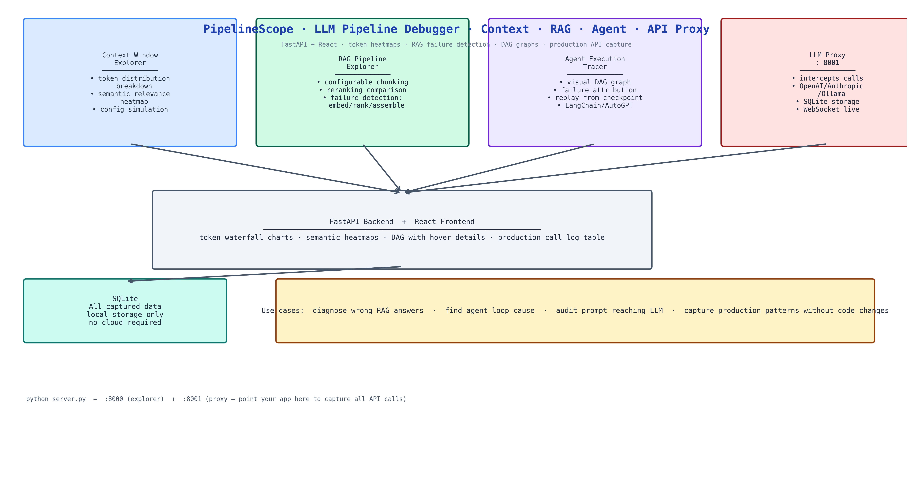

# PipelineScope: Interactive Debugger for LLM Context, RAG, and Agent Pipelines

[](https://github.com/dakshjain-1616/PipelineScope)



## The Problem

> An LLM pipeline is slow, producing wrong answers, or failing silently. You don't know where. Is the context window filled with irrelevant chunks? Is the RAG reranker dropping the passage that would answer the question? Is the agent looping on step 7? Is the LLM receiving a malformed prompt because of a middleware transformation somewhere? Debugging LLM pipelines requires observability at multiple layers simultaneously, and most tools give you one layer at a time.

NEO built PipelineScope to give you all four layers — context, retrieval, execution, and API calls — in a single interactive tool, with visual representations that make the failure obvious without log-diving.

## Four Exploration Modes

### Context Window Explorer

Upload your assembled context or paste it directly. PipelineScope visualizes:
- **Token distribution** — which sections consume which share of the budget, as a visual breakdown
- **Semantic relevance heatmap** — each chunk scored against the query, with low-relevance chunks highlighted
- **Configuration simulation** — compare how different chunking strategies or context compositions would affect the response

The heatmap tells you immediately whether the context contains the right information for the query. If the relevant passages are in the bottom 20% of the relevance ranking, you know to fix your retrieval, not your generation.

### RAG Pipeline Explorer

Index a document set with configurable chunking (size, overlap, strategy). PipelineScope runs the full retrieval pipeline — embedding, search, reranking — and shows:
- **Retrieval quality** — which chunks were retrieved, ranked by relevance
- **Failure point detection** — embedding failures, ranking inversions, assembly issues
- **Reranking comparison** — how the order changed between initial retrieval and reranking

When your RAG system gives a wrong answer, PipelineScope shows you whether the right passage was retrieved (ranking failure), retrieved but ranked low (reranking failure), or not present in the index (indexing failure).

### Agent Execution Explorer

Parse and visualize agent execution traces from LangChain, AutoGPT, CrewAI, and other frameworks. PipelineScope builds:
- **Visual execution DAG** — step dependencies as a directed graph
- **Failure attribution** — which specific step caused a downstream failure
- **Replay mode** — modify a trace and re-run from any checkpoint to test fixes

The DAG view makes it immediately obvious when an agent is looping, when a parallel branch failed and cascaded, or when a tool call returned bad data that propagated through the rest of the run.

### LLM Proxy

Enable the proxy and point your application's OpenAI, Anthropic, or Ollama calls at `http://localhost:8001`. PipelineScope intercepts every API call:
- Records the full request and response in SQLite
- Streams intercepted calls to the real API transparently
- Shows latency, token counts, and error rates per endpoint in real time via WebSocket

This captures production patterns without modifying application code. You see exactly what your application is sending and receiving.

## FastAPI + React Stack

The backend is FastAPI with WebSocket support for real-time proxy updates. The frontend is React with interactive visualizations: token waterfall charts, semantic relevance heatmaps, DAG graphs with hover details, and a production call log table with filtering and export.

SQLite stores all captured data locally. No cloud required, no external observability service.

## How to Build This with NEO

Open NEO in VS Code or Cursor and describe what you want to build. A good starting prompt for this project:

> "Build a full-stack LLM pipeline debugging tool with FastAPI backend and React frontend. Implement four exploration modes: (1) context window explorer with token distribution breakdown and semantic relevance heatmap; (2) RAG pipeline explorer with configurable chunking, retrieval quality display, and failure point detection for embedding/ranking/assembly issues; (3) agent execution explorer that parses LangChain/AutoGPT traces, builds visual DAG graphs, attributes failures to specific steps, and supports replay from any checkpoint; (4) LLM proxy that intercepts calls to OpenAI/Anthropic/Ollama, stores them in SQLite, and streams analytics via WebSocket. All data stored locally."

<a href="https://heyneo.com/dashboard?section=new-chat&prompt=Build%20a%20full-stack%20LLM%20pipeline%20debugging%20tool%20with%20FastAPI%20and%20React.%20Four%20modes%3A%20context%20window%20explorer%20with%20token%20breakdown%20and%20semantic%20heatmap%3B%20RAG%20pipeline%20explorer%20with%20failure%20point%20detection%3B%20agent%20execution%20tracer%20with%20visual%20DAG%20and%20replay%3B%20LLM%20proxy%20that%20captures%20API%20calls%20to%20SQLite%20with%20real-time%20WebSocket%20analytics.%20All%20local." style="display:inline-block;background:#1e40af;color:#ffffff;padding:10px 22px;border-radius:6px;text-decoration:none;font-weight:600;font-size:14px;">Build with NEO →</a>

NEO scaffolds the FastAPI backend, the four explorer components, the React DAG visualization, the semantic relevance scorer, the proxy interceptor, the WebSocket streaming, and the SQLite store. From there you iterate — add a diff view that compares two agent runs side by side, add alert rules that notify you when proxy latency or error rate exceeds a threshold, or extend the agent trace parser to support additional frameworks.

To run the finished project:

```bash
git clone https://github.com/dakshjain-1616/PipelineScope
cd PipelineScope
pip install -r requirements.txt
cd frontend && npm install && npm run build && cd ..

python server.py
```

Open `http://localhost:8000` — all four exploration modes are available. Enable the proxy at `http://localhost:8001` and point your LLM application at it.

NEO built an interactive LLM pipeline debugger covering context windows, RAG failure detection, agent execution tracing, and API call capture — four observability layers in one local tool that requires no cloud service. See what else NEO ships at [heyneo.com](https://heyneo.com/).

---

## Try NEO in Your IDE

Install the NEO extension to bring AI-powered development directly into your workflow:

- **VS Code**: [NEO in VS Code](https://marketplace.visualstudio.com/items?itemName=NeoResearchInc.heyneo)
- **Cursor**: <a href="cursor://extension/NeoResearchInc.heyneo" style="color:#0066FF;font-weight:bold;">Install NEO for Cursor →</a>

---
