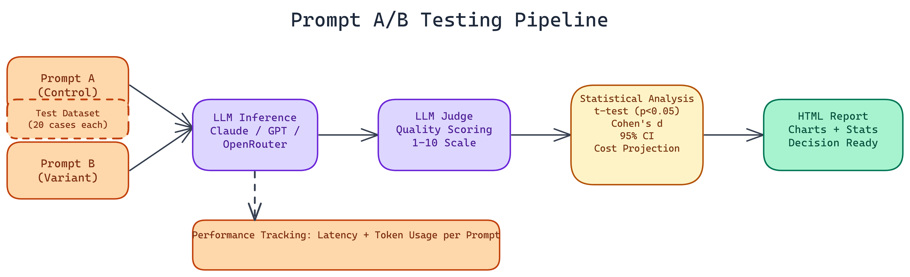

# Prompt A/B Testing: Measuring What Your System Prompt Actually Does

[](https://github.com/Dakshjain1604/Prompt-AB-testing-Tool)



## The Problem

> Prompt engineering often works like this: someone writes a system prompt, tests it on a handful of examples, decides it looks good, and ships it. Then the next person who touches it rewrites it based on intuition. Nobody actually knows whether the new version is better or worse. Running 20 queries manually and comparing outputs is slow, subjective, and statistically meaningless at small sample sizes — teams regularly ship prompt changes that perform better on the 20 examples they tested and worse on the actual production input distribution.

NEO built a tool to fix that. It runs proper statistical A/B tests on prompts, scores response quality using an LLM judge, tracks latency and token costs, and produces a full report you can actually make decisions from.

## How the Testing Pipeline Works

You provide two prompts. Each contains an `{input}` placeholder where the test case text gets inserted. You pick a dataset, and the system runs both prompts across every test case, collecting responses from your chosen provider.

Built-in datasets cover **customer support queries**, **coding tasks**, and **creative writing**, 20 test cases each. These cover three meaningfully different task types where prompt sensitivity tends to show up differently. You can also supply your own dataset for domain-specific evaluation.

### Quality Scoring

Response quality gets scored on a 1 to 10 scale by an LLM judge. This is not a simple heuristic. The judge evaluates responses against a consistent rubric, which means the scoring is more reliable than human annotation at scale while still capturing the semantic quality that raw metrics like token count miss.

Effect sizes and confidence intervals come standard. A percentage improvement number alone does not tell you whether the difference is meaningful. Cohen's d gives you the standardized effect size, which lets you compare across experiments and understand practical significance.

### Statistical Tests

The framework uses independent t-tests with a **0.05 significance threshold** and calculates **95% confidence intervals** around the difference between variants. If the p-value is above 0.05, the tool tells you there is not enough evidence to conclude the prompts differ in quality, and you should keep what you have rather than chasing noise.

### Performance and Cost Tracking

Beyond quality, the tool tracks response latency and token usage per prompt. It then calculates cost projections at scale. If Prompt A uses 15% more tokens on average, that adds up across millions of requests. Sometimes the better-quality prompt is also the more expensive one and you need to decide whether the quality delta justifies the cost.

The cost projection feature makes that decision concrete rather than estimated.

## Running It

The tool runs from the command line in two modes: interactive, where it walks you through configuration, or argument-based for scripting and automation. It supports Anthropic Claude, OpenAI, and OpenRouter, so you are not locked to a single provider.

The output is a self-contained HTML report with visualizations. You get charts comparing quality distributions across both prompts, the statistical test results, effect sizes, and cost projections all in one document you can share with a team.

## Practical Applications

The most direct use is comparing a current production prompt against a proposed revision before deploying the change. You run the test, check the confidence intervals, verify the improvement is statistically significant, and ship with confidence.

It is also useful for prompt debugging. If users are reporting inconsistent quality, running an A/B test across variations of your current prompt can surface whether a specific phrasing element is responsible for poor outputs on certain input types.

Cross-provider evaluation is another application. Same prompt, two different models. The framework handles this cleanly and gives you apples-to-apples quality and cost comparisons.

## The Broader Point

Prompt engineering is a real engineering discipline. It has testable hypotheses, measurable outcomes, and statistical methods that are directly applicable. The tools have just not been there to support it properly.

This is what systematic prompt evaluation looks like.

---

## How to Build This

Clone the repo and install dependencies:

```bash
git clone https://github.com/Dakshjain1604/Prompt-AB-testing-Tool
cd Prompt-AB-testing-Tool
pip install -r requirements.txt
```

Set your API key for the provider you want to test against. The tool supports Anthropic, OpenAI, and OpenRouter:

```bash
OPENAI_API_KEY=sk-...
# or
ANTHROPIC_API_KEY=sk-ant-...
# or
OPENROUTER_API_KEY=sk-or-...
```

Create two prompt files. Each prompt uses `{input}` as a placeholder for the test case text:

```
# prompt_a.txt
You are a helpful customer support agent. Answer the following question concisely: {input}

# prompt_b.txt
You are a senior customer support specialist. Think step by step before answering: {input}
```

Run the A/B test interactively:

```bash
python ab_test.py --prompt-a prompt_a.txt --prompt-b prompt_b.txt --dataset customer_support --provider openai --model gpt-4o-mini
```

The tool runs both prompts against all 20 test cases in the selected dataset, scores responses using an LLM judge, computes the t-test and Cohen's d, and writes a self-contained HTML report to `reports/`. The report includes quality score distributions, the statistical test result with p-value and confidence intervals, latency comparisons, and cost projections at scale. If the p-value is above 0.05, the report flags the result as statistically inconclusive.

NEO built a prompt A/B testing tool where t-tests, Cohen's d effect sizes, and LLM quality scoring replace intuition-driven prompt decisions with statistically grounded evidence. See what else NEO ships at [heyneo.so](https://heyneo.so/).

---

## Try NEO in Your IDE

Install the NEO extension to bring AI-powered development directly into your workflow:

- **VS Code**: [NEO in VS Code](https://marketplace.visualstudio.com/items?itemName=NeoResearchInc.heyneo)
- **Cursor**: <a href="cursor://extension/NeoResearchInc.heyneo" style="color:#0066FF;font-weight:bold;">Install NEO for Cursor →</a>

---
