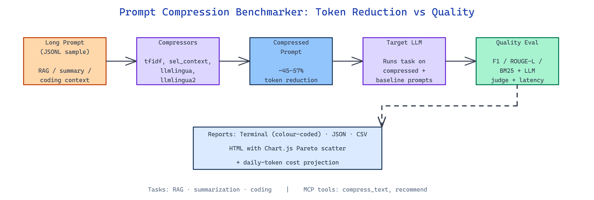

# Prompt Compression Benchmarker: Measure Token Reduction vs Quality Loss Across Five Algorithms

[](https://github.com/dakshjain-1616/Prompt-Compression-Benchmarker)



## The Problem

> Prompt compression libraries all promise 50%+ token reduction with "minimal" quality loss — but "minimal" is measured on their benchmarks, not your RAG context, your summarization prompts, or your code. Picking the wrong compressor can silently cost accuracy while the token savings look great on the invoice.

NEO built Prompt Compression Benchmarker (`pcb`) to run every major compression technique against realistic RAG, summarization, and coding workloads and report token reduction, proxy quality, latency, and optional LLM-as-judge scores side by side.

## Five Compressors Across Three Task Types

**Prompt Compression Benchmarker** ships implementations of five compressors under `src/pcb/compressors/` and evaluates each against three task modules under `src/pcb/tasks/`.

| Compressor | Mechanism | Best For |
|---|---|---|
| `tfidf` | Sentence-level TF-IDF scoring | General documents, factual passages |
| `selective_context` | Greedy token-budget selection from document start | Ordered narratives where prefix matters |
| `llmlingua` | Sentence-level coarse pruning | Narratives and transcripts |
| `llmlingua2` | Word-level stopword and low-content token removal | Code and RAG contexts |
| `no_compression` | Passthrough baseline | Quality reference |

The bundled datasets under `/data` include `rag_samples.jsonl` (20 real factual passages, 400–450 tokens), `summarization_samples.jsonl` (10 news-style articles), and `coding_samples.jsonl` (10 Python code contexts, 370–800 tokens), so the numbers you see are from real prompts, not synthetic filler.

## Metrics That Actually Matter

Every run reports five numbers per (compressor, task) cell:

- **Token Reduction %** — fraction of input tokens removed
- **Proxy Score** — task-specific automated metric (F1 for RAG, ROUGE-L for summarization, BM25 for coding)
- **Proxy Drop %** — quality change relative to the uncompressed baseline
- **LLM Score** — optional 0–1 judgment from a real model through OpenRouter
- **Latency (ms)** — wall time to compress

The terminal reporter under `src/pcb/reporters/` colours each row by quality loss severity — cyan for improvements, green below 5%, yellow 5–15%, red above 15% — so Pareto-dominant compressors jump off the screen. The HTML reporter renders Chart.js scatter plots with Pareto highlights so you can share the results without anyone installing Python.

```bash
# Full benchmark with daily-traffic cost projection
pcb run --daily-tokens 3000000 --cost-model claude-sonnet-4-6

# Compress a single file with stats
pcb compress context.txt --compressor llmlingua2 --rate 0.45 --stats

# Add LLM-as-judge scoring on a sample
pcb run --llm-judge --judge-model claude-sonnet-4-6 --max-samples 10

# Point at your own JSONL dataset
pcb run --data-dir ./my_data --task rag --max-samples 50
```

## Trade-off Numbers From a Real Run

On the shipped RAG benchmark the numbers tell a clear story — more aggressive compression bleeds quality faster than token savings justify, and the right choice depends on what your downstream LLM is actually doing.

| Compressor | Token Reduction | Proxy Drop |
|---|---:|---:|
| `selective_context` | 56.9% | 34.4% |
| `llmlingua2` | 45.0% | 27.3% |

`selective_context` is cheaper per token but drops quality harder; `llmlingua2` holds up better at a smaller reduction. The whole point of benchmarking is that this verdict flips by task — `llmlingua2` dominates on coding, `tfidf` competes on factual passages, and `selective_context` can win on narrative summarization where prefix bias is accurate.

Outputs land in three formats under `src/pcb/reporters/`: JSON with per-sample detail, CSV with one row per (compressor, task) pair for spreadsheets and pandas, and the HTML interactive report with scatter plots. An MCP server (`src/pcb/mcp_server.py`) exposes `compress_text`, `estimate_savings`, `list_compressors`, and `recommend` tools so Claude or any MCP client can compress prompts inline before shipping them to an expensive model.

## How to Build This with NEO

Open NEO in VS Code or Cursor and describe what you want to build. A good starting prompt for this project:

> "Build a Python CLI called pcb using Typer that benchmarks five prompt compression techniques (TF-IDF, selective context, LLMLingua, LLMLingua2, no-compression baseline) across RAG, summarization, and coding tasks loaded from JSONL. Report token reduction %, proxy score (F1/ROUGE-L/BM25), proxy drop %, latency, and an optional LLM-as-judge score through OpenRouter. Render results to terminal with colour-coded quality loss, JSON, CSV, and an interactive HTML report with Chart.js scatter plots and Pareto highlights. Include daily-token cost projection against configurable model rate cards and an MCP server exposing compress_text, estimate_savings, list_compressors, and recommend tools."

<a href="https://heyneo.com/dashboard?section=new-chat&prompt=Build%20a%20Python%20CLI%20called%20pcb%20using%20Typer%20that%20benchmarks%20five%20prompt%20compression%20techniques%20%28TF-IDF%2C%20selective%20context%2C%20LLMLingua%2C%20LLMLingua2%2C%20no-compression%20baseline%29%20across%20RAG%2C%20summarization%2C%20and%20coding%20tasks%20loaded%20from%20JSONL.%20Report%20token%20reduction%20%25%2C%20proxy%20score%20%28F1%2FROUGE-L%2FBM25%29%2C%20proxy%20drop%20%25%2C%20latency%2C%20and%20an%20optional%20LLM-as-judge%20score%20through%20OpenRouter.%20Render%20results%20to%20terminal%20with%20colour-coded%20quality%20loss%2C%20JSON%2C%20CSV%2C%20and%20an%20interactive%20HTML%20report%20with%20Chart.js%20scatter%20plots%20and%20Pareto%20highlights.%20Include%20daily-token%20cost%20projection%20against%20configurable%20model%20rate%20cards%20and%20an%20MCP%20server%20exposing%20compress_text%2C%20estimate_savings%2C%20list_compressors%2C%20and%20recommend%20tools." style="display:inline-block;background:#1e40af;color:#ffffff;padding:10px 22px;border-radius:6px;text-decoration:none;font-weight:600;font-size:14px;">Build with NEO →</a>

NEO generates the project structure and compressor plugins. From there you iterate — add a new compressor (e.g. sentence-embedding clustering), swap in a different judge model, plug a custom task module for your production prompts, or extend the cost projection to a multi-tier rate card so the recommendation reflects cache hits versus cold calls. Each request builds on what's already there.

To run the finished project:

```bash
git clone https://github.com/dakshjain-1616/Prompt-Compression-Benchmarker
cd Prompt-Compression-Benchmarker
pip install -r requirements.txt
pcb run --daily-tokens 3000000 --cost-model claude-sonnet-4-6
```

The terminal prints the decision matrix with colour-coded quality loss, `results.html` opens the interactive Pareto scatter, and the MCP server is ready to wire into any MCP-compatible client for inline compression.

NEO built a benchmarking harness that makes "which compressor should we use" a measured answer on your own data, not a vendor claim. See what else NEO ships at [heyneo.com](https://heyneo.com/).

---

## Try NEO in Your IDE

Install the NEO extension to bring AI-powered development directly into your workflow:

- **VS Code**: [NEO in VS Code](https://marketplace.visualstudio.com/items?itemName=NeoResearchInc.heyneo)
- **Cursor**: <a href="cursor://extension/NeoResearchInc.heyneo" style="color:#0066FF;font-weight:bold;">Install NEO for Cursor →</a>

---
