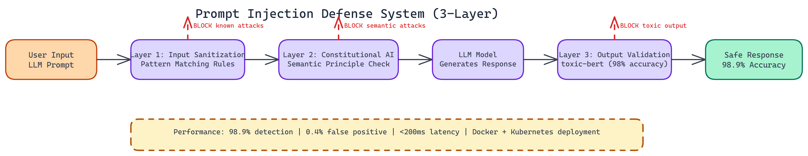

# How NEO Built a Prompt Injection Defense System with 98.9% Detection Accuracy

## The Problem

> Prompt injection attacks are not theoretical. Attackers craft inputs designed to override a model's system instructions, switch its operating persona, or extract sensitive information it was trained to protect. The standard approach — bolt on a basic content filter and call it done — fails against novel attack variants, because pattern matching alone can't keep up with the attack surface. For agentic systems that take real-world actions, a successful injection isn't just an annoyance: it's a direct security vulnerability.

NEO took a different approach: a proper, layered defense system that treats prompt injection as a first-class threat, tested against over **1,000 adversarial scenarios**. The result: **98.9% overall detection accuracy**, a **0.4% false positive rate**, and **sub-200ms latency**.

## Three Layers of Defense

NEO designed the system around three independent defensive layers, each catching a different class of attack.

### Layer 1: Input Sanitization

The first layer runs pattern recognition across the raw input before it ever reaches the model. NEO built a rule set targeting known injection signatures: phrases that attempt to override instructions, attempts to access system prompts, and common jailbreak templates. This layer is fast. It adds almost no latency because it runs before any model inference.

Known attack patterns are caught here. Novel patterns pass through to the next layer.

### Layer 2: Constitutional AI Evaluation

The second layer evaluates inputs against a set of ethical principles, inspired by the Constitutional AI framework. Rather than looking for specific attack strings, this layer asks a higher-level question: does this input attempt to make the model violate its operating principles?

This catches adversarial inputs that are syntactically novel but semantically dangerous. Role-switching prompts that use indirect language. Attacks embedded in creative writing framing. Social engineering attempts.

### Layer 3: ML-Powered Output Validation

The third layer evaluates model outputs using `toxic-bert`, a fine-tuned BERT model for toxicity classification. Even if a malicious input slips through the first two layers, this layer checks whether the output itself contains harmful content before it reaches the user. NEO scored 98% accuracy on toxicity classification using this model alone.

This is the backstop. Outputs are scored, and anything above the toxicity threshold is blocked and logged.

## Performance in Production

NEO tested the full pipeline across 1,000+ adversarial scenarios, covering every major attack category in current research.

- **Instruction override attacks: 100% detection rate**
- **Role-switching attacks: 100% detection rate**
- **Overall detection accuracy: 98.9%**
- **False positive rate: 0.4%**
- End-to-end latency: under **200ms** with GPU acceleration

That false positive rate matters as much as the detection rate. A defense system that blocks 30% of legitimate traffic is not deployable. At 0.4%, this system is production-viable.

## Deployment

NEO ships this with Docker configuration built for security hardening. The container runs as a non-root user, mounts the filesystem read-only, and enforces resource limits. Kubernetes deployment specs are included for teams running at enterprise scale.

Setup requires Python 3.12+ and a free HuggingFace account to pull the toxicity model. The automated setup scripts handle environment configuration on both macOS/Linux and Windows.

## Where This Gets Used

The obvious use case is protecting any customer-facing LLM application. Chatbots, copilots, document Q&A systems. Anywhere user input touches a language model is a potential attack surface.

Beyond that, this is critical infrastructure for agentic systems. When an LLM agent can take real actions in the world, prompt injection is not just an annoyance. It is a direct security vulnerability. A well-crafted injection could redirect an agent's actions entirely.

Medical platforms, legal document tools, financial advisory systems. Any domain where a compromised model output carries real-world consequences needs a defense like this.

## What is Next

The current system is extensible. NEO is working on adding semantic similarity analysis to catch paraphrased attacks that share meaning but not surface form, and custom detection rules for domain-specific attack patterns.

Integrations with REST APIs and monitoring dashboards are on the roadmap so security teams can observe attack patterns over time, not just block them in the moment.

---

NEO built a prompt injection defense system where three independent layers—input sanitization, constitutional AI evaluation, and ML-powered output validation—achieve 98.9% detection accuracy at a 0.4% false positive rate, making it deployable in production without blocking legitimate traffic. See what else NEO ships at [heyneo.so](https://heyneo.so/).

---

## Try NEO in Your IDE

Install the NEO extension to bring AI-powered development directly into your workflow:

- **VS Code**: [NEO in VS Code](https://marketplace.visualstudio.com/items?itemName=NeoResearchInc.heyneo)
- **Cursor**: [**Install NEO for Cursor →**](cursor:extension/NeoResearchInc.heyneo)

---
