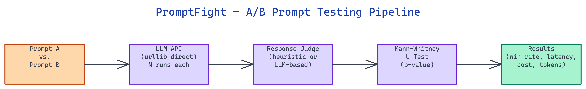

# PromptFight: Statistical A/B Testing for LLM Prompts

[](https://github.com/dakshjain-1616/promptfight)



## The Problem

> Choosing between two prompt formulations usually comes down to intuition or a handful of manual tests. That process produces no statistical confidence and misses latency and cost differences that matter in production. Running a proper A/B test requires either a framework with significant overhead or custom evaluation infrastructure that takes time to build.

NEO built PromptFight to run prompt comparisons with statistical rigor and no framework overhead. It calls OpenAI and Anthropic APIs directly through Python's `urllib` module, tracks win rates using the Mann-Whitney U test, and reports latency, cost, and token counts per run.

## No SDK Overhead

PromptFight's core design decision is to avoid importing openai, anthropic, or any other large SDK at runtime. All API calls go through Python's standard library `urllib.request`, with JSON payloads and response parsing handled manually.

This keeps the install size small and makes the HTTP layer visible and auditable. The request format for each provider is a thin wrapper in the codebase. If a provider changes their API schema, the fix is a one-line change to a dictionary, not a version bump of a transitive dependency.

The only optional dependencies are `scipy` and `numpy`, used for the Mann-Whitney U test. If those are absent, PromptFight skips statistical significance reporting and returns raw win counts.

## Running a Fight

The `fight()` function is the primary entry point. It takes two prompt templates with an `{input}` placeholder, a list of models to test against, and a number of runs.

```python
from promptfight import fight

results = fight(
    prompt_a="Summarize: {input}",
    prompt_b="TL;DR: {input}",
    user_input="Your text here",
    models=["mock"],
    runs=5
)
```

Each run sends both prompts to the specified model and scores the responses using the configured judge. Scores are collected across all runs and passed to the Mann-Whitney U test to determine whether the difference in win rates is statistically significant at the p < 0.05 level.

The `mock` model runs offline with no API key and returns synthetic responses in milliseconds. It is the right starting point when verifying prompt logic before spending on live API calls.

## Multi-Model Testing and Judging

**Multi-model support** runs both prompts against every model in the list and reports separate results per model. This is useful when the same prompt pair behaves differently across providers. A prompt optimized for GPT-5.4 Nano may perform worse than the baseline on Claude 3.5 Sonnet, where longer context and different tokenization change the output distribution.

The **judge** is the component that scores each response. PromptFight supports two judge modes. The heuristic judge scores responses based on configurable criteria: length, keyword presence, structural elements like lists and headers, and absence of refusals. The LLM judge sends each response to a separate model evaluation call, asking the judge model to rate response quality on a fixed rubric. The LLM judge produces more nuanced scores but costs more and adds latency.

For most prompt iteration workflows, the heuristic judge is accurate enough to distinguish meaningful prompt differences across 10 to 20 runs.

## Output Formats

PromptFight reports results in three formats.

The **table** format prints a formatted comparison to stdout: win rates, average score per prompt, average latency, total token count, and estimated cost per run. This is the default output for interactive use.

The **JSON** format writes a structured object with the full run-by-run breakdown. Each entry includes the prompt used, model response, score, latency in milliseconds, token count, and cost in USD. JSON output is the right choice for downstream analysis or logging to a metrics system.

The **CSV** format produces a flat table compatible with spreadsheet tools and Pandas. Column names are stable across versions, making it safe to use as input to a recurring comparison pipeline.

## How to Build This with NEO

Open NEO in VS Code or Cursor and describe what you want to build. A good starting prompt for this project:

> "Build a lightweight Python prompt A/B testing tool called PromptFight that calls OpenAI and Anthropic APIs using only Python's standard library urllib.request with no SDK imports. Accept two prompt templates with {input} placeholders, a list of models, and a run count. Score responses with a configurable heuristic judge (length, keyword presence, structural elements, absence of refusals) or an LLM judge. Run the Mann-Whitney U test using scipy to determine statistical significance at p < 0.05. Support multi-model testing that runs both prompts against every model in the list. Output results as a formatted table (default), JSON with full per-run breakdown, or CSV for downstream analysis. Include a mock model that runs offline in milliseconds."

<a href="https://heyneo.com/dashboard?section=new-chat&prompt=Build%20a%20lightweight%20Python%20prompt%20A%2FB%20testing%20tool%20called%20PromptFight%20that%20calls%20OpenAI%20and%20Anthropic%20APIs%20using%20only%20Python%27s%20standard%20library%20urllib.request%20with%20no%20SDK%20imports.%20Accept%20two%20prompt%20templates%20with%20%7Binput%7D%20placeholders%2C%20a%20list%20of%20models%2C%20and%20a%20run%20count.%20Score%20responses%20with%20a%20configurable%20heuristic%20judge%20%28length%2C%20keyword%20presence%2C%20structural%20elements%2C%20absence%20of%20refusals%29%20or%20an%20LLM%20judge.%20Run%20the%20Mann-Whitney%20U%20test%20using%20scipy%20to%20determine%20statistical%20significance%20at%20p%20%3C%200.05.%20Support%20multi-model%20testing%20that%20runs%20both%20prompts%20against%20every%20model%20in%20the%20list.%20Output%20results%20as%20a%20formatted%20table%20%28default%29%2C%20JSON%20with%20full%20per-run%20breakdown%2C%20or%20CSV%20for%20downstream%20analysis.%20Include%20a%20mock%20model%20that%20runs%20offline%20in%20milliseconds." style="display:inline-block;background:#1e40af;color:#ffffff;padding:10px 22px;border-radius:6px;text-decoration:none;font-weight:600;font-size:14px;">Build with NEO →</a>

NEO generates the project structure and core implementation. From there you iterate — ask it to add token count and per-run cost tracking in USD for each provider, add graceful degradation that returns raw win counts when scipy is not installed, or add per-model result separation in JSON output so multi-model runs stay organized.

To run the finished project:

```bash
git clone https://github.com/dakshjain-1616/promptfight
cd promptfight
pip install -r requirements.txt
python -m promptfight --prompt-a "Summarize: {input}" --prompt-b "TL;DR: {input}" --input "Your text here" --model mock --runs 5
```

Swap `mock` for `gpt-4o-mini` and set `OPENAI_API_KEY` when you are ready to run against a real model and get a p-value with your win rates.

NEO built PromptFight to make rigorous prompt comparison as fast as running a single test, using direct API calls and statistical validation without framework overhead. See what else NEO ships at [heyneo.com](https://heyneo.com/).

---

## Try NEO in Your IDE

Install the NEO extension to bring AI-powered development directly into your workflow:

- **VS Code**: [NEO in VS Code](https://marketplace.visualstudio.com/items?itemName=NeoResearchInc.heyneo)
- **Cursor**: <a href="cursor://extension/NeoResearchInc.heyneo" style="color:#0066FF;font-weight:bold;">Install NEO for Cursor →</a>

---
