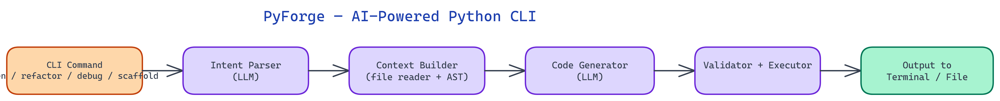

# PyForge: Generate, Refactor, and Debug Python from the Terminal with Natural Language

[](https://github.com/dakshjain-1616/PyForge-AI-powered-Python-CLI)



## The Problem

> Python developers spend a disproportionate amount of time on mechanical tasks: writing boilerplate for a new CLI tool, refactoring a function to use a newer API, or tracing a stack trace back to its root cause. These tasks require Python knowledge but not creative thought. Switching to a browser or chat interface to ask an AI breaks the terminal flow that most developers work hardest to stay in.

NEO built PyForge to keep AI-assisted coding inside the terminal, where the code actually runs.

## Core Command Modes

PyForge exposes four primary command modes, each optimized for a different stage of the development workflow.

### `pyforge gen` — One-Shot Code Generation

The `gen` command takes a natural language description and produces runnable Python. The output is not pseudocode or a skeleton — it is executable code with imports, error handling, and sensible defaults. PyForge makes opinionated choices about style (type hints, f-strings, dataclasses over raw dicts) and documents them in inline comments so the developer understands what was generated and can override it.

The generated code is written directly to a file if a path is specified, or piped to stdout for integration with other shell tools. This means `pyforge gen "parse CSV and compute per-column statistics" | pbcopy` works exactly as expected.

For longer generation tasks, PyForge uses streaming output so the terminal shows progress as the code is produced rather than hanging until completion.

### `pyforge refactor` — Targeted Code Transformation

The `refactor` command takes an existing Python file and a natural language instruction. Instructions can be specific ("replace all `print` statements with `logging.info` calls") or high-level ("modernize this to use pathlib instead of os.path"). The command produces a diff preview before writing changes, requiring explicit confirmation by default.

Under the hood, PyForge parses the target file into an AST before passing it to the model. This gives the model structural context — it knows which functions exist, what they call, and what the imports are — without requiring the full source text to be in the context window for large files. The AST summary is passed alongside the relevant source sections identified by the instruction.

### `pyforge debug` — Stack Trace Analysis

The `debug` command accepts a Python stack trace (from stdin or a file) and a description of what the code was supposed to do. It identifies the root cause, explains what went wrong, and produces a specific fix. For common error patterns — `KeyError` on dict access, `AttributeError` on None, off-by-one in slice operations — it also identifies whether the fix should be defensive (add a check) or corrective (fix the underlying logic).

PyForge does not guess. If the stack trace is ambiguous without seeing the source code, it asks for the relevant file before producing a diagnosis. This interactive mode is intentional — a confident wrong answer is worse than a clarifying question.

### `pyforge scaffold` — Project Structure Generation

The `scaffold` command generates a complete project structure from a high-level description. "A FastAPI service with PostgreSQL, JWT auth, and a pytest test suite" produces a directory tree with `pyproject.toml`, a Dockerfile, environment variable templates, a database migration setup, and test fixtures. The scaffold follows community conventions — it does not invent its own project layout.

## Iterative Refinement

The most underrated feature is iterative refinement. After any `gen` or `refactor` operation, PyForge stores the result in a session buffer. Follow-up commands like `pyforge refine "add input validation"` or `pyforge refine "make it async"` apply to the buffered result without re-reading the file. This creates a conversational loop inside the terminal where each command builds on the last.

Session state is stored in a lightweight SQLite database in the user's home directory. Sessions are named automatically by timestamp and the first few words of the initial generation prompt, making it easy to resume a previous session with `pyforge resume`.

## Integration with the Shell

PyForge is designed to compose with standard shell tools. Generated code can be piped to `black` for formatting, `mypy` for type checking, or `pytest` for immediate test execution. Exit codes follow Unix conventions — zero for success, non-zero for any error — so PyForge steps can be embedded in shell scripts and CI pipelines without special handling.

The tool also reads from `.pyforge.toml` in the project root for project-specific configuration: preferred style, common imports, module naming conventions. This means the generated code fits the existing codebase rather than starting from PyForge's own defaults.

## Performance and Local vs. Cloud Models

PyForge supports both cloud API backends (OpenAI, Anthropic) and local models via Ollama. For one-shot scripts and small refactors, local models with quantization are fast enough to feel responsive. For complex scaffolding or multi-file refactors, cloud models produce substantially better results. The backend is configurable per command type, so a developer can route simple generations to a local model and complex tasks to a cloud API, balancing speed and capability.

## How to Build This with NEO

Open NEO in VS Code or Cursor and describe what you want to build. A good starting prompt for this project:

> "Build a Python CLI tool called PyForge with four commands: 'gen' that takes a natural language description and produces executable Python with type hints, f-strings, and error handling written to stdout or a file with streaming output; 'refactor' that parses the target file into an AST for structural context, applies a natural language instruction, and shows a diff preview before writing; 'debug' that accepts a stack trace from stdin or a file, identifies the root cause, and produces a specific fix or asks a clarifying question if the trace is ambiguous; and 'scaffold' that generates a complete project directory following community conventions. Store session state in SQLite for follow-up refinement with 'pyforge refine'. Support OpenAI, Anthropic, and Ollama backends."

<a href="https://heyneo.so/dashboard?section=new-chat&prompt=Build%20a%20Python%20CLI%20tool%20called%20PyForge%20with%20four%20commands%3A%20%27gen%27%20that%20takes%20a%20natural%20language%20description%20and%20produces%20executable%20Python%20with%20type%20hints%2C%20f-strings%2C%20and%20error%20handling%20written%20to%20stdout%20or%20a%20file%20with%20streaming%20output%3B%20%27refactor%27%20that%20parses%20the%20target%20file%20into%20an%20AST%20for%20structural%20context%2C%20applies%20a%20natural%20language%20instruction%2C%20and%20shows%20a%20diff%20preview%20before%20writing%3B%20%27debug%27%20that%20accepts%20a%20stack%20trace%20from%20stdin%20or%20a%20file%2C%20identifies%20the%20root%20cause%2C%20and%20produces%20a%20specific%20fix%20or%20asks%20a%20clarifying%20question%20if%20the%20trace%20is%20ambiguous%3B%20and%20%27scaffold%27%20that%20generates%20a%20complete%20project%20directory%20following%20community%20conventions.%20Store%20session%20state%20in%20SQLite%20for%20follow-up%20refinement%20with%20%27pyforge%20refine%27.%20Support%20OpenAI%2C%20Anthropic%2C%20and%20Ollama%20backends." style="display:inline-block;background:#1e40af;color:#ffffff;padding:10px 22px;border-radius:6px;text-decoration:none;font-weight:600;font-size:14px;">Build with NEO →</a>

NEO generates the project structure and core implementation. From there you iterate — ask it to add a `.pyforge.toml` project config that sets preferred style and common imports so generated code fits the existing codebase, add per-command backend routing so simple generations go to a local Ollama model while complex scaffolds go to a cloud API, or add Unix-standard exit codes so PyForge steps compose cleanly in shell scripts and CI pipelines.

To run the finished project:

```bash
git clone https://github.com/dakshjain-1616/PyForge-AI-powered-Python-CLI
cd PyForge-AI-powered-Python-CLI
pip install -e .
pyforge gen "read a CSV file, compute per-column statistics, and write a summary to stdout"
```

Generated code streams to stdout immediately — pipe it to `black`, `mypy`, or a file without any extra steps.

NEO built PyForge to eliminate the context switch between writing code and asking for help with it. See what else NEO ships at [heyneo.so](https://heyneo.so()).

---

## Try NEO in Your IDE

Install the NEO extension to bring AI-powered development directly into your workflow:

- **VS Code**: [NEO in VS Code](https://marketplace.visualstudio.com/items?itemName=NeoResearchInc.heyneo)
- **Cursor**: <a href="cursor://extension/NeoResearchInc.heyneo" style="color:#0066FF;font-weight:bold;">Install NEO for Cursor →</a>

---
