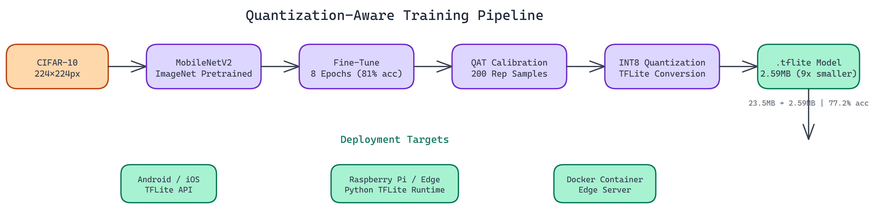

# 9x Model Compression with Quantization-Aware Training for Edge Deployment

[](https://github.com/dakshjain-1616/Quantisation-Awareness-training)



## The Problem

> Deploying neural networks to edge devices is a genuine engineering challenge. The model that works great on your training server is often too large and too slow for a mobile device or a Raspberry Pi. Naive post-training quantization can cause accuracy drops of 10-20% on some models, leaving teams stuck between a model that's too big to deploy and one that's too degraded to use.

NEO applied quantization-aware training (QAT) to solve this — simulating quantization during training so the model learns to be robust to precision reduction before it's actually applied. The result: a **23.5MB** model compressed down to **2.6MB** — a **9.08x reduction** — with only a **3.8% accuracy drop**.

## Why Quantization Works

Neural networks are typically trained with 32-bit floating point weights (4 bytes per parameter). Research has consistently shown that you can represent weights with much lower precision, 8-bit integers instead of 32-bit floats, without losing much predictive capability.

INT8 quantization cuts the memory footprint by roughly 4x on weights alone. It also enables faster inference on hardware with optimized INT8 compute paths, which includes most modern mobile chips and microcontrollers. Reduced memory bandwidth requirements matter significantly on constrained devices.

## The Implementation

### Data and Model Setup

The pipeline uses CIFAR-10 resized to 224x224 pixels to match MobileNetV2's expected input dimensions. MobileNetV2 is initialized with ImageNet pretrained weights, giving the model a strong starting point before fine-tuning on CIFAR-10.

Fine-tuning runs for 8 epochs. This is enough to adapt the pretrained weights to the new dataset while preserving the general visual features learned from ImageNet.

### Calibration

Quantization-aware training requires a calibration dataset: a representative sample of input data used to determine the optimal scaling factors for mapping floating-point values to the INT8 range. The pipeline uses **200 representative samples** for calibration.

The calibration step is critical. The scaling factors it produces determine how well the quantized model approximates the full-precision model's behavior. Too few calibration samples and the scaling is poorly estimated. Too many and you're spending compute on diminishing returns. 200 samples is a reliable default for most vision tasks.

### INT8 Quantization with TFLite

The pipeline converts the calibrated model to TensorFlow Lite format with full INT8 quantization. "Full INT8" means both weights and activations are quantized, as opposed to weight-only quantization which leaves activations in floating point.

The output is a `.tflite` file at 2.59MB.

### A Practical Note on Tooling

During development, NEO initially tried TensorFlow's native quantization toolkit for the conversion step and hit API compatibility issues with the specific TF version in use. NEO pivoted to post-training quantization instead, which proved more stable and produced comparable results. This kind of tooling friction is common in the quantization space, where APIs are still evolving. The lesson is to have a fallback approach ready and to test the output model thoroughly regardless of which conversion path you use.

## Results

| Metric | Original | Quantized |
|:-------|----------:|----------:|
| Model size | 23.52 MB | 2.59 MB |
| Compression ratio | 1x | 9.08x |
| Test accuracy | 81.0% | 77.2% |
| Accuracy drop | - | 3.8% |
| Format | .h5 | .tflite |

A 3.8% accuracy drop is acceptable for most edge applications. If your baseline accuracy is 81% and your quantized model hits 77.2%, you're still within the performance range needed for practical classification tasks.

The total training and quantization process takes **15-40 minutes** depending on hardware.

## Deployment Targets

The `.tflite` model deploys to three main targets:

**Android and iOS** via the native TensorFlow Lite APIs. Mobile apps can bundle the model file and run inference on-device without network connectivity. This matters for latency and privacy.

**Raspberry Pi and edge devices** via the Python TFLite runtime. The compressed model loads fast and runs inference efficiently on ARM processors.

**Docker containers** for edge server deployments where you want containerization but still need CPU-optimized inference.

## When to Use QAT vs. Post-Training Quantization

Post-training quantization (PTQ) is faster to apply and works well when the base model has a large capacity relative to the task. QAT takes longer because it requires a training pass, but it typically recovers more accuracy for smaller models where PTQ degrades performance significantly.

For MobileNetV2, which is already a compact architecture, QAT is worth the extra training time. For very large models like ResNet-50 or larger, PTQ often works well enough and saves significant compute.

## Where This Fits in a Production ML Pipeline

Quantization is usually one of the last steps before deployment, but it should be planned for early. The model architecture, training data, and fine-tuning regime all affect how well quantization works. Building quantization into your training pipeline from the start, rather than treating it as an afterthought, leads to better results.

This pipeline integrates naturally into CI/CD workflows: train, quantize, evaluate, and if accuracy meets your threshold, deploy. If it doesn't, adjust the calibration or fine-tuning and repeat.

## Watch It in Action

NEO recorded a full walkthrough of the quantization pipeline, showing the training run, conversion step, and the final model size comparison live.

[](https://youtu.be/Z9W2gTu-Ekc)

---

## How to Build This with NEO

Open NEO in VS Code or Cursor and describe what you want to build. A good starting prompt for this project:

> "Build a quantization-aware training pipeline in Python using TensorFlow 2.x that fine-tunes MobileNetV2 (pretrained on ImageNet) on CIFAR-10 resized to 224x224 for 8 epochs, then applies post-training INT8 quantization with a calibration dataset of 200 representative samples using TFLite, exporting both a full-precision model.h5 at ~23.5MB and a quantized model_quantized.tflite at ~2.6MB. Include evaluate.py that prints test accuracy for both models side by side, and infer.py that runs single-image inference on the TFLite model. The .tflite output should be deployable to Android, iOS via TFLite native APIs, and Raspberry Pi via the Python TFLite runtime."

<a href="https://heyneo.so/dashboard?section=new-chat&prompt=Build%20a%20quantization-aware%20training%20pipeline%20in%20Python%20using%20TensorFlow%202.x%20that%20fine-tunes%20MobileNetV2%20%28pretrained%20on%20ImageNet%29%20on%20CIFAR-10%20resized%20to%20224x224%20for%208%20epochs%2C%20then%20applies%20post-training%20INT8%20quantization%20with%20a%20calibration%20dataset%20of%20200%20representative%20samples%20using%20TFLite%2C%20exporting%20both%20a%20full-precision%20model.h5%20at%20~23.5MB%20and%20a%20quantized%20model_quantized.tflite%20at%20~2.6MB.%20Include%20evaluate.py%20that%20prints%20test%20accuracy%20for%20both%20models%20side%20by%20side%2C%20and%20infer.py%20that%20runs%20single-image%20inference%20on%20the%20TFLite%20model.%20The%20.tflite%20output%20should%20be%20deployable%20to%20Android%2C%20iOS%20via%20TFLite%20native%20APIs%2C%20and%20Raspberry%20Pi%20via%20the%20Python%20TFLite%20runtime." style="display:inline-block;background:#1e40af;color:#ffffff;padding:10px 22px;border-radius:6px;text-decoration:none;font-weight:600;font-size:14px;">Build with NEO →</a>

NEO generates the project structure and core implementation. From there you iterate — ask it to add a results table that prints model size, compression ratio, and accuracy side by side after each run, add GPU detection so the pipeline reports estimated wall-clock time before starting, or add Docker configuration for containerized edge server deployment.

To run the finished project:

```bash
git clone https://github.com/dakshjain-1616/Quantisation-Awareness-training
cd Quantisation-Awareness-training
pip install -r requirements.txt
python train_and_quantize.py
python evaluate.py --model model.h5 && python evaluate.py --model model_quantized.tflite
```

The evaluate script prints accuracy for both models so the 3.8% gap is visible directly. The `.tflite` file is ready to deploy to Android, iOS, or Raspberry Pi.

NEO built a quantization-aware training pipeline where MobileNetV2 is compressed 9x for edge deployment—from 23.5MB to 2.6MB—with only a 3.8% accuracy drop, ready to run on Android, iOS, and Raspberry Pi. See what else NEO ships at [heyneo.so](https://heyneo.so()).

---

## Try NEO in Your IDE

Install the NEO extension to bring AI-powered development directly into your workflow:

- **VS Code**: [NEO in VS Code](https://marketplace.visualstudio.com/items?itemName=NeoResearchInc.heyneo)
- **Cursor**: <a href="cursor://extension/NeoResearchInc.heyneo" style="color:#0066FF;font-weight:bold;">Install NEO for Cursor →</a>

---
