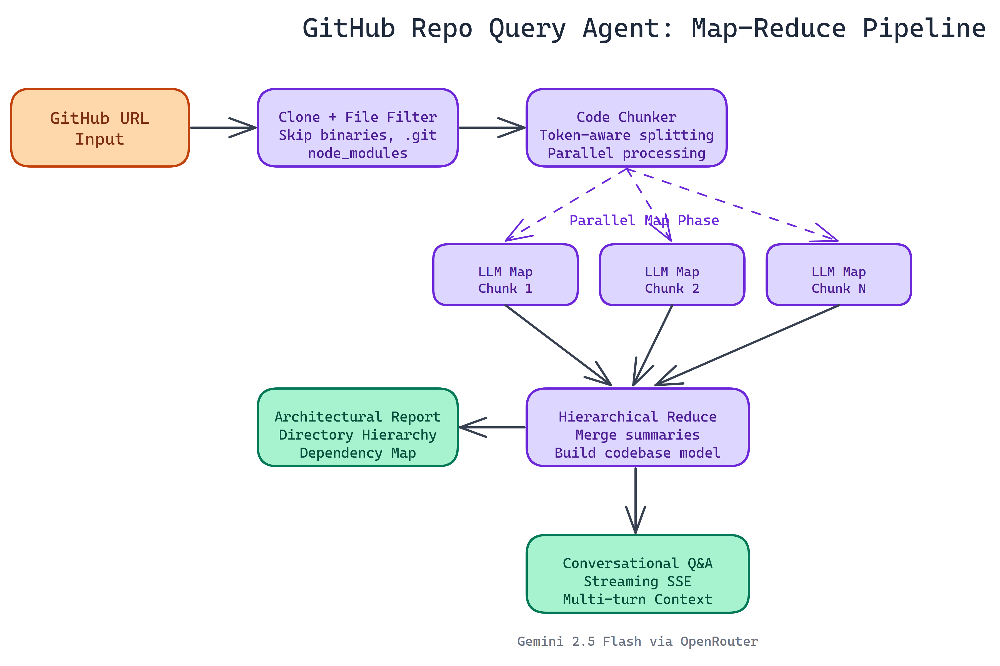

# Query Any GitHub Repo with a Conversational AI Agent

## The Problem

> Reading a codebase you've never seen before is slow work. You clone the repo, start scanning files, try to figure out what connects to what, and spend the first hour just building a mental model before you can answer a single real question. For engineers onboarding to new projects, reviewing unfamiliar libraries, or conducting technical due diligence, this is a significant time sink with no good tooling solution.

NEO autonomously built an agent that does this for you. Point it at any public GitHub repository, and within minutes you can ask questions in plain language and get real answers.

## What It Actually Does

The agent runs end-to-end. You give it a GitHub URL. It clones the repository, walks the file tree, filters out noise (binaries, `.git` directories, `node_modules`), and processes the actual source code. Then it builds a structured understanding of the codebase.

Before you've typed your first question, it generates a comprehensive architectural report: directory hierarchy, key components, dependency relationships, and data flow patterns. That report becomes the foundation for everything that follows.

Then you interact with it. Ask about how authentication works, what a specific module does, how data moves through the system, what dependencies the project pulls in. The agent answers conversationally, with streaming output so you see results as they arrive rather than waiting for a full response.

Multi-turn conversations work too. You can drill into a topic across several exchanges without losing context.

## The Map-Reduce Pipeline

Large codebases don't fit in a single LLM context window. A 200,000-line monorepo can't be handed to the model as a single input. We needed a way to analyze code at scale without losing information.

The solution is a map-reduce pipeline. The codebase gets chunked into manageable pieces. Each chunk is processed in parallel, producing a summary. Those summaries are hierarchically merged, with later reduction stages combining intermediate results until a single coherent analysis emerges.

This approach has real advantages. Parallel processing keeps analysis time reasonable even on large repos. The hierarchical reduction preserves relationships between components that would be lost in a naive "summarize each file separately" approach. The pipeline handles token limits gracefully at every stage, so it doesn't fail silently when a repository is larger than expected.

## Technical Stack

The backend is Python and Flask. Server-Sent Events handle the streaming so you see analysis and answers in real-time without polling. The LLM is configurable through environment variables, defaulting to `google/gemini-2.5-flash-lite` via OpenRouter. Swapping models is a config change, not a code change.

The frontend is a terminal-styled interface. It looks and feels like a developer tool, not a consumer app. That's intentional. The users for this are engineers, and the interface reflects that.

## Practical Use Cases

**Onboarding to unfamiliar projects.** Instead of reading a codebase for hours, ask the agent to explain the architecture, main entry points, data layer design, and patterns. Get oriented in minutes.

**Code review context.** Before reviewing a pull request, query the agent to understand the module being changed. Understand side effects and dependencies before reading a diff.

**Due diligence on open source dependencies.** Wondering if a library does what it claims? Point the agent at it. Ask about its security practices, its test coverage, its actual implementation of the feature you care about.

**Technical interviews and assessments.** Ask candidates about a repo during a live session. See how they reason about code they've never read.

**Documentation generation.** Use the architectural report as a starting point for writing docs on your own projects.

## Setup

The stack requirements are minimal. Clone the repository, install Python dependencies, add an OpenRouter API key to a `.env` file, and start the Flask server. The web UI is available locally and analysis starts the moment you enter a GitHub URL.

The only hard requirement on the repo side is that it's public. Private repo support would require token-based authentication, which is a natural extension.

## Why This Matters

Codebases are one of the richest knowledge sources in software engineering, and until recently there was no good way to query them conversationally. You either read them manually or ran static analysis tools that produce structured output but can't answer freeform questions.

A conversational agent changes the interaction model entirely. The question "how does the authentication flow work in this repo" produces a different kind of answer than a linter or a class diagram. It produces understanding.

This is where developer tooling is going. Less grep, more Q&A.

## Build Your Own Code Intelligence Tools

NEO built a conversational GitHub repo agent where a map-reduce pipeline distills any public codebase into an architectural understanding you can query in plain language, replacing hours of manual code reading. See what else NEO ships at [heyneo.so](https://heyneo.so/).

---

## Try NEO in Your IDE

Install the NEO extension to bring AI-powered development directly into your workflow:

- **VS Code**: [NEO in VS Code](https://marketplace.visualstudio.com/items?itemName=NeoResearchInc.heyneo)
- **Cursor**: [**Install NEO for Cursor →**](cursor:extension/NeoResearchInc.heyneo)
