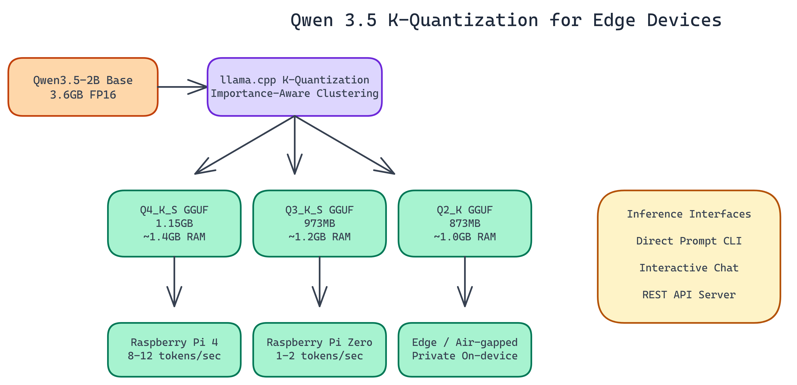

# Running Qwen 3.5 on a Raspberry Pi: Extreme Quantization for Edge Devices

[](https://github.com/dakshjain-1616/Qwen-3.5-Quantisation-for-small-devices-)



## The Problem

> The original Qwen3.5-2B model weighs in at **3.6GB**. A Raspberry Pi 4 has 4GB of RAM total, and you need most of that just to run the operating system. Most quantization approaches reduce weights uniformly and accept large quality losses at aggressive compression levels — leaving engineers without a viable path to run capable language models on hardware that costs under $100.

NEO worked through the quantization process for Qwen3.5-2B using K-quantization from llama.cpp, which takes an importance-aware approach: weights with more influence on model output are compressed less aggressively. The result: three GGUF variants down to 873MB, all running on sub-$100 hardware.

## What K-Quantization Actually Does

Most quantization approaches reduce every weight uniformly. K-quantization from llama.cpp takes a different approach: importance-aware weight clustering. Weights that have more influence on model output are quantized less aggressively. Weights that matter less get compressed harder.

The result is that you lose less quality per bit than uniform quantization. At Q4 precision you're typically losing 4-8% of full-precision performance on reasoning tasks. At Q2 you lose more, but for many edge applications the degradation is acceptable.

The "K" variants (K_S, K_M) use different block sizes and mixing strategies. K_S prioritizes smaller file size at some quality cost. K_M balances the two. For this project NEO focused on K_S variants at Q4 and Q3, plus Q2_K for the most constrained deployments.

## The Three Model Variants

**Q4_K_S (1.15 GB, ~1.4 GB RAM required)**

The quality-first option. This is the right choice when you have a Raspberry Pi 4 or similar hardware with at least 2GB of usable RAM. It delivers the closest output quality to the original model and is the recommended default for most edge applications.

**Q3_K_S (973 MB, ~1.2 GB RAM required)**

The middle ground. Roughly 15% smaller than Q4_K_S with a modest quality tradeoff. If you're running other processes alongside inference and need to keep memory usage down, this is a reasonable choice.

**Q2_K (873 MB, ~1.0 GB RAM required)**

Maximum compression. This variant will run on hardware that the others won't, including Raspberry Pi Zero W. Quality degrades noticeably at Q2, so this is best for use cases where size matters more than response quality: classification tasks, intent detection, simple extraction.

All three represent **68-76% size reductions** from the 3.6GB baseline.

## Measured Performance

Performance on Raspberry Pi hardware is what you'd expect from CPU inference: usable, but not fast.

On Raspberry Pi Zero (single-core ARM11): **1-2 tokens per second**. Slow for conversational use, but workable for batch processing where latency isn't critical.

On Raspberry Pi 4 (quad-core Cortex-A72): **8-12 tokens per second**. This is genuinely interactive. At 10 tokens per second, a 100-token response completes in ten seconds. Not instant, but acceptable for many embedded applications.

Context window is technically 32K tokens, but in practice NEO recommends 2K contexts on edge hardware. Larger contexts require more memory for the KV cache, and the Pi 4 doesn't have headroom to spare.

## Deployment Options

The repository includes three interfaces for running inference:

**Direct prompt mode.** Pass a prompt string via CLI and get a completion. Good for scripting and batch processing.

**Interactive chat mode.** Multi-turn conversation from the terminal. Manages conversation history automatically.

**REST API server.** Exposes inference through HTTP endpoints. This is the interface to use when you want to integrate the model into a larger application or access it from another device on the network.

All three run on the same GGUF models through llama.cpp.

## Use Cases That Make Sense at the Edge

Running inference on-device has real advantages beyond cost. The data never leaves the hardware. There's no network dependency. Latency is predictable and doesn't spike based on API load.

These properties make edge LLM deployment attractive for specific scenarios:

**Air-gapped environments.** Industrial control systems, medical devices, field equipment. Anywhere that network connectivity is unreliable, expensive, or prohibited by security policy.

**Privacy-sensitive applications.** Processing personal data without sending it to a cloud endpoint satisfies many compliance requirements.

**High-volume, low-complexity tasks.** If you're classifying text, extracting structured fields from documents, or running simple question-answering against local data, a quantized small model on-device can be more cost-effective than API calls at scale.

**Embedded product features.** Offline voice commands, local search, on-device assistance in consumer products where adding a cloud dependency is undesirable.

## What to Expect in Practice

Set your expectations correctly going in. Q4_K_S Qwen3.5-2B is a capable small model, not a GPT-4 replacement. It handles straightforward reasoning, summarization, and extraction well. It struggles with multi-step problems that require maintaining complex state across many reasoning steps.

For edge use cases, that's usually fine. Most embedded applications don't need the full capability of frontier models. They need reliable, fast, private inference for bounded tasks. That's exactly what these quantized variants deliver.

## How to Build This

Download the GGUF models from HuggingFace. Install the HuggingFace CLI first:

```bash
pip install huggingface_hub
```

Then pull whichever variant fits your hardware:

```bash
# Q4_K_S — recommended for Raspberry Pi 4 (requires ~1.4 GB RAM)
huggingface-cli download dakshjain-1616/Qwen-3.5-Quantisation-for-small-devices- \
  --include "qwen3.5-2b-q4_k_s.gguf" --local-dir ./model

# Q3_K_S — smaller footprint (~1.2 GB RAM)
huggingface-cli download dakshjain-1616/Qwen-3.5-Quantisation-for-small-devices- \
  --include "qwen3.5-2b-q3_k_s.gguf" --local-dir ./model

# Q2_K — maximum compression for Pi Zero (~1.0 GB RAM)
huggingface-cli download dakshjain-1616/Qwen-3.5-Quantisation-for-small-devices- \
  --include "qwen3.5-2b-q2_k.gguf" --local-dir ./model
```

Clone the repository and install the Python wrapper:

```bash
git clone https://github.com/dakshjain-1616/Qwen-3.5-Quantisation-for-small-devices-
cd Qwen-3.5-Quantisation-for-small-devices-
pip install -r requirements.txt
```

Run a single prompt:

```bash
python run.py --mode prompt \
  --model ./model/qwen3.5-2b-q4_k_s.gguf \
  --prompt "Explain what a transformer model is in two sentences."
```

Start an interactive chat session:

```bash
python run.py --mode chat --model ./model/qwen3.5-2b-q4_k_s.gguf
```

Start the REST API server for integration with other services:

```bash
python run.py --mode server --model ./model/qwen3.5-2b-q4_k_s.gguf --port 8080
```

On a Raspberry Pi 4 using Q4_K_S, expect 8 to 12 tokens per second. A 100-token response completes in roughly ten seconds. The API server listens on the configured port and accepts POST requests with a JSON body containing a `prompt` field.

## Bringing ML to Constrained Hardware

NEO built an extreme quantization pipeline for Qwen 3.5 where importance-aware K-quantization produces three GGUF variants under 1.15GB that run at 8–12 tokens per second on a Raspberry Pi 4—no cloud, no GPU, no compromise on usability. See what else NEO ships at [heyneo.so](https://heyneo.so/).

---

## Try NEO in Your IDE

Install the NEO extension to bring AI-powered development directly into your workflow:

- **VS Code**: [NEO in VS Code](https://marketplace.visualstudio.com/items?itemName=NeoResearchInc.heyneo)
- **Cursor**: <a href="cursor://extension/NeoResearchInc.heyneo" style="color:#0066FF;font-weight:bold;">Install NEO for Cursor →</a>

---
