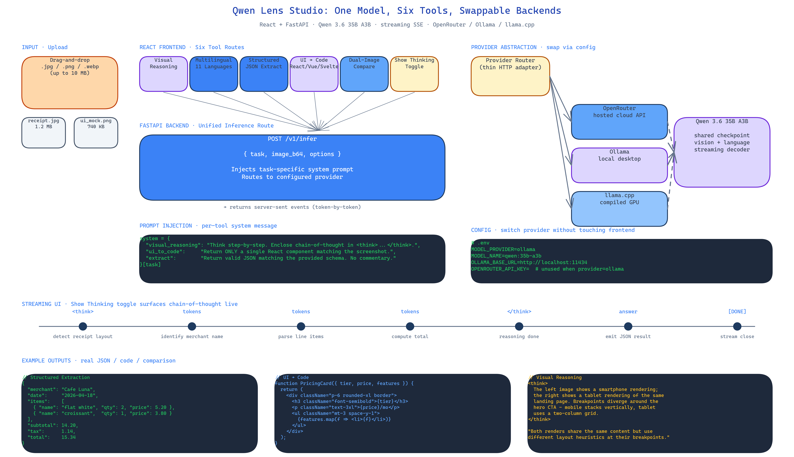

# Qwen Lens Studio: A Self-Hosted Multimodal Vision Workbench

[](https://github.com/dakshjain-1616/Qwen-Lens-Studio)



## The Problem

> Every closed-source vision API ships a single opinionated pipeline. If you want reasoning, you use one endpoint. If you want OCR, you use another. If you want UI-to-code, you buy a third tool. Each of them charges per image, sends your data off-box, and breaks if you blink. For anyone actually trying to build on top of vision models, the tax is unworkable.

NEO built Qwen Lens Studio as the counter-argument: one self-hosted app, one model weight, six working tools, and a backend abstraction thin enough that you swap providers without touching a line of React.

## One Model, Six Tools

Qwen Lens Studio wraps [Qwen 3.6 35B A3B](https://huggingface.co/Qwen) into six distinct UIs that share the same inference path:

- **Visual Reasoning** — chain-of-thought analysis with a `Show Thinking` toggle that surfaces intermediate reasoning steps rather than hiding them behind a polished answer.
- **Multilingual Description** — eleven languages, generated from the same image, with consistent terminology across translations.
- **Structured Extraction** — images in, JSON out, schema-bound. Meant for invoices, tables, ID documents, any situation where "describe this" is the wrong question.
- **UI-to-Code** — screenshot a page, get React, Vue, Svelte, or raw HTML back. Component-aware, not just a dumb DOM dump.
- **Dual-Image Comparison** — side-by-side vision pass with the model instructed to reason about differences, not describe both images independently.
- **Backend Swap** — the same UI drives OpenRouter, Ollama, or llama.cpp by changing a single config field.

Each tool is a separate route in the React frontend but hits the same FastAPI endpoint under the hood. The model decides what to do based on a task-specific system prompt that the backend injects before the user message. No per-task fine-tuning, no per-task model — just prompt steering on top of a shared checkpoint.

## Backend Abstraction

The FastAPI layer is intentionally thin. It takes a request that looks identical regardless of which tool sent it — `{ task, image_b64, options }` — and routes to the configured provider. OpenRouter is used for cloud hosting. Ollama is used for desktop-local inference. llama.cpp is used for GPU-poor environments or edge deployment.

Because the abstraction happens at the HTTP layer, the React bundle has no idea which backend is running. This matters more than it sounds. It means you can prototype against OpenRouter on a laptop, swap to a local Ollama instance for privacy, and move to llama.cpp on a hardened Linux box in production without changing any frontend code. Same UI, same prompts, same output format.

## Streaming Responses End-to-End

FastAPI streams tokens as server-sent events. The React client buffers them and renders them character-by-character so you see reasoning unfold rather than waiting on a complete response. For the `Show Thinking` toggle this is important — watching the chain of thought stream in real time makes the model's behavior legible in a way that a finished answer never can.

## Deployment

The studio runs on `localhost:8000` once dependencies are installed. An optional `npm run dev` frontend server at `localhost:5173` gives you hot-reloading while you iterate on UI. For production you build the React bundle and serve it as FastAPI static files on a single port.

```bash
git clone https://github.com/dakshjain-1616/Qwen-Lens-Studio
cd Qwen-Lens-Studio
pip install -r requirements.txt
cd frontend && npm install && npm run build && cd ..
python -m uvicorn server:app --port 8000
```

Environment configuration lives in `.env`: `MODEL_PROVIDER`, `MODEL_NAME`, `OPENROUTER_API_KEY` (optional), `OLLAMA_BASE_URL` (optional).

## How to Build This with NEO

Open NEO in VS Code or Cursor and describe what you want to build. A good starting prompt for this project:

> "Build a multimodal vision studio in Python and React. Use [Qwen 3.6 35B A3B](https://huggingface.co/Qwen) as the backbone and wrap six tools around it — visual reasoning with chain-of-thought, multilingual description across 11 languages, structured JSON extraction, UI-to-code generation for React/Vue/Svelte/HTML, dual-image comparison, and a Show Thinking toggle. Backend is FastAPI with streaming responses. Frontend is React with Vite. Route all inference through a thin provider abstraction so switching between OpenRouter, Ollama, and llama.cpp requires only a config change."

<a href="https://heyneo.com/dashboard?section=new-chat&prompt=Build%20a%20multimodal%20vision%20studio%20in%20Python%20and%20React.%20Use%20Qwen%203.6%2035B%20A3B%20as%20the%20backbone%20and%20wrap%20six%20tools%20around%20it%20-%20visual%20reasoning%20with%20chain-of-thought%2C%20multilingual%20description%20across%2011%20languages%2C%20structured%20JSON%20extraction%2C%20UI-to-code%20generation%20for%20React%2FVue%2FSvelte%2FHTML%2C%20dual-image%20comparison%2C%20and%20a%20Show%20Thinking%20toggle.%20Backend%20is%20FastAPI%20with%20streaming%20responses.%20Frontend%20is%20React%20with%20Vite.%20Route%20all%20inference%20through%20a%20thin%20provider%20abstraction%20so%20switching%20between%20OpenRouter%2C%20Ollama%2C%20and%20llama.cpp%20requires%20only%20a%20config%20change." style="display:inline-block;background:#1e40af;color:#ffffff;padding:10px 22px;border-radius:6px;text-decoration:none;font-weight:600;font-size:14px;">Build with NEO →</a>

NEO scaffolds the FastAPI server, the React frontend, and the provider adapters. From there you iterate — ask it to add a custom extraction schema editor, plug in a different vision model, or wire the structured-extraction output into a downstream database.

NEO built a one-model, six-tool multimodal studio with a swappable inference backend and streaming responses end-to-end. See what else NEO ships at [heyneo.com](https://heyneo.com/).

---

## Try NEO in Your IDE

Install the NEO extension to bring AI-powered development directly into your workflow:

- **VS Code**: [NEO in VS Code](https://marketplace.visualstudio.com/items?itemName=NeoResearchInc.heyneo)
- **Cursor**: <a href="cursor://extension/NeoResearchInc.heyneo" style="color:#0066FF;font-weight:bold;">Install NEO for Cursor →</a>

---
