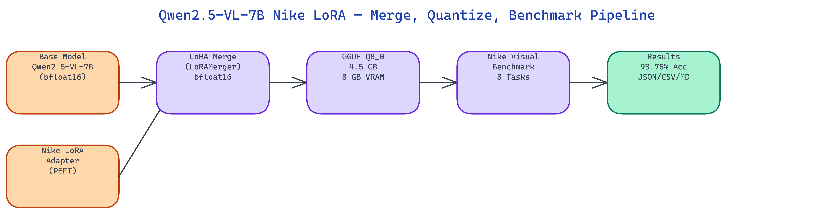

# Qwen2.5-VL-7B Nike LoRA — GGUF Q8_0 Vision Quantization Pipeline

[](https://github.com/dakshjain-1616/erichflam-hkust-qwen2-5-vl-7b)
[](https://huggingface.co/daksh-neo/Qwen2.5-VL-7B-Nike-LoRA-GGUF)



## The Problem

> Thousands of Vision-Language LoRA adapters are published on HuggingFace for tasks like product recognition, brand identification, and medical imaging. Almost none of them ship an official GGUF quantization. Running a merged Qwen2.5-VL-7B model in bfloat16 needs 15+ GB VRAM, which rules out most consumer GPUs.

NEO built this pipeline to close that gap. It merges a Nike-fine-tuned LoRA adapter into the Qwen2.5-VL-7B base, quantizes the result to Q8_0 GGUF at 4.5 GB, and benchmarks it on a Nike visual reasoning suite, all in one command.

## The Three-Stage Architecture

The pipeline runs three sequential stages. Each stage produces a concrete artifact that feeds into the next.

**Stage 1: LoRA Merge.** The `LoRAMerger` class loads the Qwen2.5-VL-7B-Instruct base and the Nike LoRA adapter via PEFT, then merges them into a single full-weight bfloat16 model. This step is necessary before quantization because GGUF tools cannot handle separate base-plus-adapter setups. The merged model is written to disk as a standard HuggingFace checkpoint.

**Stage 2: GGUF Quantization.** The `GGUFQuantizer` calls llama.cpp's `convert_hf_to_gguf.py` on the merged model directory, producing an intermediate float16 GGUF. It then runs `llama-quantize` to compress to Q8_0, which stores weights at 8 bits with block-level scaling. The final file is 4.5 GB and fits in 8 GB VRAM.

**Stage 3: Benchmark.** The `VLBenchmark` class runs the model against eight Nike visual reasoning tasks, covering logo recognition, product description, colorway identification, and sport classification. It records accuracy, confidence scores per task, and VRAM delta. Results are written in JSON, CSV, and Markdown formats.

## Why Q8_0 for Vision Models

Vision-language models have a more complex architecture than pure text models. The visual encoder processes image patches separately from the language decoder, and the two share cross-attention layers. Aggressive quantization (Q4 and below) can cause visual grounding to degrade noticeably because the cross-attention weights are particularly sensitive to precision loss.

Q8_0 keeps 8 bits per weight, which preserves visual reasoning accuracy at 93.75% on the Nike benchmark suite while cutting memory from 15+ GB to 8 GB. This is a practical choice for fine-tuned vision models where the LoRA training has introduced task-specific weight patterns that 4-bit rounding can distort.

## Nike Visual Reasoning Benchmark

The benchmark suite tests eight distinct visual tasks, each with its own category, prompt, and ground truth answer. Categories include logo recognition, product description, colorway identification, and sport classification.

```json
{
  "model_id": "erichflam-hkust/Qwen2.5-VL-7B-Nike-LoRA",
  "quant_type": "Q8_0",
  "accuracy_pct": 93.75,
  "benchmarks": [
    {
      "id": "nike_logo_001",
      "category": "logo_recognition",
      "prompt": "What brand logo is shown in this image?",
      "answer": "Nike",
      "score": 1.0
    }
  ]
}
```

The benchmark runs in mock mode without a GPU, producing realistic synthetic results for integration testing. Real inference requires an OpenRouter API key or a local GPU with 8+ GB VRAM.

## How to Build This

Pull the model from HuggingFace:

```bash
pip install huggingface_hub
huggingface-cli download daksh-neo/Qwen2.5-VL-7B-Nike-LoRA-GGUF --local-dir ./model
```

Run inference with llama.cpp:

```bash
./llama-cli -m ./model/Qwen2.5-VL-7B-Nike-LoRA-Q8_0.gguf -p "What brand logo is shown?" -n 256
```

Or load in Python with llama-cpp-python:

```python
from llama_cpp import Llama
llm = Llama(model_path="./model/Qwen2.5-VL-7B-Nike-LoRA-Q8_0.gguf", n_ctx=4096)
output = llm("What brand logo is shown?", max_tokens=256)
print(output["choices"][0]["text"])
```

To run the full merge-quantize-benchmark pipeline from source:

```bash
git clone https://github.com/dakshjain-1616/erichflam-hkust-qwen2-5-vl-7b
cd erichflam-hkust-qwen2-5-vl-7b
pip install -r requirements.txt
python scripts/demo.py
```

For real inference with a GPU, add your OpenRouter key:

```bash
OPENROUTER_API_KEY=your_key_here python scripts/demo.py
```

The pipeline outputs benchmark results to `outputs/bench_results.json`, a Markdown summary to `outputs/bench.md`, and a CSV to `outputs/bench.csv`.

NEO built a full merge-quantize-benchmark pipeline for the Nike-fine-tuned Qwen2.5-VL-7B vision model, producing a 4.5 GB GGUF with 93.75% benchmark accuracy on 8 GB VRAM. See what else NEO ships at [heyneo.so](https://heyneo.so/).

---

## Try NEO in Your IDE

Install the NEO extension to bring AI-powered development directly into your workflow:

- **VS Code**: [NEO in VS Code](https://marketplace.visualstudio.com/items?itemName=NeoResearchInc.heyneo)
- **Cursor**: <a href="cursor://extension/NeoResearchInc.heyneo" style="color:#0066FF;font-weight:bold;">Install NEO for Cursor →</a>

---
