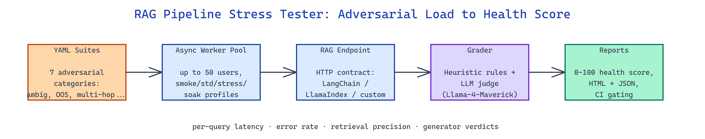

# RAG Pipeline Stress Tester: Find Where Your Retrieval Breaks Before Users Do

[](https://github.com/dakshjain-1616/RAG-pipeline-stress-tester)



## The Problem

> RAG pipelines that nail a happy-path eval crumble on ambiguous queries, out-of-scope questions, multi-hop reasoning, and prompt injections — and the failure rarely shows up until production traffic reveals it.

NEO built RAG Pipeline Stress Tester to expose those failure modes under load before the first user hits them.

## Seven Adversarial Query Categories

**RAG Pipeline Stress Tester** ships a curated suite of adversarial queries across seven categories: `ambiguous`, `out_of_scope`, `multi_hop`, `needle_in_haystack`, `contradictory_context`, `prompt_injection`, and `long_context`. Each category targets a specific failure mode that vector search plus naive prompting tends to miss. The suite is extensible — YAML files describe new categories and load seamlessly alongside the built-ins.

```yaml
category: needle_in_haystack
queries:
  - id: nih_017
    prompt: "What is the serial number of the fridge in Appendix C, section 4?"
    expected_behaviour: cite_appendix_c
    grading: exact_match_token
```

The runner sends each query through the target pipeline via a standard HTTP contract, so any framework — LangChain, LlamaIndex, custom — can plug in by implementing one endpoint.

## Concurrent Load with Async Workers

Tests run through an `asyncio` worker pool configurable up to 50+ concurrent virtual users. The runner records per-query latency, error rate, retrieval hit precision (when ground-truth chunk IDs are provided), and generator verdicts graded by either heuristic rules or an LLM judge. Error isolation keeps one worker's failure from cascading into the rest of the run.

| Load Profile | Users | Queries | Typical Duration |
|---|---|---|---|
| Smoke | 5 | 50 | 1-2 min |
| Standard | 20 | 300 | 5-8 min |
| Stress | 50 | 1000 | 20-30 min |
| Soak | 10 | 10k | 4-6 hrs |

The soak profile is the one most teams skip and regret later — it surfaces memory leaks and connection-pool exhaustion that shorter runs never trigger.

## Health Score and Reports

At completion, every run is reduced to a 0-100 health score derived from category accuracy, error rate, p95 latency, and retrieval precision. The HTML report leads with the score, drills into per-category breakdowns, and lists the 20 worst-performing queries with full context and retrieval traces for triage. JSON output mirrors everything for downstream dashboards and CI gating.

```bash
python stress.py \
  --endpoint https://rag.internal/query \
  --suite suites/standard.yaml \
  --users 20 --queries 300 \
  --judge openrouter/meta-llama/llama-4-maverick \
  --report report.html
```

The test harness ships with 58 pytest cases covering the runner, scorer, and report generation, so extensions to the suite stay safe.

## How to Build This with NEO

Open NEO in VS Code or Cursor and describe what you want to build. A good starting prompt for this project:

> "Build an async stress-testing framework for RAG pipelines. It should load YAML suites of adversarial queries across seven categories (ambiguous, out-of-scope, multi-hop, needle-in-haystack, contradictory, prompt-injection, long-context), run them concurrently against an HTTP endpoint using an asyncio worker pool up to 50 users, grade responses with heuristic rules and an LLM judge, and produce an HTML report with a 0-100 health score and per-category breakdowns plus a JSON artifact for CI."

<a href="https://heyneo.com/dashboard?section=new-chat&prompt=Build%20an%20async%20stress-testing%20framework%20for%20RAG%20pipelines.%20It%20should%20load%20YAML%20suites%20of%20adversarial%20queries%20across%20seven%20categories%20%28ambiguous%2C%20out-of-scope%2C%20multi-hop%2C%20needle-in-haystack%2C%20contradictory%2C%20prompt-injection%2C%20long-context%29%2C%20run%20them%20concurrently%20against%20an%20HTTP%20endpoint%20using%20an%20asyncio%20worker%20pool%20up%20to%2050%20users%2C%20grade%20responses%20with%20heuristic%20rules%20and%20an%20LLM%20judge%2C%20and%20produce%20an%20HTML%20report%20with%20a%200-100%20health%20score%20and%20per-category%20breakdowns%20plus%20a%20JSON%20artifact%20for%20CI." style="display:inline-block;background:#1e40af;color:#ffffff;padding:10px 22px;border-radius:6px;text-decoration:none;font-weight:600;font-size:14px;">Build with NEO →</a>

NEO generates the project structure and core implementation. From there you iterate — add domain-specific query suites, wire the JSON output into a CI gate that fails builds when health drops below 80, or build a soak-mode dashboard that streams live metrics during multi-hour runs. Each request builds on what's already there.

To run the finished project:

```bash
git clone https://github.com/dakshjain-1616/RAG-pipeline-stress-tester
cd RAG-pipeline-stress-tester
pip install -r requirements.txt
python stress.py --endpoint http://localhost:8000/query --suite suites/smoke.yaml --users 5
```

Open `report.html` for the health score and category breakdown; pipe `report.json` into your observability stack for trend tracking.

NEO built a focused stress harness that exposes the RAG failure modes eval datasets never catch, so teams ship with confidence instead of surprises. See what else NEO ships at [heyneo.com](https://heyneo.com/).

---

## Try NEO in Your IDE

Install the NEO extension to bring AI-powered development directly into your workflow:

- **VS Code**: [NEO in VS Code](https://marketplace.visualstudio.com/items?itemName=NeoResearchInc.heyneo)
- **Cursor**: <a href="cursor://extension/NeoResearchInc.heyneo" style="color:#0066FF;font-weight:bold;">Install NEO for Cursor →</a>

---
