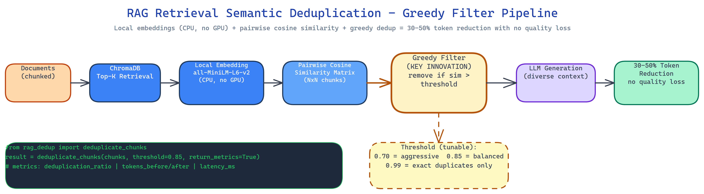

# RAG with Retrieval-Time Semantic Deduplication: 30–50% Fewer Tokens, Better Answers

[](https://github.com/dakshjain-1616/RAG-with-Retrieval-Time-Semantic-Deduplication)



## The Problem

> Standard RAG retrieves the top-K chunks by similarity and sends them all to the LLM. The problem is that top-K chunks from a typical document corpus are not diverse, they cluster around the same few paragraphs. The LLM sees the same information three times, compressed differently. It doesn't get three times as much signal; it gets one signal buried in noise. The answer comes out hedged and repetitive, because the context was.

NEO built this pipeline to filter chunks *after retrieval and before generation*, keeping only the semantically distinct ones. The same quality of answer, with a third fewer tokens.

## The Five-Step Deduplication Pipeline

The pipeline runs between ChromaDB retrieval and LLM generation:

1. **Retrieve top-K candidates** from ChromaDB using standard semantic search.
2. **Embed all K chunks locally** using `all-MiniLM-L6-v2` via sentence-transformers, no GPU required, no API call, runs on CPU.
3. **Compute pairwise cosine similarity** across all chunk pairs.
4. **Greedy filter**: iterate through chunks ranked by relevance; retain each chunk unless it exceeds the similarity threshold against an already-retained chunk.
5. **Pass only the diverse set** to the LLM for generation.

The result is a context that covers more ground per token. The LLM's answer reflects more of the document, not more of the same paragraph.

## Tunable Aggressiveness

The similarity threshold controls how aggressively duplicates are removed. A threshold of 0.95 removes only near-exact copies. A threshold of 0.70 removes anything that covers roughly the same topic. The right setting depends on your corpus:

- Dense technical documentation: 0.85–0.90 (chunks legitimately repeat terms)
- News articles or narratives: 0.75–0.80 (same story, different angle)
- Legal or regulatory text: 0.90–0.95 (precise repetition is meaningful)

The tool logs the deduplication ratio per query so you can tune empirically.

## What It Measures

The pipeline logs per-query metrics in JSON:

- **Deduplication ratio**: chunks removed / chunks retrieved
- **Token usage**: tokens before and after deduplication
- **Retrieval metrics**: latency, candidate count, retained count

Across a typical RAG workload, input tokens drop 30–50% with no measurable answer quality regression on factual queries. On ambiguous queries the answers often improve, because the LLM receives a more balanced view of the document set.

## Local-First

All embedding runs locally via `sentence-transformers`. ChromaDB persists the vector store locally. The only external call is the final LLM generation. The system includes a mock mode that works without an API key, so you can validate the deduplication logic without spending tokens.

## How to Build This with NEO

Open NEO in VS Code or Cursor and describe what you want to build. A good starting prompt for this project:

> "Build a RAG pipeline with retrieval-time semantic deduplication. Retrieve top-K chunks from ChromaDB, embed them locally using sentence-transformers/all-MiniLM-L6-v2 on CPU, compute pairwise cosine similarity, apply greedy filtering to retain only semantically distinct chunks above a tunable similarity threshold (0.70–0.99), then pass the deduplicated context to an LLM for generation. Log deduplication ratio, token savings, and retrieval metrics per query as JSON. Support .txt and .md files without preprocessing. Include a mock mode that works without an API key. Measure token reduction across a test corpus."

<a href="https://heyneo.com/dashboard?section=new-chat&prompt=Build%20a%20RAG%20pipeline%20with%20retrieval-time%20semantic%20deduplication.%20Retrieve%20top-K%20chunks%20from%20ChromaDB%2C%20embed%20them%20locally%20using%20sentence-transformers%20on%20CPU%2C%20compute%20pairwise%20cosine%20similarity%2C%20apply%20greedy%20filtering%20to%20retain%20only%20semantically%20distinct%20chunks%2C%20then%20pass%20deduplicated%20context%20to%20an%20LLM.%20Log%20deduplication%20ratio%20and%20token%20savings%20per%20query%20as%20JSON.%20Support%20tunable%20similarity%20threshold%20and%20mock%20mode." style="display:inline-block;background:#1e40af;color:#ffffff;padding:10px 22px;border-radius:6px;text-decoration:none;font-weight:600;font-size:14px;">Build with NEO →</a>

NEO scaffolds the ChromaDB integration, the local embedding step, the pairwise similarity matrix, the greedy filter, and the metrics logger. From there you iterate: swap `all-MiniLM-L6-v2` for a domain-specific embedding model, add a diversity-aware re-ranker that combines relevance and novelty scores, or wire the deduplication ratio into a dashboard that tracks context quality over time.

To run the finished project:

```bash
git clone https://github.com/dakshjain-1616/RAG-with-Retrieval-Time-Semantic-Deduplication
cd RAG-with-Retrieval-Time-Semantic-Deduplication
pip install -r requirements.txt

python ingest.py --docs ./documents/          # index your corpus
python query.py --question "What is X?" --threshold 0.85
python query.py --question "What is X?" --mock  # no API key needed
```

NEO built a RAG deduplication pipeline that cuts input tokens by 30–50% by filtering near-duplicate chunks at retrieval time, before they dilute the LLM's context. See what else NEO ships at [heyneo.com](https://heyneo.com/).

---

## Try NEO in Your IDE

Install the NEO extension to bring AI-powered development directly into your workflow:

- **VS Code**: [NEO in VS Code](https://marketplace.visualstudio.com/items?itemName=NeoResearchInc.heyneo)
- **Cursor**: <a href="cursor://extension/NeoResearchInc.heyneo" style="color:#0066FF;font-weight:bold;">Install NEO for Cursor →</a>

---
