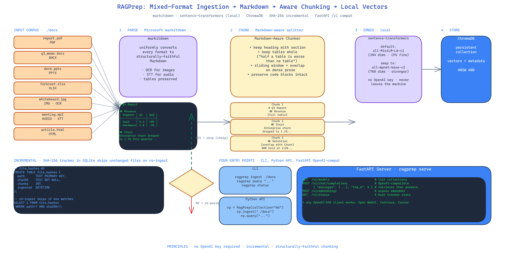

# RAGPrep: One-Command Document Ingestion for Local-First RAG

[](https://github.com/dakshjain-1616/RagPrep)



## The Problem

> Building RAG sounds easy right up until you have to ingest real documents. PDFs with multi-column layouts. DOCX files with embedded images. PPTX decks where the content is in the speaker notes. Tables that span pages. The "parse, chunk, embed, store" pipeline always breaks at step one, and when it breaks every downstream stage inherits the damage. Half a table retrieved from a vector DB is worse than no table.

NEO built RAGPrep to make this boring and reproducible: one command turns a folder of mixed-format documents into a queryable vector store, with chunking that respects document structure and an OpenAI-compatible query endpoint that runs entirely on your machine.

## Parsing Through markitdown

Microsoft's `markitdown` is the parsing layer. It converts PDF, DOCX, PPTX, XLSX, images, audio, and HTML into clean Markdown before anything else touches them. This matters because once every format is Markdown, the rest of the pipeline has one job — chunking Markdown — instead of seven jobs — chunking seven different formats badly.

Images go through OCR. Audio goes through speech-to-text. Spreadsheets are preserved as Markdown tables. The output is structurally faithful: headings stay headings, tables stay tables, lists stay lists.

## Markdown-Aware Chunking

This is where most RAG pipelines go wrong. They use fixed-token or fixed-character splits that cut through sentences, split tables mid-row, and orphan headings from their content. RAGPrep chunks by Markdown structure:

- Each section keeps its heading attached. When the retriever returns chunk N, the user sees the section title, not a floating paragraph.
- Tables are kept whole. Splitting a four-row table into two two-row chunks is a bug; RAGPrep treats tables as atomic.
- Dense prose uses a sliding window with overlap to avoid semantic cliffs at chunk boundaries.

The repo's maxim: *half a table is worse than no table*. The chunker is built around that.

## Local-First Embeddings

Embeddings are computed locally with `sentence-transformers`. The default model is `all-MiniLM-L6-v2` — 384 dimensions, CPU-friendly, good enough for most document QA. You can swap to `all-mpnet-base-v2` for higher fidelity or to a domain-specific model by changing one line of config.

No OpenAI API key. No network calls at embedding time. Your documents never leave the machine.

## Incremental Hash Tracking

SHA-256 of every file is stored in SQLite at ingestion time. On the next run, files whose hashes have not changed are skipped entirely — no re-parsing, no re-embedding, no ChromaDB churn. For a document collection that grows over time this makes re-ingestion cheap: only the diff gets processed.

## Four Ways to Use It

```bash
ragprep ingest ./docs       # CLI ingestion
ragprep query "question"    # CLI query
ragprep serve               # FastAPI server with OpenAI-compatible /v1/chat/completions
ragprep status              # hash tracker + collection stats
```

The `serve` subcommand is the one that unlocks downstream integration. Any tool that speaks the OpenAI chat API — Open WebUI, Continue, a custom React frontend, another LLM agent — can point at `http://localhost:8000/v1` and get RAG-augmented responses without knowing RAGPrep exists.

## Python API

For embedding into your own app:

```python
from ragprep import RagPrep

rp = RagPrep(collection="knowledge")
rp.ingest("./docs")
answers = rp.query("what did the Q3 report say about churn?", top_k=5)
```

## How to Build This with NEO

Open NEO in VS Code or Cursor and describe what you want to build. A good starting prompt for this project:

> "Build a local-first RAG ingestion pipeline in Python. Use Microsoft markitdown to parse PDFs, DOCX, PPTX, XLSX, images, audio, and HTML into Markdown. Chunk with Markdown-aware rules: keep headings with sections, keep tables whole, use sliding-window overlap for dense prose. Embed locally with sentence-transformers all-MiniLM-L6-v2. Store vectors in ChromaDB. Track file SHA-256 in SQLite for incremental re-ingestion — skip unchanged files. Expose four entry points: CLI ingest/query/status, FastAPI server with OpenAI-compatible /v1/chat/completions, and a Python API. No OpenAI API key required for core operation."

<a href="https://heyneo.com/dashboard?section=new-chat&prompt=Build%20a%20local-first%20RAG%20ingestion%20pipeline%20in%20Python.%20Use%20Microsoft%20markitdown%20to%20parse%20PDFs%2C%20DOCX%2C%20PPTX%2C%20XLSX%2C%20images%2C%20audio%2C%20and%20HTML%20into%20Markdown.%20Chunk%20with%20Markdown-aware%20rules%3A%20keep%20headings%20with%20sections%2C%20keep%20tables%20whole%2C%20use%20sliding-window%20overlap%20for%20dense%20prose.%20Embed%20locally%20with%20sentence-transformers%20all-MiniLM-L6-v2.%20Store%20vectors%20in%20ChromaDB.%20Track%20file%20SHA-256%20in%20SQLite%20for%20incremental%20re-ingestion%20-%20skip%20unchanged%20files.%20Expose%20four%20entry%20points%3A%20CLI%20ingest%2Fquery%2Fstatus%2C%20FastAPI%20server%20with%20OpenAI-compatible%20%2Fv1%2Fchat%2Fcompletions%2C%20and%20a%20Python%20API." style="display:inline-block;background:#1e40af;color:#ffffff;padding:10px 22px;border-radius:6px;text-decoration:none;font-weight:600;font-size:14px;">Build with NEO →</a>

NEO scaffolds the parsing, chunking, embedding, and storage layers. From there you iterate — add a re-ranker on top of ChromaDB retrieval, plug the FastAPI server into an Open WebUI frontend, or extend the chunker with a domain-specific rule for code blocks.

NEO built a one-command local-first RAG ingestion pipeline with Markdown-aware chunking, incremental hash tracking, and an OpenAI-compatible query endpoint. See what else NEO ships at [heyneo.com](https://heyneo.com/).

---

## Try NEO in Your IDE

Install the NEO extension to bring AI-powered development directly into your workflow:

- **VS Code**: [NEO in VS Code](https://marketplace.visualstudio.com/items?itemName=NeoResearchInc.heyneo)
- **Cursor**: <a href="cursor://extension/NeoResearchInc.heyneo" style="color:#0066FF;font-weight:bold;">Install NEO for Cursor →</a>

---
