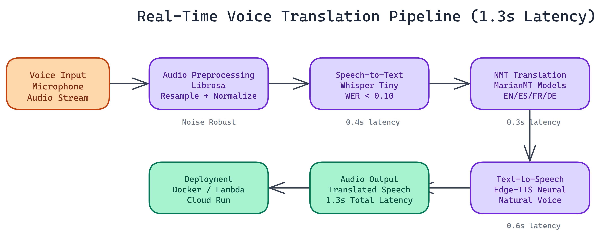

# Real-Time Voice Translation Pipeline with Sub-2-Second Latency

[View the code on GitHub](https://github.com/dakshjain-1616/Real-time-Voice-Translation-Pipeline)

Latency is everything in voice applications. Once you cross two seconds of delay between someone speaking and hearing a translated response, the interaction stops feeling natural. It becomes a transaction. The goal with this pipeline was to stay well under that threshold while keeping the system practical to deploy.

We hit 1.3 seconds end-to-end. Here's how.

## Designing for Low Latency

The common trap in building voice translation systems is stacking components that each add meaningful delay. If your speech-to-text takes 1.5 seconds, your translation takes another 0.8 seconds, and your TTS adds 1.2 seconds, you've already lost. Each stage needs to be lean.

We made specific model choices at each stage to keep the pipeline fast without sacrificing quality.

## Pipeline Architecture

The system chains four components: audio preprocessing, speech recognition, neural machine translation, and speech synthesis.

### Audio Preprocessing

We use Librosa for audio handling specifically because it works without an FFmpeg dependency. This matters for deployment. FFmpeg is a system-level dependency that creates friction in containerized environments. Librosa handles resampling, normalization, and format conversion entirely in Python.

The preprocessing stage also handles noise robustness. We've tested against background noise, varying microphone quality, and recordings made in non-ideal acoustic environments. The pipeline degrades gracefully rather than failing hard.

### Speech-to-Text with Whisper Tiny

We chose Whisper Tiny for the STT stage. This is a deliberate trade-off. Whisper Large produces better transcriptions, but the latency cost is too high for real-time use. Whisper Tiny completes the STT stage in 0.4 seconds and achieves a word error rate below 0.10 on clean audio, which is sufficient for the languages and use cases we're targeting.

For applications where accuracy matters more than latency, swapping in a larger Whisper variant is a one-line config change.

### Neural Machine Translation with MarianMT

Translation runs through MarianMT transformer models. We load a separate model per language pair, which costs some memory but keeps translation inference to 0.3 seconds per request. The models cover English, Spanish, French, and German, handling four of the most common translation pairs in business and travel contexts.

MarianMT is well-suited here because the models are compact, inference is fast on CPU, and translation quality is competitive with much larger models for common language pairs.

### Text-to-Speech with Edge-TTS

The final stage converts translated text to speech using Edge-TTS with neural voices. This is the slowest stage at 0.6 seconds, but the output quality is substantially better than older TTS systems. The voices are natural enough that the output doesn't sound robotic.

Edge-TTS runs without requiring local model weights for TTS, which keeps the deployment footprint smaller.

## End-to-End Performance

Total processing: 1.3 seconds median latency across tested audio samples.

Breakdown:
- STT (Whisper Tiny): 0.4s
- Translation (MarianMT): 0.3s
- TTS (Edge-TTS): 0.6s

These numbers are measured on CPU hardware. With GPU acceleration, the STT and translation stages run faster, pushing total latency lower.

## Deployment Flexibility

The pipeline supports three deployment targets:

**Local installation** via pip, straightforward for development and single-machine deployments.

**Docker containerization** for consistent environments and easy scaling. The Docker image bundles all dependencies including Librosa audio handling, so there are no system-level surprises at deployment time.

**Serverless cloud platforms** including AWS Lambda and Google Cloud Run. For serverless deployment, pre-warm model instances to avoid cold-start latency on the first request. Model loading time is the main source of variability in cold-start scenarios.

For high-volume production environments, load balancing across multiple instances with pre-loaded models is the standard approach.

## Language Support

The current four language pairs cover English-Spanish, English-French, English-German, and bidirectional translation between each. Adding a new language pair requires downloading the corresponding MarianMT model and registering it in the configuration file. The pipeline architecture doesn't change.

## Practical Use Cases

Real-time voice translation at this latency range opens up several applications that don't work well with slower systems:

**Live meetings and calls** where participants speak different languages and need near-real-time translation to follow the conversation.

**Customer service** where agents and customers speak different languages, and a translated audio feed reduces the need for bilingual agents.

**Field translation** for healthcare, legal, and social services where interpreter availability is limited.

**Travel applications** where quick back-and-forth conversation in a foreign language is the primary use case.

## Extending the System

The architecture is modular. The main extension points are: adding WebSocket support for true streaming (rather than request-response), expanding language coverage beyond the current four, adding speaker diarization to handle multi-speaker audio, and integrating domain-specific vocabulary for technical or specialized language.

---

If you want to build a voice AI pipeline like this without handling all the model integration and latency optimization yourself, [NEO](https://heyneo.so/) can take you from requirements to working system. See what autonomous ML engineering looks like at heyneo.so.

---

## Try NEO in Your IDE

Install the NEO extension to bring AI-powered development directly into your workflow:

- **VS Code**: [NEO in VS Code](https://marketplace.visualstudio.com/items?itemName=NeoResearchInc.heyneo)
- **Cursor**: [NEO in Cursor](cursor:extension/NeoResearchInc.heyneo)
