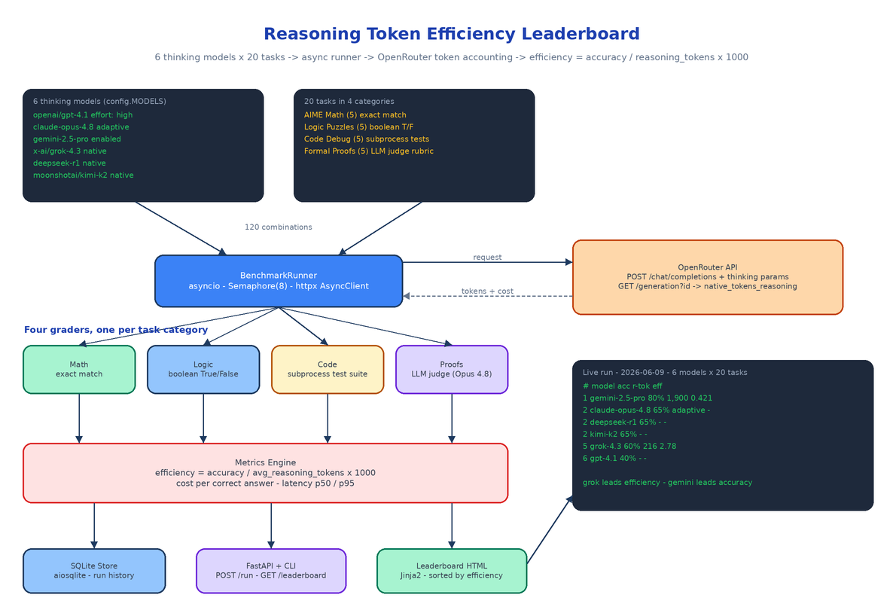

# Reasoning Token Efficiency Leaderboard: Ranking Thinking Models by Accuracy per Token

[](https://github.com/dakshjain-1616/Reasoning-Token-Efficiency-Leaderboard)



## The Problem

> Two models both solve the math problem. One thinks for 216 tokens. The other thinks for 1,900. The leaderboard you checked before picking a model shows the same green checkmark for both — and your invoice shows the difference at the end of the month.

Every public LLM leaderboard ranks by accuracy. None of them tells you how many reasoning tokens the model burned to get there, even though thinking tokens are billed like any other output tokens and dominate latency on hard tasks. A model that scores 80% using 500 reasoning tokens beats one that scores 85% using 10,000 for most real workloads. The Reasoning Token Efficiency Leaderboard benchmarks six thinking models on 20 reasoning tasks and publishes the metric nobody else does:

```
efficiency = accuracy / avg_reasoning_tokens × 1000
```

Accuracy per thousand thinking tokens. Not who is smartest — who is smartest per token.

## Measuring Tokens You Can't See

The hard part is that reasoning tokens are mostly invisible. Providers stream a `<thinking>` summary or nothing at all; the actual internal token count never appears in the chat completion response. The benchmark solves this through OpenRouter's generation API. After every completion, `src/benchmark/token_extractor.py` pulls the generation ID from the response (the `gen-` prefixed `id` field, falling back to the `x-openrouter-generation-id` header) and calls `GET /api/v1/generation?id=...`, which returns `native_tokens_reasoning` — the provider-reported count of internal thinking tokens actually consumed, plus `total_cost`, `tokens_prompt`, `tokens_completion`, and latency. Stats can lag the completion by a moment, so the runner retries the lookup once after a one-second sleep before giving up.

That one field is what makes the whole leaderboard possible: real billed reasoning tokens, not a guess from counting visible output.

## Six Models, Each at Its Intended Operating Point

The model roster lives in `src/config.py` as a dict mapping OpenRouter model IDs to their reasoning parameters, because every provider spells "think hard" differently:

```python
MODELS = {
    "openai/gpt-4.1": {"reasoning": {"effort": "high"}},
    "anthropic/claude-opus-4.8": {"thinking": {"type": "adaptive"}},
    "google/gemini-2.5-pro": {"reasoning": {"enabled": True}},
    "x-ai/grok-4.3": {},
    "deepseek/deepseek-r1": {},
    "moonshotai/kimi-k2": {},
}
```

GPT-4.1 gets `reasoning.effort: high`, Claude Opus 4.8 gets adaptive thinking (the model decides how much to think per task), Gemini 2.5 Pro gets reasoning explicitly enabled, and DeepSeek-R1, Grok-4.3, and Kimi-K2 reason natively with no extra parameters. The params are spread directly into each `/chat/completions` request body, so every model runs at its intended operating point rather than a crippled default.

## Twenty Tasks, Four Graders

Tasks split into four categories of five, each with a grading strategy matched to what "correct" actually means in that domain:

- **AIME Math** — competition algebra and number theory, graded by exact numeric match. The model produces 507 or it fails.
- **Logic Puzzles** — knights and knaves, muddy children, hat puzzles, river crossings, graded as boolean True/False extraction.
- **Code Debugging** — buggy Python snippets where the model's fix is executed against a real test suite via `subprocess` with a 10-second timeout. Plausible-looking wrong code scores zero.
- **Formal Proofs** — sqrt(2) is irrational, infinitude of primes, Cantor's diagonal argument, graded by Claude Opus 4.8 acting as a strict math judge against a per-task rubric (`JUDGE_MODEL` in config).

The graders in `src/benchmark/grader.py` are where the benchmark earns its trust: two categories are mechanically verifiable, one is verified by running the code, and only proofs need an LLM judge.

## The Runner: 120 Combinations, Eight at a Time

`BenchmarkRunner` in `src/benchmark/runner.py` fires every model×task combination — 6 models × 20 tasks = 120 calls — concurrently through a single `httpx.AsyncClient`, throttled by `asyncio.Semaphore(8)`. Each `run_single` posts the prompt with the model's thinking params, extracts the response text (handling both string and content-block formats), fetches generation stats, grades by category, and returns a result dict carrying `passed`, `reasoning_tokens`, `total_cost`, and wall-clock latency. Transient HTTP failures retry once with exponential backoff; a combination that still fails is recorded as a failed result rather than silently dropped, so the denominator stays honest.

`src/benchmark/metrics.py` then aggregates per model: accuracy, average reasoning tokens, the efficiency score, total cost, cost per correct answer, and latency at p50/p95, plus a per-task breakdown. Models come back sorted by efficiency descending — that ordering is the leaderboard.

## What a Real Run Looks Like

The README ships results from an actual run on 2026-06-09:

| Rank | Model | Accuracy | Reasoning Tokens | Efficiency | Cost | p50 Latency |
|------|-------|----------|-----------------|-----------|------|------------|
| 1 | google/gemini-2.5-pro | 80.0% | 1,900 | 0.421 | $0.4352 | 31.0s |
| 2 | anthropic/claude-opus-4.8 | 65.0% | adaptive | — | $0.2030 | 18.6s |
| 2 | deepseek/deepseek-r1 | 65.0% | — | — | $0.00 | 131.2s |
| 2 | moonshotai/kimi-k2 | 65.0% | — | — | $0.0038 | 30.2s |
| 5 | x-ai/grok-4.3 | 60.0% | 216 | 2.78 | $0.0157 | 13.2s |
| 6 | openai/gpt-4.1 | 40.0% | — | — | $0.0313 | 7.5s |

The split verdict is exactly why the metric matters: Gemini 2.5 Pro wins on raw accuracy (80%), but Grok-4.3 wins on efficiency (2.78) — it scored 60% on just 216 average reasoning tokens, nearly nine times fewer than Gemini. If you are routing high-volume traffic, those are two different "best models."

## Storage, API, and the Rendered Leaderboard

Every run persists to SQLite through `aiosqlite` (`src/db/store.py`), keyed by run ID. A FastAPI app (`src/api/`) exposes the lifecycle:

| Method | Path | Description |
|--------|------|-------------|
| `POST` | `/run` | Trigger a full benchmark run asynchronously |
| `GET` | `/results/{run_id}` | Raw per-model-per-task results |
| `GET` | `/leaderboard` | Rendered HTML leaderboard sorted by efficiency |
| `GET` | `/api/leaderboard` | Latest leaderboard aggregated as JSON |

The HTML view is built by `src/leaderboard/builder.py` from a Jinja2 template and rebuilt automatically after each run. From the terminal:

```bash
pip install -r requirements.txt
echo "OPENROUTER_API_KEY=sk-or-..." > .env

python -m src.cli run --dry-run   # print 6 models, 20 tasks, 120 combos — no API calls
python -m src.cli run             # full benchmark + summary table + save to SQLite
pytest tests/ -v                  # 54 tests: graders, token extraction, metrics, API
```

The 54-test suite covers the parts that would silently corrupt a leaderboard if they broke: answer extraction, subprocess code grading, the judge call, generation-stats parsing, and the efficiency computation itself.

## How to Build This with NEO

Open NEO in VS Code or Cursor and describe what you want to build. A good starting prompt for this project:

> "Build a Python benchmark called Reasoning Token Efficiency Leaderboard that ranks thinking models by accuracy per reasoning token. Define 6 models in a config dict mapping OpenRouter model IDs to their thinking params (reasoning.effort, thinking.type adaptive, reasoning.enabled, or native). Write 20 tasks in four categories: AIME math (exact numeric match), logic puzzles (boolean extraction), code debugging (run the fix against a test suite via subprocess with a timeout), and formal proofs (graded by Claude Opus 4.8 as an LLM judge with rubrics). Build an async BenchmarkRunner using httpx.AsyncClient and asyncio.Semaphore(8) that runs all 120 model×task combinations, retries transient failures with backoff, and extracts native_tokens_reasoning from OpenRouter's GET /generation endpoint after each completion. Compute per-model metrics: accuracy, avg reasoning tokens, efficiency = accuracy / reasoning_tokens × 1000, cost per correct answer, latency p50/p95. Store runs in SQLite via aiosqlite, render an HTML leaderboard with Jinja2 sorted by efficiency, and expose FastAPI endpoints: POST /run, GET /results/{run_id}, GET /leaderboard, GET /api/leaderboard. Add a CLI (python -m src.cli run, with --dry-run) and pytest coverage for grading, token extraction, metrics, and the API."

<a href="https://heyneo.com/dashboard?section=new-chat&prompt=Build%20a%20Python%20benchmark%20called%20Reasoning%20Token%20Efficiency%20Leaderboard.%20Run%2020%20reasoning%20tasks%20%28AIME%20math%2C%20logic%20puzzles%2C%20code%20debugging%2C%20formal%20proofs%29%20against%206%20thinking%20models%20via%20OpenRouter%20with%20asyncio%20and%20a%20semaphore%20of%208.%20Extract%20native_tokens_reasoning%20from%20the%20%2Fgeneration%20endpoint%2C%20grade%20with%20exact%20match%2C%20boolean%20extraction%2C%20subprocess%20test%20suites%2C%20and%20an%20LLM%20judge%2C%20compute%20efficiency%20%3D%20accuracy%20%2F%20reasoning_tokens%20x%201000%20plus%20cost%20and%20latency%20p50%2Fp95%2C%20store%20runs%20in%20SQLite%20via%20aiosqlite%2C%20and%20serve%20a%20Jinja2%20HTML%20leaderboard%20through%20FastAPI." style="display:inline-block;background:#1e40af;color:#ffffff;padding:10px 22px;border-radius:6px;text-decoration:none;font-weight:600;font-size:14px;">Build with NEO →</a>

NEO scaffolds the runner, the four graders, the token extractor, the metrics engine, the SQLite store, and the FastAPI surface. From there you swap in your own task set — your domain's hard problems matter more than AIME — add models as OpenRouter ships them, and schedule `POST /run` nightly so the leaderboard tracks model updates instead of a single snapshot.

NEO built the leaderboard that prices thinking by the token. See what else NEO ships at [heyneo.com](https://heyneo.com/).

---

## Try NEO in Your IDE

Install the NEO extension to bring AI-powered development directly into your workflow:

- **VS Code**: [NEO in VS Code](https://marketplace.visualstudio.com/items?itemName=NeoResearchInc.heyneo)
- **Cursor**: <a href="cursor://extension/NeoResearchInc.heyneo" style="color:#0066FF;font-weight:bold;">Install NEO for Cursor →</a>

---
