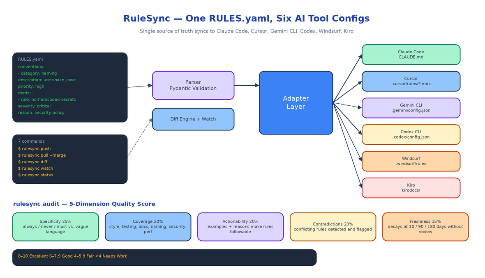

# RuleSync: One RULES.yaml to Keep Six AI Coding Tool Configs in Sync

[](https://github.com/dakshjain-1616/RuleSync)



## The Problem

> Six repos, six AI tools, six config formats. Someone tightens a naming convention in `CLAUDE.md`. A week later, a teammate is still on the old convention in `.cursor/rules/`. The AI tool they reach for determines which rules they get — and nobody's rules are the same.

Modern teams reach for multiple AI coding assistants depending on the task. Claude Code for architectural work, Cursor for inline edits, Gemini CLI for quick questions, Codex or Windsurf or Kiro for their own niches. Each tool does the same job: follow your team's conventions when it writes code. But each expects a completely different config format — `CLAUDE.md`, `.cursor/rules/*.mdc`, `.gemini/config.json`, `.codex/config.json`, `.windsurf/rules`, `kirodocs/`. Keeping six configs synchronized by hand means the moment you update one, the others drift. RuleSync replaces all six with a single `RULES.yaml` and handles the translation automatically.

## One File, Seven Commands

```bash
rulesync init --project-name "My Project"   # create a RULES.yaml with sensible defaults
rulesync push                               # sync RULES.yaml to all detected AI tool configs
rulesync pull                               # import existing tool configs into RULES.yaml
rulesync pull --merge                       # combine imported rules with your existing ones
rulesync diff                               # show what differs between RULES.yaml and live configs
rulesync audit                              # score your RULES.yaml across 5 quality dimensions
rulesync watch                              # sync automatically on every save
rulesync status                             # which tools are present and are they in sync
```

`push` detects which AI tools are present in your project by checking for `.claude/`, `.cursor/`, `.gemini/`, `.codex/`, `.windsurf/`, and `kirodocs/` directories, then writes each tool's native format automatically. `pull` goes the other direction — if you already have configs scattered across tools, `rulesync pull --merge` brings them together into a single RULES.yaml without overwriting what you've already written. `watch` starts a file-system watcher so that every save to RULES.yaml immediately syncs all detected tool configs.

## The RULES.yaml Format

A RULES.yaml has two required sections and three optional ones.

**`conventions`** are what your team does: naming patterns, architecture decisions, testing standards, documentation style. Each entry requires a `category`, a `description`, a `priority` (`low` / `medium` / `high` / `critical`), and optionally an `examples` list that makes the convention concrete.

**`donts`** are what your team avoids: anti-patterns, security pitfalls, known gotchas. Each entry requires a `rule`, a `severity` (`warning` / `error` / `critical`), and optionally a `reason` so the why is never lost as team membership changes.

**`context`** holds optional project metadata — tech stack, team size, deployment environment — that some adapters surface directly to the AI tool.

**`tool_overrides`** allows per-tool additions for conventions that only make sense in a specific tool's context.

**`version`** and **`last_updated`** are managed automatically and feed the quality scorer.

## Five-Dimension Quality Audit

The `rulesync audit` command scores your RULES.yaml against five dimensions that determine how well an AI tool will actually follow your rules:

**Specificity (25%)** — Directive language ("always", "never", "must", "should") produces consistent AI behavior. Vague language ("consider", "maybe") does not. Rules that tell the AI exactly what to do score higher.

**Coverage (20%)** — A thorough rule set addresses style, testing, documentation, naming, security, performance, and error handling. Gaps in coverage leave the AI without guidance in those areas, and it will fall back to its defaults.

**Actionability (20%)** — Conventions with examples and donts with reasons are far more likely to be followed. This dimension rewards rules that explain both what and why.

**Contradictions (20%)** — Conflicting rules confuse AI tools. RuleSync detects potential contradictions and flags them explicitly so you can resolve them rather than leave the AI to guess.

**Freshness (15%)** — Rules that haven't been reviewed in months often drift from actual team practice. The freshness score decays over 30, 90, and 180 days to prompt periodic reviews.

Overall scores: **8–10 Excellent · 6–7.9 Good · 4–5.9 Fair · below 4 Needs Work.**

## How to Build This with NEO

Open NEO in VS Code or Cursor:

> "Build a Python CLI called RuleSync. It maintains a single RULES.yaml as the authoritative source for AI coding tool configuration and automatically syncs it to Claude Code (CLAUDE.md), Cursor (.cursor/rules/*.mdc), Gemini CLI (.gemini/config.json), Codex (.codex/config.json), Windsurf (.windsurf/rules), and Kiro (kirodocs/). Commands: init, push, pull (with --merge), diff, audit, watch, status. Auto-detect which tools are present by checking for their config directories. Build a five-dimension quality audit: specificity, coverage, actionability, contradictions, freshness. Use Pydantic for RULES.yaml validation, Click for the CLI, Rich for terminal output, and watchdog for file-system watching."

<a href="https://heyneo.com/dashboard?section=new-chat&prompt=Build%20a%20Python%20CLI%20called%20RuleSync%20that%20maintains%20a%20single%20RULES.yaml%20as%20the%20authoritative%20source%20for%20AI%20coding%20tool%20configuration%20and%20syncs%20it%20to%20Claude%20Code%2C%20Cursor%2C%20Gemini%20CLI%2C%20Codex%2C%20Windsurf%2C%20and%20Kiro%20with%20init%2Fpush%2Fpull%2Fdiff%2Faudit%2Fwatch%2Fstatus%20commands%2C%20five-dimension%20quality%20audit%2C%20Pydantic%20validation%2C%20and%20watchdog%20file-system%20watching." style="display:inline-block;background:#1e40af;color:#ffffff;padding:10px 22px;border-radius:6px;text-decoration:none;font-weight:600;font-size:14px;">Build with NEO →</a>

NEO scaffolds the full adapter layer for all six tools, the RULES.yaml Pydantic schema, each CLI command, the five-dimension audit rubric, and the file-system watcher. From there you adjust the audit thresholds to match your team's standards and wire `rulesync push` into a pre-commit hook so configs stay in sync without anyone having to remember.

```bash
git clone https://github.com/dakshjain-1616/RuleSync
cd RuleSync
pip install -e .

rulesync init --project-name "My Project"
rulesync audit          # check quality before distributing
rulesync push           # write all detected tool configs
rulesync watch          # keep them in sync automatically
```

The single-source-of-truth problem for AI coding configs has a solution: one file, one format, one command. RuleSync keeps all six tools honest. See what else NEO ships at [heyneo.com](https://heyneo.com/).

---

## Try NEO in Your IDE

Install the NEO extension to bring AI-powered development directly into your workflow:

- **VS Code**: [NEO in VS Code](https://marketplace.visualstudio.com/items?itemName=NeoResearchInc.heyneo)
- **Cursor**: <a href="cursor://extension/NeoResearchInc.heyneo" style="color:#0066FF;font-weight:bold;">Install NEO for Cursor →</a>

---
