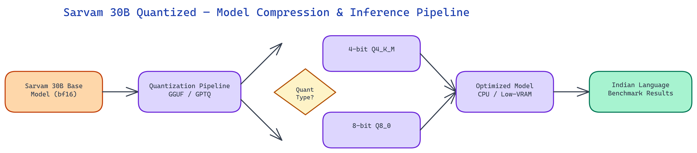

# Sarvam 30B Quantized: Running a Multilingual Indian Language Model on Consumer Hardware

[](https://huggingface.co/daksh-neo/sarvam-30b-quantized)



## The Problem

> Sarvam 30B is one of the most capable multilingual models for Indian languages — covering Hindi, Bengali, Telugu, Tamil, Marathi, Kannada, Malayalam, Gujarati, Punjabi, Odia, and Urdu with strong performance on regional language benchmarks. But a 30-billion-parameter model in full BF16 precision requires roughly 60GB of VRAM to run, which puts it out of reach for individual researchers, small teams, and the edge deployments where Indian language processing matters most. The model was accessible but not practically deployable.

NEO built a quantized version of Sarvam 30B that brings the model down to sizes that run on consumer GPUs, CPUs, and edge hardware — making serious Indian language AI accessible outside of datacenter infrastructure.

## The Quantization Approach

The release includes both GGUF and GPTQ quantized versions, targeting different deployment scenarios.

**GGUF quantization** (via llama.cpp) produces versions optimized for CPU inference and hybrid CPU/GPU inference. GGUF files can be loaded with partial GPU offloading — putting as many model layers as possible on whatever GPU memory is available and running the rest on CPU. This hybrid mode makes the model usable on machines with 8GB or 16GB of VRAM, offloading layers to CPU/RAM for the remainder. Pure CPU inference is also supported for environments with no GPU at all, at reduced throughput.

The GGUF release includes multiple quantization levels:
- **Q4_K_M**: 4-bit quantization with mixed precision in key layers. Approximately 16GB total size, runnable entirely on a single 24GB GPU or in hybrid mode on smaller cards. This is the recommended configuration for most use cases — the quality-to-size tradeoff is well-calibrated.
- **Q5_K_M**: 5-bit quantization. Approximately 20GB. Slightly better quality on complex multilingual tasks, particularly code-switching scenarios where the model needs to handle multiple scripts in the same output.
- **Q8_0**: 8-bit quantization. Approximately 30GB. Near-lossless quality with roughly 2x memory reduction. Suitable for applications where accuracy is paramount and 30GB of VRAM or RAM is available.
- **Q2_K**: Aggressive 2-bit quantization. Approximately 10GB. Significant quality degradation on complex tasks but usable for simpler classification and extraction tasks where the memory constraint is severe.

**GPTQ quantization** produces versions optimized for GPU inference with the AutoGPTQ library. The 4-bit GPTQ version uses approximately 18GB of VRAM, making it runnable on a single A10 or RTX 4090 with some overhead. GPTQ generally outperforms GGUF on pure GPU inference in terms of throughput, making it the better choice for serving applications where you have a compatible GPU and want to maximize tokens per second.

## Evaluating Quality on Indian Language Benchmarks

Quantization always trades some quality for memory efficiency. The key question is how much quality is lost, and on which tasks.

The evaluation suite covers the major Indian language benchmarks: IndicGLUE for cross-lingual understanding, Indic-Gen for generative quality across Indian languages, Flores-200 translation pairs for the covered languages, and a set of code-switching evaluations specific to how Indian speakers naturally mix languages in informal text.

The Q4_K_M GGUF and 4-bit GPTQ versions both achieve over 95% of the original model's scores on the core IndicGLUE tasks. The quality degradation is concentrated in the most difficult tasks: long-form generation in less-resourced Indic languages (Odia, Punjabi) shows the most measurable degradation, while high-resource languages like Hindi and Bengali show minimal quality loss even at aggressive quantization levels.

Code-switching evaluation — where the model needs to produce outputs that mix Hindi and English naturally, or handle Tamil queries that include English technical terms — shows slightly higher degradation at Q4 levels. The Q5_K_M version largely recovers this quality at a modest memory cost, and is recommended for conversational applications where code-switching is common.

The Q2_K version shows meaningful degradation across all tasks and is not recommended for general use, but it achieves a 6x memory reduction from the original model and can be useful for rapid prototyping or deployment contexts where a very small footprint is the primary constraint.

## Deployment Configurations

**Single GPU deployment**: The Q4_K_M GGUF runs entirely on a 24GB GPU (RTX 3090, RTX 4090, A5000). Load with llama.cpp or Ollama pointing at the GGUF file. Inference speed is approximately 15-25 tokens per second depending on GPU, which is suitable for interactive use.

**Consumer laptop (hybrid)**: On a machine with an 8GB laptop GPU and 32GB RAM, the Q4_K_M GGUF can offload roughly 20 layers to the GPU and run the rest on CPU. This hybrid configuration achieves 3-6 tokens per second — slow for interactive chat but useful for batch processing tasks.

**CPU-only server**: The Q4_K_M GGUF on a machine with 32GB RAM and a modern multi-core CPU achieves approximately 1-3 tokens per second. Suitable for offline batch processing of documents where latency is not a concern.

**Serving endpoint**: The GPTQ version with vLLM or TGI achieves 40-80 tokens per second on an A10G, making it viable for moderate-traffic production deployments. At this throughput, a single A10G instance can handle several concurrent users comfortably.

## Practical Applications

The quantized Sarvam 30B opens up deployment scenarios that weren't practical with the original model size.

**Regional content moderation**: Platforms with significant Indian language content need moderation that understands regional languages, slang, code-switching, and cultural context. A model that runs economically at inference scale in a production serving setup makes this feasible.

**Document processing**: Legal, financial, and government documents in regional Indian languages require accurate extraction and summarization. Batch processing with a CPU or hybrid deployment is economically practical with the quantized model.

**Edge and offline applications**: Healthcare workers and government services in areas with limited connectivity need offline NLP capabilities for regional languages. The CPU-only GGUF deployment makes this possible on standard laptops without any cloud dependency.

**Research access**: Individual researchers studying Indian languages, computational linguistics, or multilingual AI need to run experiments without datacenter budgets. The Q4_K_M version on a consumer GPU makes serious experimentation accessible.

## Using the Quantized Model

The model is hosted on HuggingFace and loadable via standard tooling. With Ollama: create a Modelfile pointing at the GGUF and run `ollama create sarvam-30b-q4 -f Modelfile`. With llama.cpp: `./llama-cli -m sarvam-30b-q4_k_m.gguf -p "your prompt"`. With Python and the llama-cpp-python library, the standard Llama class loads GGUF files directly.

The GPTQ version loads via Transformers with AutoGPTQ: standard `AutoModelForCausalLM.from_pretrained` with `device_map="auto"` handles layer distribution automatically.

## How to Build This with NEO

Open NEO in VS Code or Cursor and describe what you want to build. A good starting prompt for this project:

> "Quantize the Sarvam 30B multilingual Indian language model into GGUF and GPTQ formats targeting consumer hardware. Produce Q4_K_M, Q5_K_M, Q8_0, and Q2_K GGUF variants using llama.cpp, and a 4-bit GPTQ variant using AutoGPTQ. Include a benchmark script that evaluates each variant against IndicGLUE and Flores-200 translation pairs for Hindi, Bengali, Tamil, and Telugu, and reports accuracy retention versus the BF16 baseline."

<a href="https://heyneo.so/dashboard?section=new-chat&prompt=Quantize%20the%20Sarvam%2030B%20multilingual%20Indian%20language%20model%20into%20GGUF%20and%20GPTQ%20formats%20targeting%20consumer%20hardware.%20Produce%20Q4_K_M%2C%20Q5_K_M%2C%20Q8_0%2C%20and%20Q2_K%20GGUF%20variants%20using%20llama.cpp%2C%20and%20a%204-bit%20GPTQ%20variant%20using%20AutoGPTQ.%20Include%20a%20benchmark%20script%20that%20evaluates%20each%20variant%20against%20IndicGLUE%20and%20Flores-200%20translation%20pairs%20for%20Hindi%2C%20Bengali%2C%20Tamil%2C%20and%20Telugu%2C%20and%20reports%20accuracy%20retention%20versus%20the%20BF16%20baseline." style="display:inline-block;background:#1e40af;color:#ffffff;padding:10px 22px;border-radius:6px;text-decoration:none;font-weight:600;font-size:14px;">Build with NEO →</a>

NEO generates the quantization scripts, evaluation harness, and HuggingFace upload configuration. From there you iterate — ask it to add hybrid CPU/GPU layer offloading for machines with 8 GB VRAM, add an Ollama Modelfile generator for one-command local deployment, or add code-switching evaluation using mixed Hindi-English prompts.

To download and run the finished model:

```bash
pip install huggingface_hub llama-cpp-python
huggingface-cli download daksh-neo/sarvam-30b-quantized \
  --include "sarvam-30b-q4_k_m.gguf" --local-dir ./model
```

Run inference with llama.cpp (build from https://github.com/ggml-org/llama.cpp):

```bash
./llama-cli -m ./model/sarvam-30b-q4_k_m.gguf \
  -p "हिंदी में भारत की राजधानी क्या है?" \
  -n 256 --ctx-size 2048
```

The Q4_K_M GGUF runs entirely on a 24 GB GPU at 15-25 tokens per second, and in hybrid CPU/GPU mode on 8 GB VRAM machines at 3-6 tokens per second — making serious Indian language AI accessible without datacenter hardware.

NEO built a quantized Sarvam 30B so that serious Indian language model capabilities are deployable beyond datacenter infrastructure, bringing multilingual AI accessibility to the hardware that most of the world actually has. See what else NEO ships at [heyneo.so](https://heyneo.so/).

---

## Try NEO in Your IDE

Install the NEO extension to bring AI-powered development directly into your workflow:

- **VS Code**: [NEO in VS Code](https://marketplace.visualstudio.com/items?itemName=NeoResearchInc.heyneo)
- **Cursor**: <a href="cursor://extension/NeoResearchInc.heyneo" style="color:#0066FF;font-weight:bold;">Install NEO for Cursor →</a>

---
