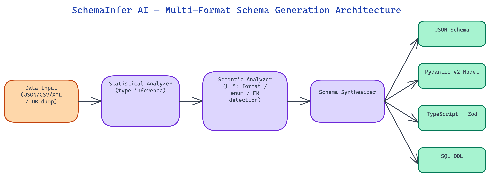

# SchemaInfer AI: From Raw Data to Production Schemas in Seconds

[](https://github.com/dakshjain-1616/schemainfer-ai)



## The Problem

> Every data engineering project starts with the same manual tax: someone has to look at the raw data and write the schema by hand. For a JSON blob with 50 fields, that means inferring types, identifying which fields are nullable, spotting enum-like fields that should be constrained, and reverse-engineering relationships between nested objects. Done carefully, it takes hours. Done quickly, it produces schemas that miss edge cases and cause silent data quality failures downstream.

NEO built SchemaInfer AI, an AI-powered schema inference tool that analyzes JSON, CSV, XML, or database dumps and generates comprehensive, production-ready schemas automatically. The tool infers types, constraints, nullable fields, enum values, and cross-field relationships. It outputs JSON Schema, Pydantic models, TypeScript interfaces, or SQL DDL — whichever format your stack needs.

## The Inference Pipeline

SchemaInfer AI's inference pipeline runs in three stages: statistical analysis, semantic analysis, and schema synthesis. The separation matters because statistical analysis alone misses semantic patterns, while pure LLM-based analysis without statistics produces schemas that don't accurately reflect the actual data distribution.

**Statistical Analysis** scans the full dataset and computes, per field: cardinality, null rate, min/max (for numerics), min/max length (for strings), unique value distribution (to detect enums), pattern distributions (to detect formats like ISO dates, UUIDs, emails, phone numbers), and correlation coefficients between numeric fields. This produces a rich statistical profile that grounds all subsequent inference in the actual data rather than in assumptions.

**Semantic Analysis** feeds the statistical profile — not the raw data — into an LLM alongside sample field names and values. The LLM identifies semantic patterns that statistics alone cannot capture: field names that suggest domain-specific semantics (a field named `user_id` that contains integers is almost certainly a foreign key reference), groups of fields that appear to represent the same entity concept, and string fields whose content suggests specific validation rules.

**Schema Synthesis** combines the statistical and semantic analyses into a final schema, resolving conflicts between the two signals using a configurable priority system. Statistical evidence overrides semantic guesses when the data is unambiguous; semantic reasoning fills in where statistics are insufficient (for example, a field with 100% cardinality across a small sample is statistically indistinguishable from a free-text field, but semantic analysis of the field name and value patterns can recognize it as a UUID).

## Type Inference Beyond the Obvious

Naive type inference is straightforward: scan a column, find all values are integers, mark it as integer type. SchemaInfer AI goes substantially further.

**Numeric subtype detection** distinguishes integers from floats, signed from unsigned, and identifies bit-width requirements. A field containing only values between 0 and 255 gets typed as `uint8` in contexts where that matters (SQL, numpy-facing schemas) rather than the lazy `integer`. A field containing precise monetary values is flagged as a candidate for `decimal` type rather than `float`, with a warning that floating-point representation is unsuitable for financial data.

**String format detection** identifies 23 common string formats — ISO 8601 dates and datetimes, UUIDs v1/v3/v4/v5, email addresses, URLs, IPv4 and IPv6 addresses, phone numbers in major formats, credit card number patterns, hex color codes, and more. Detected formats are expressed as `format` constraints in JSON Schema, `Field(pattern=...)` validators in Pydantic, and appropriate column types in SQL DDL.

**Enum inference** applies a heuristic combining cardinality ratio (unique values / total values), absolute cardinality ceiling, and semantic field name analysis. A string field with 8 unique values across 10,000 rows and a field name containing "status," "type," or "category" is a strong enum candidate. The inferred enum values are included in the schema as allowed values, with a confidence score so users can choose whether to enforce them strictly or treat them as documentation.

**Nullable vs. optional vs. required** are three distinct concepts that naive schema inference conflates. A field that is absent from some records in a JSON dataset is `optional` (may be omitted). A field that is present but contains `null` is `nullable` (present but null). A field that is always present and never null is `required`. SchemaInfer AI tracks all three states and represents them correctly in each output format.

## Relationship and Constraint Inference

For structured datasets with multiple related entities — JSON with nested objects or arrays, CSV tables from a relational database export, SQL dumps — SchemaInfer AI infers cross-entity relationships.

**Foreign key detection** looks for integer or UUID fields whose name contains the name of another detected entity type (e.g., `product_id` in an `orders` table when a `products` table is also present) and whose value distribution is a subset of the candidate primary key's values. Detected foreign key relationships are expressed as `$ref` links in JSON Schema, `ForeignKey` constraints in SQL DDL, and relationship fields in Pydantic.

**Composite key detection** identifies combinations of fields that together uniquely identify each record when no single field does. This is expressed as a unique constraint in SQL DDL and documented in JSON Schema using `allOf` with uniqueness annotations.

**Value dependency detection** identifies fields whose valid values depend on another field's value — for example, a `state` field that only takes certain values when `country` is "US". These dependencies are expressed as conditional schemas using JSON Schema's `if/then/else` constructs.

## Output Formats

SchemaInfer AI generates schemas in four output formats, with format-specific optimizations for each.

**JSON Schema (Draft 2020-12)** is the most complete output, expressing all inferred constraints including format validations, conditional dependencies, and cross-reference relationships. The output is self-contained and valid against the JSON Schema meta-schema.

**Pydantic v2 models** include appropriate Field validators for all detected constraints, Optional type hints for nullable fields, model Config settings for strict mode where appropriate, and validator methods for cross-field constraints that cannot be expressed as Field parameters.

**TypeScript interfaces** use discriminated union types for enum fields, optional property markers for nullable/optional fields, and nested interface definitions for structured sub-objects. A separate TypeScript module with Zod schemas is generated alongside the interfaces for runtime validation.

**SQL DDL** generates CREATE TABLE statements with appropriate column types for the target database dialect (PostgreSQL, MySQL, SQLite, or BigQuery are currently supported), NOT NULL constraints, CHECK constraints for enum fields, PRIMARY KEY and FOREIGN KEY declarations, and index suggestions for fields identified as likely query predicates.

## How to Build This

Clone the repo and install dependencies:

```bash
git clone https://github.com/dakshjain-1616/schemainfer-ai
cd schemainfer-ai
pip install -r requirements.txt
```

Set your API key for the LLM backend. The tool uses OpenAI by default:

```bash
export OPENAI_API_KEY=sk-...
```

Run inference against a JSON file:

```bash
python infer.py --input ./samples/orders.json --format json-schema
```

Supported `--format` values are `json-schema`, `pydantic`, `typescript`, and `sql`. The `--dialect` flag controls SQL output when using `--format sql`:

```bash
python infer.py --input ./samples/transactions.csv --format sql --dialect postgresql
```

For a database dump:

```bash
python infer.py --input ./samples/export.sql --format pydantic
```

The tool prints the inferred schema to stdout. Redirect to a file to save it:

```bash
python infer.py --input ./samples/products.json --format typescript > schema.ts
```

The output includes inferred types, nullable markers, detected enum values with confidence scores, and constraint annotations. For JSON input with multiple related collections, the tool also emits detected foreign key relationships as `$ref` links in JSON Schema or `ForeignKey` declarations in SQL DDL. Processing a 10,000-row CSV file typically takes 5 to 15 seconds depending on field count and LLM response time.

NEO built a schema inference tool that turns the first-hour data engineering tax into a ten-second automated step. See what else NEO ships at [heyneo.so](https://heyneo.so/).

---

## Try NEO in Your IDE

Install the NEO extension to bring AI-powered development directly into your workflow:

- **VS Code**: [NEO in VS Code](https://marketplace.visualstudio.com/items?itemName=NeoResearchInc.heyneo)
- **Cursor**: <a href="cursor://extension/NeoResearchInc.heyneo" style="color:#0066FF;font-weight:bold;">Install NEO for Cursor →</a>

---
