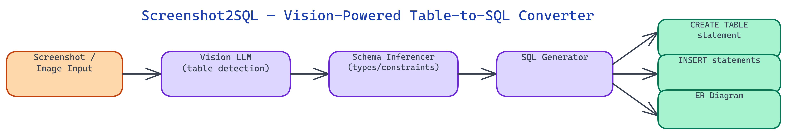

# Screenshot2SQL: From Visual Table Data to SQL Schema in One Command

## The Problem

> Data engineers regularly encounter the same frustrating situation: a stakeholder shares a screenshot of a spreadsheet, a database table from a legacy system, or a web app data grid — and asks you to load the data into your database. The data exists visually but not digitally. Manually transcribing column names, inferring types, and writing CREATE TABLE statements is tedious, error-prone, and completely automatable.

NEO built Screenshot2SQL to make this a one-command operation. Pass a screenshot, get back a complete SQL schema with INSERT statements, ready to execute.

## Vision LLM Parsing

The core of Screenshot2SQL is a vision LLM pipeline that understands tabular data in images. The tool sends the screenshot to a vision model (GPT-4o Vision, Claude 3.5 Sonnet, or Gemini 1.5 Pro, depending on configuration) with a structured prompt that asks it to identify table boundaries, extract column headers, enumerate all visible rows, and reason about data types from the values it sees.

The vision prompt is carefully engineered for tabular extraction. It instructs the model to preserve exact column naming (including spaces, capitalization, and special characters), identify whether a row is a header or data row, handle merged cells by inferring the appropriate column for each cell's value, and flag any cells where the value is ambiguous or illegible.

The model's response is structured as a JSON object: a list of column descriptors (name, apparent type, sample values, nullability inference) and a list of row objects mapping column names to cell values. This structured output feeds directly into the schema inference stage without any unstructured text parsing.

## Schema Inference

Given the extracted column descriptors and data rows, Screenshot2SQL's schema inference engine determines the SQL type for each column.

The inference logic applies a hierarchy of type tests. Integer detection checks whether all non-null values in the column parse as integers within a configurable range. Float detection catches numeric columns with decimal points. Date and datetime detection uses a library of format patterns covering ISO 8601, US date formats, European date formats, Excel serial date numbers, and several dozen common representations. Boolean detection catches columns whose values are exclusively from a set like `{true, false}`, `{yes, no}`, `{1, 0}`, `{Y, N}`.

Columns that do not match any specialized type fall back to `VARCHAR(n)` where n is determined by the maximum observed string length with a configurable headroom multiplier (default 1.5x to allow for values not visible in the screenshot).

Constraint inference runs as a second pass. Primary key detection looks for columns named `id`, `*_id`, or columns with all unique values and no nulls — these get `PRIMARY KEY` with `NOT NULL`. Foreign key suggestions are generated for columns that appear to reference another table based on naming patterns like `user_id`, `product_id`, or `order_id`. These are emitted as comments rather than constraints, since the referenced table may not exist in the current session.

Unique constraint inference detects non-primary columns with all distinct values. Not-null inference marks columns with no empty cells as `NOT NULL`.

## SQL Output Formats

Screenshot2SQL generates output in two forms: a `CREATE TABLE` statement and a batch of `INSERT` statements.

The `CREATE TABLE` statement includes the inferred column names with properly escaped identifiers (backtick-quoted for MySQL, double-quote-quoted for PostgreSQL and SQLite), data types with appropriate lengths and precision, and all inferred constraints. The dialect is configurable via a `--dialect` flag supporting MySQL, PostgreSQL, SQLite, and SQL Server.

The `INSERT` statements are generated as a single multi-row insert for efficiency — `INSERT INTO table_name (col1, col2, ...) VALUES (row1), (row2), ...` — with values properly escaped for the target dialect. String values are single-quoted with internal quotes escaped. NULL values are emitted as SQL NULL rather than empty strings. Date values are formatted in the ISO 8601 format appropriate for the target dialect.

An optional `--upsert` flag generates `INSERT ... ON CONFLICT DO UPDATE` (PostgreSQL) or `INSERT ... ON DUPLICATE KEY UPDATE` (MySQL) syntax instead of plain inserts, which is useful when loading data into a table that may already have some of the rows.

## Handling Complex Layouts

Real-world screenshots are messier than clean spreadsheet exports. Screenshot2SQL handles several common complications.

**Multi-table screenshots**: Some screenshots contain multiple distinct tables or data grids. The tool detects visual boundaries between tables and generates a separate SQL output block for each, naming them `table_1`, `table_2`, and so on with a suggestion to rename based on visible headers or titles.

**Rotated or skewed screenshots**: Mobile screenshots, scanned documents, and photos of screens often have slight rotation. Screenshot2SQL applies a pre-processing step that detects and corrects tilt before passing the image to the vision model.

**Partial columns**: Wide tables that extend beyond the screenshot edge are handled by noting the truncation in a comment and omitting values for the cut-off columns rather than generating corrupt partial data.

**Numeric formatting**: Numbers formatted with thousands separators (1,000,000) or currency symbols ($42.50) are correctly parsed to their numeric values rather than treated as strings.

## Workflow Integration

Screenshot2SQL is designed to fit into existing data engineering workflows. The CLI accepts a file path or a URL pointing to an image. Standard output is the SQL text, which can be piped directly into `psql`, `mysql`, or `sqlite3`. A `--output` flag writes to a file instead. A `--dry-run` flag prints the inferred schema as a human-readable table without generating SQL, useful for reviewing the type inference before committing.

A Python library interface is also available for integration into data pipeline scripts. Pass an image path and get back a structured object containing the table name, column definitions, and rows — from which you can generate any output format you need.

NEO built Screenshot2SQL to eliminate one of the most tedious recurring tasks in data engineering — taking visual table data and turning it into executable SQL with zero manual transcription. See what else NEO ships at [heyneo.so](https://heyneo.so/).

---

## Try NEO in Your IDE

Install the NEO extension to bring AI-powered development directly into your workflow:

- **VS Code**: [NEO in VS Code](https://marketplace.visualstudio.com/items?itemName=NeoResearchInc.heyneo)
- **Cursor**: <a href="cursor://extension/NeoResearchInc.heyneo" style="color:#0066FF;font-weight:bold;">Install NEO for Cursor →</a>

---
