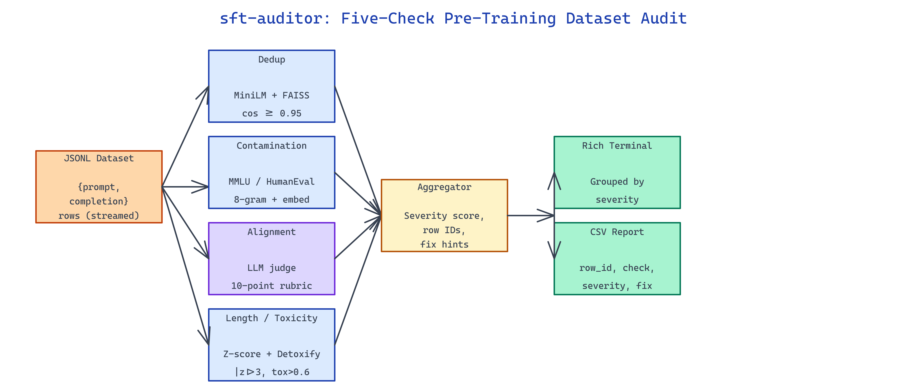

# sft-auditor: Find What's Wrong in Your Fine-Tuning Dataset Before You Train

[](https://github.com/dakshjain-1616/sft-auditor)



## The Problem

> Teams spend four-figure GPU bills fine-tuning on datasets with hidden duplicates, leaked MMLU questions, and system-prompt violations — then wonder why eval numbers look suspicious and deployed models refuse to follow instructions.

NEO built sft-auditor to catch all five failure modes in a single pre-training pass so bad data never reaches the optimizer.

## Five Checks in One Pass

**sft-auditor** runs five independent checks over a JSONL fine-tuning dataset with `{prompt, completion}` fields and produces a consolidated report. Each check outputs a severity score, affected row IDs, and an actionable fix recommendation.

```bash
python audit.py --input dataset.jsonl --output report.csv --checks all
```

The auditor streams the file so it scales to multi-million-row datasets without loading everything into memory; embedding computations are batched and cached on disk keyed by prompt hash.

## Duplicate Detection and Contamination Scans

The dedup check encodes every prompt with `sentence-transformers/all-MiniLM-L6-v2` and runs an approximate nearest-neighbor search (FAISS IndexFlatIP) with a cosine similarity threshold of `0.95`. Matches are grouped into duplicate clusters with a canonical row marked for retention — surfacing soft duplicates that `hash(prompt)` alone would miss.

Benchmark contamination runs two scans: **MMLU** contamination compares prompts against the full 15,908-question MMLU test set, and **HumanEval** contamination compares completions against the 164-problem reference implementations. Both use n-gram overlap (8-gram minimum) plus embedding similarity to catch paraphrased leaks.

| Check | Method | Threshold | Output |
|---|---|---|---|
| Duplicates | MiniLM + FAISS | cos ≥ 0.95 | Cluster groups |
| MMLU leak | 8-gram + embed | any match | Row + source Q |
| HumanEval leak | 8-gram + embed | any match | Row + source fn |
| Alignment | LLM judge | score < 6/10 | Row + rationale |
| Length anomaly | Z-score | \|z\| > 3 | Row + length |
| Toxicity | Detoxify | score > 0.6 | Row + labels |

## Alignment, Length, and Toxicity Signals

The alignment check prompts a judge LLM with both the expected system behavior and the `(prompt, completion)` pair, scoring how well the completion respects the system role on a 10-point rubric. Scores below 6 are flagged with the judge's rationale attached. Length anomalies surface completions that are absurdly short or long via a Z-score computed over the dataset's own length distribution. Toxicity uses the `Detoxify` multi-label classifier and flags any row exceeding `0.6` on any of its six categories.

Output is rendered via Rich in the terminal for interactive review and written to CSV for pipeline integration:

```bash
python audit.py \
  --input sft_dataset.jsonl \
  --checks dedup,mmlu,humaneval,alignment,length,toxicity \
  --output audit_report.csv \
  --toxicity-threshold 0.6
```

The terminal view groups findings by severity and shows a sampled row from each issue type; the CSV contains one row per finding with `{row_id, check, severity, details, fix}` so downstream pipelines can filter, patch, or block training automatically.

## How to Build This with NEO

Open NEO in VS Code or Cursor and describe what you want to build. A good starting prompt for this project:

> "Build a JSONL fine-tuning dataset auditor that runs five checks in a single streaming pass: semantic duplicate detection with MiniLM embeddings and FAISS, MMLU and HumanEval contamination scans using n-gram overlap plus embedding similarity, alignment scoring via an LLM judge with a 10-point rubric, length anomaly detection using Z-scores, and toxicity flagging with Detoxify. Render findings with Rich in the terminal and export to CSV."

<a href="https://heyneo.com/dashboard?section=new-chat&prompt=Build%20a%20JSONL%20fine-tuning%20dataset%20auditor%20that%20runs%20five%20checks%20in%20a%20single%20streaming%20pass%3A%20semantic%20duplicate%20detection%20with%20MiniLM%20embeddings%20and%20FAISS%2C%20MMLU%20and%20HumanEval%20contamination%20scans%20using%20n-gram%20overlap%20plus%20embedding%20similarity%2C%20alignment%20scoring%20via%20an%20LLM%20judge%20with%20a%2010-point%20rubric%2C%20length%20anomaly%20detection%20using%20Z-scores%2C%20and%20toxicity%20flagging%20with%20Detoxify.%20Render%20findings%20with%20Rich%20in%20the%20terminal%20and%20export%20to%20CSV." style="display:inline-block;background:#1e40af;color:#ffffff;padding:10px 22px;border-radius:6px;text-decoration:none;font-weight:600;font-size:14px;">Build with NEO →</a>

NEO generates the project structure and core implementation. From there you iterate — add custom benchmarks beyond MMLU, wire the output into a CI gate that blocks training on severity-high findings, or build an auto-fix mode that removes or rewrites problematic rows. Each request builds on what's already there.

To run the finished project:

```bash
git clone https://github.com/dakshjain-1616/sft-auditor
cd sft-auditor
pip install -r requirements.txt
python audit.py --input examples/sft_dataset.jsonl --output report.csv
```

Review the terminal summary for severity counts and open `report.csv` for the full per-row findings with fix recommendations.

NEO built a pre-training audit tool that catches dataset problems before they cost GPU hours, and produces a single consolidated report that ops teams can act on. See what else NEO ships at [heyneo.com](https://heyneo.com/).

---

## Try NEO in Your IDE

Install the NEO extension to bring AI-powered development directly into your workflow:

- **VS Code**: [NEO in VS Code](https://marketplace.visualstudio.com/items?itemName=NeoResearchInc.heyneo)
- **Cursor**: <a href="cursor://extension/NeoResearchInc.heyneo" style="color:#0066FF;font-weight:bold;">Install NEO for Cursor →</a>

---
