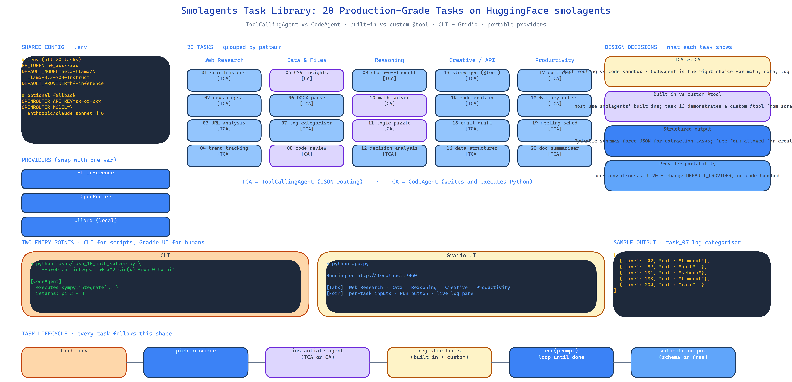

# Smolagents Task Library: 20 Production-Grade Agent Tasks on HuggingFace smolagents

[](https://github.com/dakshjain-1616/Smolagents-Task-Library)



## The Problem

> HuggingFace's smolagents is a genuinely good framework — tiny, tool-use-native, works against any hosted or local model. The docs show you a counter agent and a weather agent. Those are fine for understanding the primitives. They are not fine for understanding what a real task looks like when you actually want output someone can use. There is a gap between "here is how a ToolCallingAgent works" and "here is how to structure a log-categorisation task so the agent returns something your ops team can paste into a ticket".

NEO built the Smolagents Task Library to close that gap. Twenty tasks, each one a complete working example, each one demonstrating a specific pattern you are going to need when you build your own.

## Task Coverage

The 20 tasks cluster into five groups, chosen so that together they cover the design decisions you actually face:

**Web Research** — structured search reports, news digests, URL content analysis, trend tracking. Shows how to wire DuckDuckGo / Tavily / Serper as tools and how to force structured output when the agent wants to free-associate.

**Data & File Processing** — CSV analysis with AI insights, DOCX parsing, error log categorisation, code quality review. Shows the `CodeAgent` pattern where the agent writes and executes Python against the data in a sandbox.

**Reasoning** — chain-of-thought decomposition, mathematical problem-solving, logic puzzles, decision analysis. Shows when to use `CodeAgent` (it can actually execute the math) versus `ToolCallingAgent` (it can't).

**Creative & API Integration** — story generation, code explanation, email drafting, data structuring. The story generator is the canonical "how do I write a custom tool" example.

**Productivity** — quiz generation, fallacy detection in arguments, meeting scheduling, document summarisation. Shows structured output contracts end to end.

## ToolCallingAgent vs CodeAgent

smolagents ships two agent types and the difference matters more than the docs admit. `ToolCallingAgent` produces JSON that describes which tool to call with which arguments. `CodeAgent` produces Python source code that it then executes. For anything that requires actual computation — solving a math problem, filtering a CSV, parsing a log file — `CodeAgent` is always the right choice because it can run the code, see the output, and iterate. For anything that is routing — "call the search tool with this query, then call the summariser with the result" — `ToolCallingAgent` is lighter weight.

The library is explicit about which type each task uses and why. This is the documentation that the framework itself does not provide.

## Built-in vs Custom Tools

Most tasks use smolagents' built-in tools. The `story_generator` task is the counterexample — it defines a custom tool with `@tool` decoration, passes it to the agent, and shows the full loop from registration to invocation. When you eventually need to wire your own internal API in as a tool, this is the task to copy.

## Configuration Portability

Credentials live in `.env`:

```
HF_TOKEN=hf_xxx
DEFAULT_MODEL=meta-llama/Llama-3.3-70B-Instruct
DEFAULT_PROVIDER=hf-inference
OPENROUTER_API_KEY=sk-or-xxx  # optional fallback
```

Every task reads the same config. You swap provider once, all 20 tasks move with it. Local models via Ollama, HuggingFace Inference Endpoints, and OpenRouter are all drop-in.

## Two Entry Points

CLI mode for scripting:

```bash
python tasks/task_10_math_solver.py --problem "integral of x^2 sin(x) from 0 to pi"
```

Gradio UI for non-technical users:

```bash
python app.py
```

The Gradio interface gives each task its own input form so an analyst can run the log categoriser or the quiz generator without touching Python.

## How to Build This with NEO

Open NEO in VS Code or Cursor and describe what you want to build. A good starting prompt for this project:

> "Build a library of 20 production-ready agent tasks on HuggingFace smolagents. Cover web research (search reports, news digests, trend tracking), data processing (CSV analysis, DOCX parsing, log categorisation, code review), reasoning (chain-of-thought, math, logic puzzles, decision analysis), creative and API integration (story generation with a custom @tool, code explanation, email drafting, data structuring), and productivity (quiz generation, fallacy detection, meeting scheduling, document summarisation). For each task document whether it uses ToolCallingAgent or CodeAgent and why. Use .env for HF_TOKEN, DEFAULT_MODEL, DEFAULT_PROVIDER, OPENROUTER_API_KEY. Provide both CLI entry points and a Gradio web UI with per-task input forms."

<a href="https://heyneo.com/dashboard?section=new-chat&prompt=Build%20a%20library%20of%2020%20production-ready%20agent%20tasks%20on%20HuggingFace%20smolagents.%20Cover%20web%20research%2C%20data%20processing%2C%20reasoning%2C%20creative%20and%20API%20integration%2C%20and%20productivity.%20For%20each%20task%20document%20whether%20it%20uses%20ToolCallingAgent%20or%20CodeAgent%20and%20why.%20Use%20.env%20for%20HF_TOKEN%2C%20DEFAULT_MODEL%2C%20DEFAULT_PROVIDER%2C%20OPENROUTER_API_KEY.%20Provide%20both%20CLI%20entry%20points%20and%20a%20Gradio%20web%20UI%20with%20per-task%20input%20forms." style="display:inline-block;background:#1e40af;color:#ffffff;padding:10px 22px;border-radius:6px;text-decoration:none;font-weight:600;font-size:14px;">Build with NEO →</a>

NEO scaffolds the task files, the shared config loader, and the Gradio app. From there you iterate — add a 21st task for your specific use case, wire in an internal API as a custom tool, or extend the CLI with batch mode.

NEO built 20 complete, copyable smolagents tasks that cover the real-world design decisions the framework docs skip over. See what else NEO ships at [heyneo.com](https://heyneo.com/).

---

## Try NEO in Your IDE

Install the NEO extension to bring AI-powered development directly into your workflow:

- **VS Code**: [NEO in VS Code](https://marketplace.visualstudio.com/items?itemName=NeoResearchInc.heyneo)
- **Cursor**: <a href="cursor://extension/NeoResearchInc.heyneo" style="color:#0066FF;font-weight:bold;">Install NEO for Cursor →</a>

---
