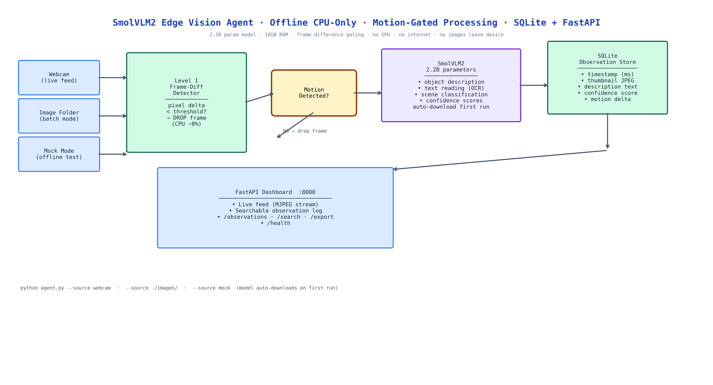

# SmolVLM2 Edge Vision Agent: Offline Camera Monitoring on CPU-Only Hardware

[](https://github.com/dakshjain-1616/SmolVLM2-Edge-Vision-Agent)



## The Problem

> Camera-based monitoring usually means cloud APIs, GPU hardware, or expensive edge devices. You send frames to a vision API and pay per call. Or you stand up a server with a GPU and maintain it. For home security, document scanning, or offline monitoring use cases, neither option is right — you want something that runs locally, works without internet, fits on a machine you already own, and doesn't send images anywhere.

NEO built SmolVLM2 Edge Vision Agent to bring capable vision monitoring to CPU-only hardware: a 16GB RAM laptop, a Raspberry Pi 5, a mini PC. No GPU required, no cloud required, no code leaves the device.

## The Motion-Gated Processing Model

The agent's efficiency comes from a two-level gating model:

**Level 1 — Frame difference detection.** Every frame is compared to the previous one. If the pixel difference is below the motion threshold, the frame is dropped. No vision model runs. This keeps CPU usage near zero during quiet periods.

**Level 2 — VLM analysis on motion.** When the frame-difference detector triggers, the frame is sent to SmolVLM2 (2.2B parameters, auto-downloaded on first run). The model generates a structured description: what it sees, where, confidence score. This runs on CPU, taking 2–8 seconds per frame depending on hardware.

Result: the vision model runs only when something changes, so a monitoring session that records motion 5% of the time uses 5% of the CPU the naive approach would require.

## What SmolVLM2 Provides

SmolVLM2 is a 2.2B-parameter vision-language model designed for edge deployment. At that size it auto-downloads in under two minutes on a typical connection and fits in 8GB RAM at INT8 quantization. On each triggered frame it provides:

- **Object description** — what objects are present and their approximate locations
- **Text reading** — OCR capability for documents, signs, screens in frame
- **Scene classification** — indoor/outdoor, lighting conditions, activity type
- **Confidence scores** — per-observation confidence for downstream filtering

## SQLite Observation Store

Every observation is persisted to SQLite with:
- Timestamp (millisecond precision)
- Thumbnail (resized frame JPEG)
- Full description text
- Confidence score
- Motion delta score (how much changed)
- Source (webcam index, folder path, or mock)

The store supports full-text search across descriptions, time-range queries, and confidence filtering. You can ask "show me all observations mentioning a person between 2am and 4am" without leaving the local machine.

## FastAPI Web Dashboard

The agent runs a local FastAPI server with:
- **Live feed** — real-time MJPEG stream from the camera
- **Observation log** — searchable, paginated table of all recorded observations
- **API endpoints** — `/observations`, `/search`, `/export` for programmatic access
- `/health` for monitoring the agent's status

Everything is accessible from your local network browser. No cloud dashboard, no account required.

## How to Build This with NEO

Open NEO in VS Code or Cursor and describe what you want to build. A good starting prompt for this project:

> "Build an offline vision monitoring agent that uses SmolVLM2 (2.2B parameters) on CPU-only hardware. Implement two-level processing: first a frame-difference motion detector that only triggers VLM analysis on scene changes, then SmolVLM2 for object description, text reading, and scene classification. Persist observations to SQLite with timestamps, thumbnails, descriptions, and confidence scores. Support webcams, image folder input, and mock mode. Run a FastAPI server with live feed, searchable observation log, and export endpoint. Target 16GB RAM machines with no GPU. Auto-download the model on first run."

<a href="https://heyneo.com/dashboard?section=new-chat&prompt=Build%20an%20offline%20vision%20monitoring%20agent%20using%20SmolVLM2%20on%20CPU-only%20hardware.%20Implement%20frame-difference%20motion%20detection%20that%20only%20triggers%20VLM%20analysis%20on%20scene%20changes.%20Persist%20observations%20to%20SQLite%20with%20timestamps%2C%20thumbnails%2C%20descriptions%2C%20and%20confidence%20scores.%20Support%20webcams%2C%20image%20folders%2C%20and%20mock%20mode.%20Run%20FastAPI%20server%20with%20live%20feed%20and%20searchable%20observation%20log." style="display:inline-block;background:#1e40af;color:#ffffff;padding:10px 22px;border-radius:6px;text-decoration:none;font-weight:600;font-size:14px;">Build with NEO →</a>

NEO scaffolds the frame-difference motion gate, the SmolVLM2 inference wrapper, the SQLite observation store, the FastAPI dashboard, and the mock mode. From there you iterate — add a notification system that triggers an alert when specific objects are detected, add multi-camera support with separate observation streams per source, or extend the SQLite schema to store bounding box coordinates for detected objects.

To run the finished project:

```bash
git clone https://github.com/dakshjain-1616/SmolVLM2-Edge-Vision-Agent
cd SmolVLM2-Edge-Vision-Agent
pip install -r requirements.txt

python agent.py --source webcam          # live camera monitoring
python agent.py --source ./images/       # process image folder
python agent.py --source mock            # offline testing
```

The model auto-downloads on first run. The dashboard is at `http://localhost:8000`.

NEO built an edge vision agent that brings capable offline monitoring to CPU-only hardware using SmolVLM2's motion-gated processing, SQLite observation store, and FastAPI dashboard — no GPU, no cloud, no images leave the device. See what else NEO ships at [heyneo.com](https://heyneo.com/).

---

## Try NEO in Your IDE

Install the NEO extension to bring AI-powered development directly into your workflow:

- **VS Code**: [NEO in VS Code](https://marketplace.visualstudio.com/items?itemName=NeoResearchInc.heyneo)
- **Cursor**: <a href="cursor://extension/NeoResearchInc.heyneo" style="color:#0066FF;font-weight:bold;">Install NEO for Cursor →</a>

---
