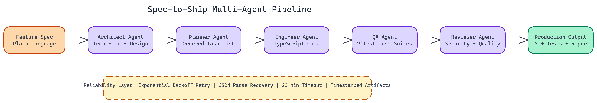

# Spec to Ship: A Multi-Agent Pipeline That Turns Feature Ideas into Production Code

<a href="https://github.com/dakshjain-1616/Spec-To-Ship" target="_blank" style="display:flex;align-items:center;gap:14px;padding:16px 20px;border:1px solid #30363d;border-radius:10px;background:#0d1117;color:#e6edf3;text-decoration:none;font-family:-apple-system,BlinkMacSystemFont,'Segoe UI',sans-serif;margin:20px 0;width:fit-content;max-width:480px;transition:border-color 0.2s;">
  <svg width="22" height="22" viewBox="0 0 16 16" fill="#e6edf3" xmlns="http://www.w3.org/2000/svg"><path d="M8 0C3.58 0 0 3.58 0 8c0 3.54 2.29 6.53 5.47 7.59.4.07.55-.17.55-.38 0-.19-.01-.82-.01-1.49-2.01.37-2.53-.49-2.69-.94-.09-.23-.48-.94-.82-1.13-.28-.15-.68-.52-.01-.53.63-.01 1.08.58 1.23.82.72 1.21 1.87.87 2.33.66.07-.52.28-.87.51-1.07-1.78-.2-3.64-.89-3.64-3.95 0-.87.31-1.59.82-2.15-.08-.2-.36-1.02.08-2.12 0 0 .67-.21 2.2.82.64-.18 1.32-.27 2-.27.68 0 1.36.09 2 .27 1.53-1.04 2.2-.82 2.2-.82.44 1.1.16 1.92.08 2.12.51.56.82 1.27.82 2.15 0 3.07-1.87 3.75-3.65 3.95.29.25.54.73.54 1.48 0 1.07-.01 1.93-.01 2.2 0 .21.15.46.55.38A8.013 8.013 0 0016 8c0-4.42-3.58-8-8-8z"/></svg>
  

    
dakshjain-1616/Spec-To-Ship

    
View on GitHub →

  

</a>

## The Problem

> The gap between "we have a spec" and "we have working code" is where most engineering time disappears. Writing the spec is fast. Implementing it, writing tests for it, and reviewing it for security issues takes most of the sprint. For well-defined features with clear acceptance criteria, most of that work is mechanical — translating specs into code following established patterns — yet it consumes senior engineering time that could be spent on harder problems.

NEO autonomously built a system to close that gap. Spec-to-Ship is a multi-agent pipeline that takes a feature idea as input and outputs tested, production-ready TypeScript code. No manual implementation steps. No separate test-writing pass.

## Five Agents, One Pipeline

The pipeline coordinates five specialized agents in sequence. Each agent has a defined role and hands its output directly to the next.

**The Architect Agent** receives the raw feature description and produces a comprehensive technical specification. It determines the right approach, defines the data structures, maps out the implementation strategy, and documents the acceptance criteria. This output drives everything downstream.

**The Planner Agent** takes the spec and converts it into a dependency-ordered task list. Order matters here. Tasks that depend on each other need to be sequenced correctly, and tasks that are independent can be parallelized. The planner handles this analysis so the engineer agent doesn't have to.

**The Engineer Agent** implements the code. Full TypeScript with complete type safety. It works through the task list produced by the planner, generating the actual implementation files. This is the primary output of the pipeline.

**The QA Agent** writes Vitest test suites against the implementation. It tests to the acceptance criteria defined in the spec, not just to the code. That distinction matters: code coverage isn't the same as spec compliance.

**The Reviewer Agent** conducts the final audit. Security checks, performance review, code quality assessment. It's the last gate before the output is considered done.

## Why Agent Specialization Works

You could attempt this with a single LLM prompt. It won't work well. A single prompt trying to simultaneously architect, plan, implement, test, and review produces mediocre results across all dimensions because the model can't hold all those concerns in focus at once.

Specialization changes this. Each agent's context is tuned for its task. The architect has the feature description. The engineer has the spec. The QA agent has both the spec and the implementation. Each agent receives exactly what it needs and nothing more.

The result is that each stage produces noticeably better output than a single-prompt approach. The architecture is more coherent. The implementation matches the spec. The tests actually test what they should.

## Reliability Under Real Conditions

Production systems fail in predictable ways. Rate limits hit. JSON parsing fails on unexpected model output. Long-running jobs time out. NEO built explicit handling for all of these.

Exponential backoff retry logic handles rate limits automatically. The system waits, then retries with increasing delays to avoid hammering the API. JSON parsing failures trigger automatic recovery, re-prompting the model with clearer output constraints. The entire pipeline has a **20-minute timeout limit** so runaway jobs don't accumulate.

Every run produces a timestamped output directory with all artifacts and logs preserved. If something goes wrong, you can inspect exactly what each agent produced and where the failure occurred.

## Running It

The prerequisites are minimal: Node.js 20 or higher, and an OpenRouter API key in a `.env` file. Install dependencies with `npm install`.

Two interfaces are available. The interactive CLI (`npm run start`) walks you through providing the feature description and runs the pipeline. The web dashboard (`npm run dev`) provides a browser-based interface at `localhost:3000` with a more visual representation of pipeline progress.

Both interfaces produce the same output: TypeScript implementation files, test suites, and a reviewer report, organized in a timestamped directory.

## Where This Fits in Real Engineering

This isn't a replacement for senior engineers. The pipeline excels at the implementation and testing phases of well-defined features. Features with clear acceptance criteria and bounded scope are where it performs best.

It's particularly useful for:

- **Rapid prototyping** where you want to move from idea to working code quickly
- **Boilerplate-heavy features** where the implementation is predictable but tedious
- **Test generation** on existing codebases where test coverage is low
- **Junior developer support** where the pipeline can produce a first implementation to review and refine

For ambiguous problems or features requiring deep domain knowledge, human judgment remains essential for the architectural decisions. But once those decisions are made, Spec-to-Ship can handle the downstream execution.

## The Broader Point

Software teams spend enormous amounts of time on implementation work that is largely mechanical: translating specs into code that follows established patterns, writing tests that verify spec compliance, reviewing for common issues. These tasks are high-volume and time-consuming without being intellectually demanding.

Multi-agent pipelines like this one are a better fit for mechanical implementation work than for open-ended architectural thinking. That's not a limitation. It's a design choice. Knowing what to automate and what to keep human is most of the engineering judgment here.

## Production ML Engineering at Scale

NEO built a spec-to-ship multi-agent pipeline where a plain-language feature description automatically becomes typed TypeScript code, Vitest test suites, and a security audit—produced by five specialized agents working in sequence. See what else NEO ships at [heyneo.so](https://heyneo.so/).

---

## Try NEO in Your IDE

Install the NEO extension to bring AI-powered development directly into your workflow:

- **VS Code**: [NEO in VS Code](https://marketplace.visualstudio.com/items?itemName=NeoResearchInc.heyneo)
- **Cursor**: [**Install NEO for Cursor →**](cursor:extension/NeoResearchInc.heyneo)

---
