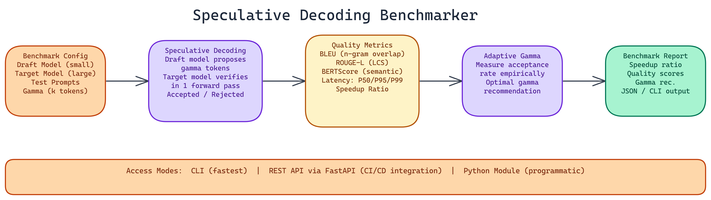

# Speculative Decoding Benchmarker: Measuring Real Inference Speedups with BLEU, ROUGE, and BERTScore

[](https://github.com/dakshjain-1616/Speculative-Decoding-Bench-marker)



## The Problem

> Speculative decoding promises faster inference by using a small draft model to propose tokens that a large target model then verifies in a single forward pass. The theory is clean. But whether it actually delivers speedup for your specific model pair and workload depends on how well your draft model predicts the target model's outputs — and that's not something you can determine from theory alone. Without careful benchmarking, you're either leaving speedup on the table or adding complexity for no gain.

The Speculative Decoding Benchmarker is a production-grade tool that runs controlled experiments across draft and target model pairs, measures both generation quality and latency across multiple percentiles, and produces structured reports with actionable recommendations.

## What Gets Measured

Quality evaluation runs across three complementary metrics.

**BLEU** measures n-gram overlap between the speculative output and the reference. It's widely used in machine translation and gives you a signal on exact phrasing similarity. High BLEU means the speculative output matches reference text closely at the token level.

**ROUGE-L** measures the longest common subsequence between output and reference. This captures structural similarity even when exact n-gram matches are absent. It's more forgiving about word order variations while still penalizing major content differences.

**BERTScore** uses contextual embeddings to measure semantic similarity rather than surface-level token matching. A speculative output that conveys the same meaning in different words will score low on BLEU but high on BERTScore. This is the most useful metric for evaluating whether speculative decoding produces semantically equivalent outputs to standard generation.

Together, these three give you a complete picture: surface similarity, structural similarity, and semantic equivalence.

For latency, the tool measures across percentiles rather than just averaging. **P50** latency tells you the typical case. **P95** and **P99** tell you about tail behavior, which matters for production systems where outlier latency can break SLA agreements.

## Adaptive Gamma Recommendations

Gamma is the number of tokens the draft model proposes per speculative step. Too low and you don't get much speedup. Too high and the target model spends more time rejecting bad proposals than it would have spent generating tokens directly.

The optimal gamma depends on how well your draft model predicts the target model's outputs on your specific prompt distribution. The tool measures this empirically and includes adaptive gamma recommendations in the benchmark report. Instead of guessing or using a hardcoded default, you get a data-driven recommendation for your specific model pair and workload.

## Three Ways to Use It

NEO built three access modes because different workflows need different interfaces.

**CLI** is the fastest path to results. Specify your draft model, target model, test parameters, and output format, and you get a report. No code required.

```bash
python -m decoding_benchmarker run \
  --draft-model facebook/opt-125m \
  --target-model facebook/opt-1.3b \
  --num-prompts 100 \
  --gamma 4 \
  --output-format json
```

**REST API** deploys the benchmarker as a service via FastAPI. You can integrate benchmark runs into CI/CD pipelines, trigger evaluations from other systems, and compare results across multiple test runs programmatically. Endpoints cover initiating benchmarks, checking status on long-running evaluations, retrieving reports, and comparing runs side by side.

**Python module** gives you programmatic control within your own code. Import `BenchmarkConfig` and `BenchmarkRunner`, configure your experiment, and process results directly.

```python
from decoding_benchmarker import BenchmarkConfig, BenchmarkRunner

config = BenchmarkConfig(
    draft_model="facebook/opt-125m",
    target_model="facebook/opt-1.3b",
    num_prompts=100,
    gamma=4
)
runner = BenchmarkRunner(config)
results = runner.run()
print(f"Speedup: {results.speedup_ratio:.2f}x")
print(f"BERTScore: {results.bert_score:.3f}")
```

## Default Configuration and Customization

The default setup uses OPT-125M as the draft model and OPT-1.3B as the target, which gives you a 10x parameter ratio. This is a reasonable starting point for validating that your setup works. From there, you can swap in any HuggingFace-compatible model pair.

Configuration accepts environment variables, YAML or JSON config files, or direct code configuration. The flexibility matters when you're running the same benchmark across multiple model pairs or in automated environments where hardcoded values are impractical.

## Code Quality Standards

NEO built this with the same standards applied to production ML infrastructure. The test suite runs via pytest. Code formatting uses Black. Import organization uses isort. Type checking uses mypy. Linting uses flake8. Pre-commit hooks automate all of these checks so they run before every commit.

This matters because benchmarking code that's hard to trust produces results that are hard to trust. If the measurement tool itself is unreliable, your benchmark data is unreliable.

## When to Use This

Speculative decoding benchmarking is most useful at a few specific decision points.

When you're selecting a draft model for a production inference setup, you need empirical data on which draft model best predicts your target model's outputs on your specific prompt distribution. Theory won't tell you which one to pick.

When you're tuning gamma, empirical benchmarking on representative prompts will find the sweet spot faster and more accurately than manual experimentation.

When you're evaluating whether speculative decoding is worth the added complexity for your use case, you need measurements on your actual workload, not published numbers from someone else's setup.

This tool gives you clean, reproducible measurements to make those decisions with confidence.

NEO built a speculative decoding benchmarker where BLEU, ROUGE-L, and BERTScore quality metrics combine with percentile latency measurements and adaptive gamma recommendations to give teams the data needed to determine whether speculative decoding actually helps their specific model pair. See what else NEO ships at [heyneo.so](https://heyneo.so/).

---

## Try NEO in Your IDE

Install the NEO extension to bring AI-powered development directly into your workflow:

- **VS Code**: [NEO in VS Code](https://marketplace.visualstudio.com/items?itemName=NeoResearchInc.heyneo)
- **Cursor**: <a href="cursor://extension/NeoResearchInc.heyneo" style="color:#0066FF;font-weight:bold;">Install NEO for Cursor →</a>

---
