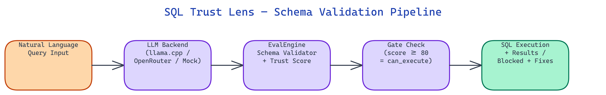

# SQL Trust Lens: Schema Validation for LLM-Generated SQL

[](https://github.com/dakshjain-1616/sql-trust-lens)



## The Problem

> LLMs generate SQL that references tables and columns that do not exist. These queries reach the database, crash pipelines, and sometimes leak information through detailed error messages. There is no standard gate between generation and execution.

NEO built SQL Trust Lens to intercept LLM-generated SQL before it hits the database, validate every identifier against the live schema, and block any query that fails the threshold.

## How the Trust Score Works

**SQL Trust Lens** assigns each query a score from 0 to 100 using a weighted formula:

```
trust_score = (table_component × 0.5 + col_component × 0.5) × 100
```

The tool validates every table and column reference in the query against the actual database schema. Missing identifiers reduce the score. The three score bands map to actions:

- **80–100:** Safe to execute
- **50–79:** Partial validity, manual review recommended
- **0–49:** Hallucination detected, blocked

This means a query that gets one table right but references five non-existent columns will score below 50 and never reach the database.

## The EvalEngine

The core component is **EvalEngine**, which wraps the full validation and execution pipeline. It returns a `ValidationResult` struct with:

- `trust_score` — the 0–100 numeric score
- `can_execute` — boolean gate flag
- `valid_tables` and `invalid_tables` — per-identifier breakdown
- `valid_columns` and `invalid_columns` — same for columns
- `suggested_corrections` — typo fixes using `difflib` fuzzy matching
- `complexity` — counts of joins, subqueries, and aggregations

The `suggested_corrections` field is particularly useful. If a column is named `customer_name` and the query says `custmer_name`, the engine catches the edit distance and suggests the fix rather than just rejecting the query.

## Typo Correction with difflib

LLMs sometimes generate near-correct identifiers. Instead of treating all mismatches as hallucinations, **SQL Trust Lens** uses Python's `difflib` to compute similarity ratios against every schema identifier.

When the ratio exceeds a threshold, the engine classifies the mismatch as a likely typo and adds it to `suggested_corrections`. This prevents valid queries from being blocked due to minor spelling errors while still catching entirely fabricated identifiers.

## LLM Backend Priority

The tool supports three backends, tried in this order when in auto mode:

1. **llama.cpp** — local GGUF model, no API cost
2. **OpenRouter** — cloud API fallback
3. **Mock** — built-in templates for testing without any API key

This lets you run the full pipeline offline during development and switch to a cloud backend in production without changing application code.

## How to Build This with NEO

Open NEO in VS Code or Cursor and describe what you want to build. A good starting prompt for this project:

> "Build a Python library that validates LLM-generated SQL against a live SQLite schema before execution. Score each query 0-100 using a weighted formula: table validity at 50% and column validity at 50%. Return a ValidationResult with trust_score, can_execute boolean, valid/invalid table and column lists, suggested corrections using difflib fuzzy matching for near-miss identifiers, and complexity metrics counting joins, subqueries, and aggregations. Block queries scoring below 50. Support three LLM backends in priority order: local llama.cpp, OpenRouter API, and a mock client for testing. Add a Streamlit UI for interactive querying and history export."

<a href="https://heyneo.com/dashboard?section=new-chat&prompt=Build%20a%20Python%20library%20that%20validates%20LLM-generated%20SQL%20against%20a%20live%20SQLite%20schema%20before%20execution.%20Score%20each%20query%200-100%20using%20a%20weighted%20formula%3A%20table%20validity%20at%2050%25%20and%20column%20validity%20at%2050%25.%20Return%20a%20ValidationResult%20with%20trust_score%2C%20can_execute%20boolean%2C%20valid%2Finvalid%20table%20and%20column%20lists%2C%20suggested%20corrections%20using%20difflib%20fuzzy%20matching%20for%20near-miss%20identifiers%2C%20and%20complexity%20metrics%20counting%20joins%2C%20subqueries%2C%20and%20aggregations.%20Block%20queries%20scoring%20below%2050.%20Support%20three%20LLM%20backends%20in%20priority%20order%3A%20local%20llama.cpp%2C%20OpenRouter%20API%2C%20and%20a%20mock%20client%20for%20testing.%20Add%20a%20Streamlit%20UI%20for%20interactive%20querying%20and%20history%20export." style="display:inline-block;background:#1e40af;color:#ffffff;padding:10px 22px;border-radius:6px;text-decoration:none;font-weight:600;font-size:14px;">Build with NEO →</a>

NEO generates the EvalEngine, difflib correction logic, backend priority chain, and Streamlit UI. From there you iterate — ask it to add a Northwind sample database for out-of-the-box testing, add per-query execution history with CSV export, or add support for PostgreSQL schemas via SQLAlchemy introspection.

To run the finished project:

```bash
git clone https://github.com/dakshjain-1616/sql-trust-lens
cd sql-trust-lens
pip install -r requirements.txt
streamlit run app.py
```

The Streamlit UI opens with the bundled Northwind schema loaded — submit any SQL query and immediately see its trust score, identifier breakdown, and suggested corrections for any mismatched column or table names.

NEO built a SQL validation layer that stops LLM hallucinations before they hit the database. See what else NEO ships at [heyneo.com](https://heyneo.com/).

---

## Try NEO in Your IDE

Install the NEO extension to bring AI-powered development directly into your workflow:

- **VS Code**: [NEO in VS Code](https://marketplace.visualstudio.com/items?itemName=NeoResearchInc.heyneo)
- **Cursor**: <a href="cursor://extension/NeoResearchInc.heyneo" style="color:#0066FF;font-weight:bold;">Install NEO for Cursor →</a>

---
