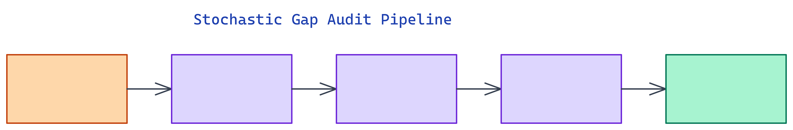

# Stochastic Gap Audit: Pre-Deployment Reliability Scoring for LLMs

[](https://github.com/dakshjain-1616/stochastic-gap-audit)



## The Problem

> Shipping an LLM without a reliability baseline is a bet on hope. Existing evaluation tools require dashboards, cloud services, or manual inspection of outputs. There is no single offline command that gives you a numeric risk score before the model touches production.

NEO built Stochastic Gap Audit to fill that gap. It runs 100 prompts across five difficulty tiers, models response transitions as a Markov chain, and outputs a `reliability_score.csv` in under five minutes with no internet connection required.

## What the Stochastic Gap Measures

The **stochastic gap** is the difference between an ideal pass rate (95%) and the observed pass rate on your specific model. A gap of 0.12 means the model fails or hedges 12% more often than a production-grade system should.

Every response is classified as one of three states: PASS (correct, confident), UNCERTAIN (needs human review), or FAIL (wrong or refused). The tool treats consecutive responses as transitions in a Markov chain and builds a 3x3 **empirical transition matrix** from the data. From this matrix it derives:

- **Steady-state distribution** via eigendecomposition of the transposed matrix
- **Mean first passage time to FAIL** (MFPT), the average number of steps before a PASS state degrades to a FAIL
- **Oversight cost**, the fraction of prompts requiring human review

The MFPT metric is particularly useful in production contexts. A model with MFPT of 4 will degrade to failure roughly every four consecutive prompts, which is a concrete number you can compare against your expected request volume.

## The Five Prompt Tiers

The audit runs 100 curated prompts across five tiers, each weighted differently in the final score.

**Math and reasoning** (25 prompts, weight 1.0) covers arithmetic, algebra, probability, and geometry. These have unambiguous ground-truth answers that keyword matching can verify exactly.

**Code and logic** (25 prompts, weight 1.0) tests Python functions, SQL queries, complexity analysis, and architecture explanations. Expected keywords must appear in the response for a PASS.

**Factual knowledge** (25 prompts, weight 0.9) covers capitals, chemistry, history, and general science. These are the easiest tier but expose models that hallucinate common facts.

**Instruction following** (25 prompts, weight 0.8) asks for recipes, cover letters, poems, and how-to guides. The scorer checks for content-specific keywords rather than exact answers.

The weighting scheme means math and code failures penalize the score more heavily than instruction failures, which matches the cost profile of most production applications.

## Output Format

Every run writes a `reliability_score.csv` where each row is one prompt result. Key columns include `state`, `state_label`, `latency_ms`, `keyword_hits`, `keyword_total`, `hit_rate`, `weighted_score`, and `stochastic_gap`.

The CLI also prints a Rich-formatted summary table:

```
╭──────────────────────────────╮
│       Audit Summary          │
├─────────────────┬────────────┤
│ Reliability Score│ 82.0%     │
│ Pass Rate        │ 82.0%     │
│ Oversight Cost   │ 18.0%     │
│ Stochastic Gap   │ 13.0%     │
│ MFPT to Fail     │ 20.0 steps│
╰─────────────────┴────────────╯
```

The `--html` flag generates a self-contained HTML report with charts. The `--history` flag appends each run to `.audit_history.jsonl` and detects regressions between runs, useful for tracking whether a fine-tune improved or degraded the baseline.

## Comparing Two Models

The `--compare` flag runs both models and prints a side-by-side table. This is the fastest way to choose between two candidates before committing to one.

```bash
python audit.py --compare mistralai/mistral-small-2603 openai/gpt-5.4-nano
```

The `ModelComparator` runs each model through the same 100 prompts in sequence, building independent transition matrices and reliability scores. You get per-tier breakdowns for both models, so you can see whether one model is weak on code but strong on factual knowledge.

## How to Build This with NEO

Open NEO in VS Code or Cursor and describe what you want to build. A good starting prompt for this project:

> "Build a Python CLI tool that audits any LLM's reliability before deployment. Run 100 prompts across five tiers — math/reasoning, code/logic, factual knowledge, and instruction following — with tier-specific keyword scoring. Classify each response as PASS, UNCERTAIN, or FAIL. Model consecutive responses as a Markov chain, compute the 3x3 empirical transition matrix, derive the steady-state distribution via eigendecomposition, and calculate mean first passage time to FAIL. Output a reliability_score.csv and a Rich-formatted summary table. Support a --compare flag for side-by-side model comparison and a --history flag for regression tracking across runs."

<a href="https://heyneo.so/dashboard?section=new-chat&prompt=Build%20a%20Python%20CLI%20tool%20that%20audits%20any%20LLM%27s%20reliability%20before%20deployment.%20Run%20100%20prompts%20across%20five%20tiers%20%E2%80%94%20math%2Freasoning%2C%20code%2Flogic%2C%20factual%20knowledge%2C%20and%20instruction%20following%20%E2%80%94%20with%20tier-specific%20keyword%20scoring.%20Classify%20each%20response%20as%20PASS%2C%20UNCERTAIN%2C%20or%20FAIL.%20Model%20consecutive%20responses%20as%20a%20Markov%20chain%2C%20compute%20the%203x3%20empirical%20transition%20matrix%2C%20derive%20the%20steady-state%20distribution%20via%20eigendecomposition%2C%20and%20calculate%20mean%20first%20passage%20time%20to%20FAIL.%20Output%20a%20reliability_score.csv%20and%20a%20Rich-formatted%20summary%20table.%20Support%20a%20--compare%20flag%20for%20side-by-side%20model%20comparison%20and%20a%20--history%20flag%20for%20regression%20tracking%20across%20runs." style="display:inline-block;background:#1e40af;color:#ffffff;padding:10px 22px;border-radius:6px;text-decoration:none;font-weight:600;font-size:14px;">Build with NEO →</a>

NEO generates the prompt suite, Markov chain analysis, scoring engine, and Rich terminal output. From there you iterate — ask it to add a `--html` flag that generates a self-contained report with distribution charts, add a mock client that simulates Markovian responses for dry-run testing without an API key, or add per-tier score breakdowns to the comparison output.

To run the finished project:

```bash
git clone https://github.com/dakshjain-1616/stochastic-gap-audit
cd stochastic-gap-audit
pip install -r requirements.txt
export OPENROUTER_API_KEY=sk-or-...
python audit.py --model mistralai/mistral-small-2603 --output-dir results/
```

In under five minutes you get a reliability score, stochastic gap, oversight cost, and mean first passage time to failure — a complete pre-deployment risk profile with no cloud dashboard required.

NEO built a five-minute, fully offline LLM reliability auditor that gives pre-deployment teams a numeric risk score with no dashboard required. See what else NEO ships at [heyneo.so](https://heyneo.so/).

---

## Try NEO in Your IDE

Install the NEO extension to bring AI-powered development directly into your workflow:

- **VS Code**: [NEO in VS Code](https://marketplace.visualstudio.com/items?itemName=NeoResearchInc.heyneo)
- **Cursor**: <a href="cursor://extension/NeoResearchInc.heyneo" style="color:#0066FF;font-weight:bold;">Install NEO for Cursor →</a>

---
