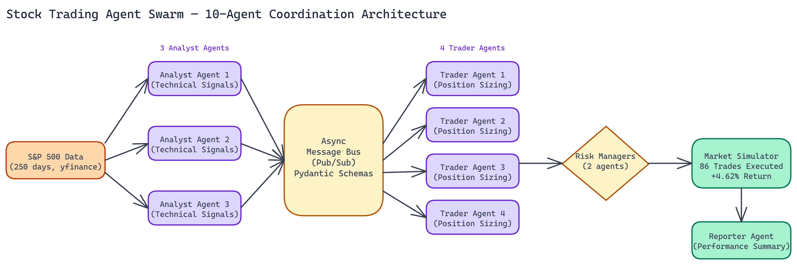

# Stock Trading Agent Swarm: How NEO Coordinated 10 Specialized Agents on a Simulated Portfolio

## The Problem

> Multi-agent systems are easy to talk about and hard to actually build. Coordination overhead, message ordering, deadlocks, agents that step on each other's decisions — most implementations that look clean in architecture diagrams get messy fast when you wire them together. The challenge isn't any single piece; it's building coordination patterns that stay coherent as agents multiply and interact under real conditions.

NEO autonomously built a 10-agent trading simulation to work through these problems in a domain that makes the coordination challenges concrete. Ten specialized agents, an asynchronous message bus, $1M in simulated capital, and 250 days of real S&P 500 data to test against. The result was **+4.62% returns**, **86 executed trades**, and a system that blocked **26 risky positions** before they went through.

This is an educational simulation, not trading advice. But the engineering is real.

## The Agent Architecture

The system divides work across four distinct roles, each handled by dedicated agents.

### Analyst Agents (3 agents)

The analyst agents generate trade signals using technical indicators. They monitor price data, compute indicator values, and publish signals to the message bus when conditions suggest a position worth taking. Three analysts running in parallel means multiple indicator strategies can run simultaneously, and their signals can be aggregated or compared by downstream agents.

No analyst agent executes trades directly. Their job is signal generation only. This separation of concerns keeps the analysis layer from being coupled to risk or execution logic.

### Trader Agents (4 agents)

Trader agents subscribe to signals from the analyst layer and manage individual portfolios. They receive a signal, determine position sizing, and submit orders. But they do not have unilateral authority to execute. Every order goes through risk validation before it reaches the market simulation.

Four trader agents each managing a portion of the capital creates natural diversification within the simulation and lets you observe how different traders respond to the same signal.

### Risk Manager Agents (2 agents)

Risk managers validate every order before it executes. They enforce position limits, check stop-loss rules, and can block trades that violate the configured risk parameters. In the 250-day simulation, risk managers blocked 26 risky positions and triggered 20 stop-losses.

The stop-loss enforcement is particularly important. An agent system without hard risk controls can run up losses on a bad position indefinitely. The risk layer enforces discipline that individual trader agents might not.

### Reporter Agent (1 agent)

The reporter aggregates metrics across all agents and produces performance summaries. Trade count, returns, approval rates, blocked orders. This is the observability layer for the whole system.

## The Message Bus

All coordination happens through an in-memory publish/subscribe message bus. Agents do not call each other directly. An analyst publishes a signal. Trader agents subscribed to that signal receive it. Traders submit orders. Risk managers subscribed to the order topic validate them.

Asynchronous message passing is what makes the architecture scale. Agents operate independently. No agent blocks waiting for another to respond. The bus handles delivery and ordering.

This design also makes the system extensible. Adding a new agent type means subscribing to the relevant topics and publishing to the appropriate output topics. You do not need to modify existing agents.

## Simulation Results

On **$1M** in simulated capital across **250 days** of S&P 500 data:

- **Total return: +4.62%**
- **Executed trades: 86**
- **Order approval rate: 86.9%**
- **Positions blocked by risk managers: 26**
- **Stop-losses triggered: 20**

The 86.9% approval rate tells you that the risk layer is active and filtering, not rubber-stamping orders. 13% of submitted orders were rejected, which reflects real risk management behavior rather than a system that passes everything through.

## Technical Stack

Python 3.12, Pydantic for message schema validation, yfinance for historical S&P 500 data, and Docker for containerized deployment. The Pydantic schemas are important. When agents communicate through a message bus, message schemas are your contract. Strict typing at the message level catches coordination bugs early.

Docker Compose handles multi-container deployment so the full system spins up in a single command.

## Why This Architecture Matters

The value of building this simulation is not the specific returns. It is the architecture patterns. Separation of signal generation from execution. Hard risk validation as a gating layer rather than an advisory one. Async coordination through a message bus that keeps agents decoupled. Observability built in through a dedicated reporting agent.

These patterns apply to much more than trading. Any domain where you need multiple specialized agents working on a shared problem, making decisions that affect each other, can benefit from this architecture. The message bus, the separation of roles, the risk validation gate. These are general solutions.

NEO built this as a simulation because trading makes the coordination challenges obvious. Real money on the line means poor coordination has immediate, measurable consequences.

## Watch It in Action

NEO recorded the full swarm running through a live simulation, with the message bus logs and per-agent trade activity visible in real time.

---

NEO built a 10-agent trading simulation where asynchronous message-bus coordination, hard risk validation gates, and separation of signal generation from execution demonstrate the coordination patterns that make multi-agent systems reliable under real conditions. See what else NEO ships at [heyneo.so](https://heyneo.so/).

---

## Try NEO in Your IDE

Install the NEO extension to bring AI-powered development directly into your workflow:

- **VS Code**: [NEO in VS Code](https://marketplace.visualstudio.com/items?itemName=NeoResearchInc.heyneo)
- **Cursor**: <a href="cursor://extension/NeoResearchInc.heyneo" style="color:#0066FF;font-weight:bold;">Install NEO for Cursor →</a>

---
