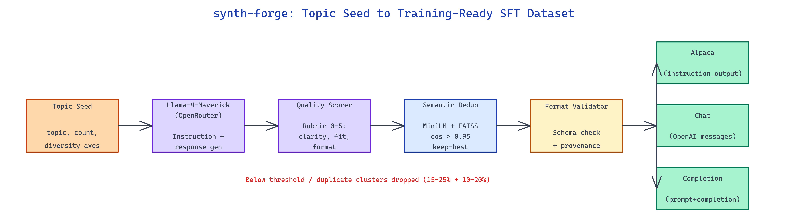

# synth-forge: Generate High-Quality Synthetic SFT Datasets from a Topic Seed

[](https://github.com/dakshjain-1616/synth-forge)



## The Problem

> Building a solid fine-tuning dataset still means either paying labelers or writing brittle one-off generation scripts that produce repetitive, low-diversity examples nobody catches until after training.

NEO built synth-forge to turn a topic seed into thousands of scored, deduplicated instruction-response pairs ready to drop into an SFT pipeline.

## Topic-Seeded Generation with Llama-4-Maverick

**synth-forge** takes a topic seed, a target row count, and a diversity directive, then drives Llama-4-Maverick via OpenRouter through a structured generation loop. Each batch request asks for N candidate instructions with deliberate variation along three axes: task type (classification, extraction, reasoning, rewriting), difficulty (beginner to expert), and persona (the user role framing the instruction). This keeps the generator from collapsing into a narrow distribution of lookalike prompts.

```bash
synth-forge generate \
  --topic "customer support for e-commerce" \
  --count 5000 \
  --model meta-llama/llama-4-maverick \
  --temperature 0.9
```

Responses are generated in a second pass so the grader can judge instruction-response fit against the same criteria a reviewer would.

## Quality Scoring and Semantic Deduplication

Every candidate row goes through a rubric-based quality scorer — clarity, specificity, answer correctness, and format fidelity — each graded 0-5 by a judge model call. Rows below a configurable threshold are dropped. The scorer emits per-row rationale for audit trails.

Semantic deduplication runs after scoring: prompts are encoded with `all-MiniLM-L6-v2`, indexed with FAISS, and pairs with cosine similarity above `0.95` are clustered. Only the highest-scoring row from each cluster survives. This catches the silent duplication that temperature sampling produces after a few thousand generations.

| Stage | Purpose | Typical Drop Rate |
|---|---|---|
| Generation | Produce candidate pairs | — |
| Quality scoring | Rubric-based filter | 15-25% |
| Semantic dedup | Cluster + keep-best | 10-20% |
| Format validation | Schema check | 1-3% |

## Multi-Format Export

The final dataset exports to three conventions so downstream training code doesn't have to reshape anything: `instruction_output` (Alpaca-style), `chat` (OpenAI messages), and `completion` (prompt+completion string). Provenance metadata — seed, model, temperature, quality score, dedup cluster ID — rides alongside every row.

```bash
synth-forge export \
  --input generated/raw.jsonl \
  --format chat,instruction_output \
  --min-quality 3.5 \
  --output datasets/
```

Runs producing 10k rows typically land in 30-50 minutes depending on provider latency; the output is already filtered, deduplicated, and ready to stream into a training job.

## How to Build This with NEO

Open NEO in VS Code or Cursor and describe what you want to build. A good starting prompt for this project:

> "Build a CLI that generates synthetic instruction-tuning datasets from a topic seed using Llama-4-Maverick via OpenRouter, varies generation along task-type/difficulty/persona axes, scores each candidate with a rubric-based judge, deduplicates semantically with MiniLM embeddings and FAISS at 0.95 similarity, and exports to Alpaca, chat, and completion formats with per-row provenance metadata."

<a href="https://heyneo.com/dashboard?section=new-chat&prompt=Build%20a%20CLI%20that%20generates%20synthetic%20instruction-tuning%20datasets%20from%20a%20topic%20seed%20using%20Llama-4-Maverick%20via%20OpenRouter%2C%20varies%20generation%20along%20task-type%2Fdifficulty%2Fpersona%20axes%2C%20scores%20each%20candidate%20with%20a%20rubric-based%20judge%2C%20deduplicates%20semantically%20with%20MiniLM%20embeddings%20and%20FAISS%20at%200.95%20similarity%2C%20and%20exports%20to%20Alpaca%2C%20chat%2C%20and%20completion%20formats%20with%20per-row%20provenance%20metadata." style="display:inline-block;background:#1e40af;color:#ffffff;padding:10px 22px;border-radius:6px;text-decoration:none;font-weight:600;font-size:14px;">Build with NEO →</a>

NEO generates the project structure and core implementation. From there you iterate — add domain-specific rubrics, wire the scorer to a fine-tuned judge model for higher fidelity, or build a preview UI that samples 50 rows for human review before committing. Each request builds on what's already there.

To run the finished project:

```bash
git clone https://github.com/dakshjain-1616/synth-forge
cd synth-forge
pip install -r requirements.txt
synth-forge generate --topic "legal contract review" --count 2000
```

Output lands in `./generated/` with both the raw candidates and the filtered, deduplicated, format-converted final dataset.

NEO built a synthetic data pipeline that turns one topic sentence into a training-ready SFT dataset with built-in quality gates. See what else NEO ships at [heyneo.com](https://heyneo.com/).

---

## Try NEO in Your IDE

Install the NEO extension to bring AI-powered development directly into your workflow:

- **VS Code**: [NEO in VS Code](https://marketplace.visualstudio.com/items?itemName=NeoResearchInc.heyneo)
- **Cursor**: <a href="cursor://extension/NeoResearchInc.heyneo" style="color:#0066FF;font-weight:bold;">Install NEO for Cursor →</a>

---
