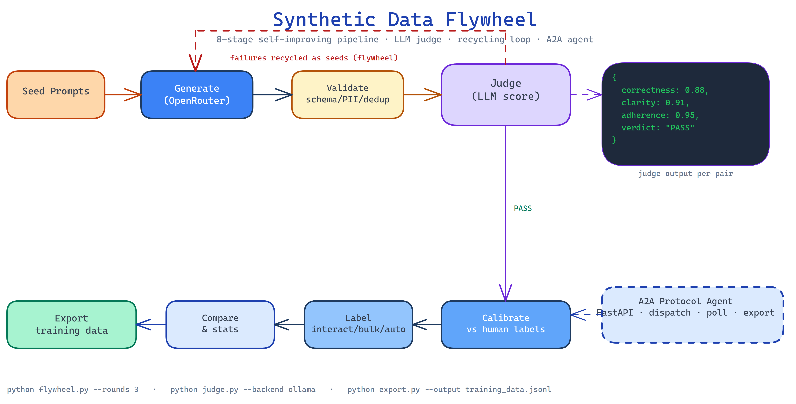

# Synthetic Data Flywheel: End-to-End Pipeline for LLM Fine-Tune Dataset Generation

[](https://github.com/dakshjain-1616/Synthetic-Data-Flywheel)



## The Problem

> You want to fine-tune a model on your domain. You don't have enough labeled data. You generate synthetic data, but half of it is low quality, wrong answers, format violations, ambiguous instructions. You filter it manually, which defeats the purpose of automation. Or you skip filtering, and your fine-tune learns from garbage. Either way, you end up back where you started: not enough good data.

NEO built Synthetic Data Flywheel to close the loop, generate, judge, filter, and recycle failures as better seeds, so each iteration produces higher-quality data than the last.

## The Pipeline Stages

The flywheel moves datasets through additive, idempotent stages:

**1. Generate**: seed prompts or existing datasets drive synthetic instruction pair generation via OpenRouter. Each pair is an (instruction, response) tuple.

**2. Validate**: schema checks, deduplication, PII detection, and profanity filtering run on the raw output. Malformed pairs are logged and discarded before they reach the judge.

**3. Judge**: an LLM judge scores each pair on correctness, clarity, and adherence to the task. Scoring backends are pluggable: Ollama (local, free), OpenRouter (cloud), or Anthropic. Judge decisions are cached to eliminate redundant scoring across runs.

**4. Calibrate**: the judge is calibrated against a small set of human labels, producing precision/recall metrics. If the judge is systematically lenient or harsh on a category, calibration adjusts the threshold before the next pass.

**5. Label**: three labeling modes: interactive (human reviews each pair), bulk (batch human labels), or automatic (judge scores as labels when confidence is high enough).

**6. Compare**: statistical analysis across judgment runs quantifies whether a prompt change or different judge model improved data quality.

**7. Visualize**: charts and HTML reports show quality distribution, failure categories, and judge confidence over the dataset.

**8. Export**: clean pairs are exported in your target fine-tuning format, ready for Unsloth on free Colab GPUs or any compatible trainer.

## The Recycling Loop

Pairs that fail judging don't get discarded, they feed the next generation cycle as negative examples. The generator learns to avoid the failure modes it produced last round. Over three to five iterations, the pass rate typically improves significantly as the generator adapts to what the judge rejects.

This is the flywheel: generate → judge → recycle failures → generate better.

## A2A Protocol Agent

The pipeline ships a FastAPI agent that speaks the A2A (Agent-to-Agent) protocol. Other agents can dispatch generation jobs, poll for completion, and retrieve exported datasets without a human in the loop. This enables multi-agent data pipelines where a research agent generates seed prompts, the flywheel produces training pairs, and a fine-tuning agent kicks off the training job.

## How to Build This with NEO

Open NEO in VS Code or Cursor and describe what you want to build. A good starting prompt for this project:

> "Build an end-to-end synthetic training data pipeline. Generate instruction pairs from seed prompts via OpenRouter. Validate with schema checks, deduplication, PII detection, and profanity filtering. Score with a pluggable LLM judge (Ollama, OpenRouter, Anthropic) using cached judgments. Calibrate the judge against human labels with precision/recall metrics. Support three labeling modes: interactive, bulk, and automatic. Run statistical comparison across judgment runs. Produce visualizations and HTML reports. Export clean pairs in fine-tuning format. Add an autonomous flywheel loop that recycles failed pairs as seeds. Expose a FastAPI A2A protocol agent for multi-agent orchestration. Run all non-training steps on CPU."

<a href="https://heyneo.com/dashboard?section=new-chat&prompt=Build%20an%20end-to-end%20synthetic%20training%20data%20pipeline.%20Generate%20instruction%20pairs%20from%20seed%20prompts%20via%20OpenRouter.%20Validate%20with%20schema%20checks%2C%20deduplication%2C%20PII%20detection%2C%20and%20profanity%20filtering.%20Score%20with%20a%20pluggable%20LLM%20judge.%20Calibrate%20against%20human%20labels.%20Support%20three%20labeling%20modes.%20Add%20autonomous%20flywheel%20loop%20that%20recycles%20failed%20pairs%20as%20seeds.%20Expose%20FastAPI%20A2A%20protocol%20agent%20for%20multi-agent%20orchestration." style="display:inline-block;background:#1e40af;color:#ffffff;padding:10px 22px;border-radius:6px;text-decoration:none;font-weight:600;font-size:14px;">Build with NEO →</a>

NEO scaffolds all eight pipeline stages, the recycling loop logic, the judge calibration, the three labeling modes, the A2A agent, and the export formats. From there you iterate: add a domain classifier that routes pairs to domain-specific judges, build a diversity sampler that ensures even coverage across task categories, or connect the export stage to an automated training pipeline on Colab.

To run the finished project:

```bash
git clone https://github.com/dakshjain-1616/Synthetic-Data-Flywheel
cd Synthetic-Data-Flywheel
pip install -r requirements.txt
echo "OPENROUTER_API_KEY=sk-or-v1-..." > .env

python generate.py --seeds seeds.txt --count 500
python judge.py --input generated.jsonl --backend ollama
python flywheel.py --rounds 3  # autonomous recycling loop
python export.py --output training_data.jsonl
```

NEO built a synthetic data flywheel with eight pipeline stages, LLM judge calibration, a recycling loop that improves data quality over iterations, and an A2A agent for multi-agent orchestration. See what else NEO ships at [heyneo.com](https://heyneo.com/).

---

## Try NEO in Your IDE

Install the NEO extension to bring AI-powered development directly into your workflow:

- **VS Code**: [NEO in VS Code](https://marketplace.visualstudio.com/items?itemName=NeoResearchInc.heyneo)
- **Cursor**: <a href="cursor://extension/NeoResearchInc.heyneo" style="color:#0066FF;font-weight:bold;">Install NEO for Cursor →</a>

---
