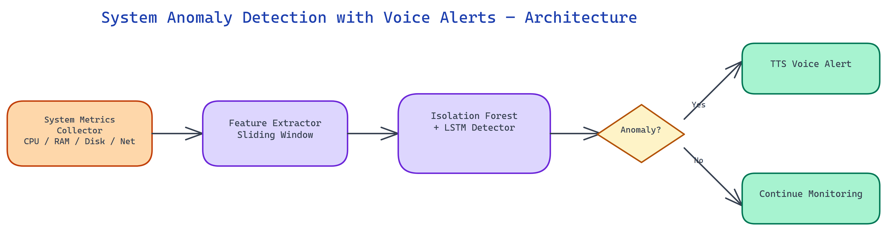

# System Anomaly Detection with Voice Alerts: ML-Powered Monitoring That Speaks

[](https://github.com/dakshjain-1616/-System-Anomaly-Detection-with-Voice-Alerts)



## The Problem

> Threshold-based monitoring — alert when CPU exceeds 90%, alert when memory exceeds 85% — misses the most insidious system problems. A process that slowly leaks memory over 48 hours never trips a threshold until it's already caused a problem. A network interface that shows 200% of its normal traffic at 3am on a Sunday is anomalous even if it's within absolute thresholds. And getting paged at 2am about a non-critical threshold breach that resolves itself generates alert fatigue that makes engineers less likely to respond urgently when alerts actually matter.

NEO built a system anomaly detection tool that learns what normal looks like on your specific hardware and workload, detects deviations from that baseline using Isolation Forest and LSTM models, and delivers alerts through voice synthesis — making anomaly notifications ambient rather than intrusive, and significantly reducing false positive rates compared to threshold-based approaches.

## The Two-Model Architecture

The tool uses two complementary anomaly detection approaches running in parallel, each suited to different types of anomalies.

**Isolation Forest** is the primary model for point anomalies — metric values that are unusual relative to the distribution of that metric's historical values. Isolation Forest works by building an ensemble of random trees that partition the feature space. Anomalous points — those that are unusual relative to the training distribution — require fewer partitions to isolate, giving them lower anomaly scores. The model is trained on the system's own historical metrics during a baseline learning period, so its sense of "normal" is calibrated to your specific hardware and workload, not a generic threshold.

Isolation Forest handles well: sudden CPU spikes, unusual memory allocation patterns, disk I/O bursts that are out of character for the workload, and network traffic anomalies. It works in near-real-time because scoring a new observation against a trained Isolation Forest is computationally cheap.

**LSTM (Long Short-Term Memory)** is the secondary model for temporal anomalies — patterns that are normal in isolation but anomalous in sequence. A gradual memory leak is the canonical example: no single memory reading is an outlier, but the sequence of monotonically increasing memory over 48 hours is clearly anomalous. Threshold monitors miss this; Isolation Forest may miss it (each point is within the normal distribution); LSTM catches it because it's modeling the temporal sequence.

The LSTM is trained to predict the next value in each metric time series. Anomalies are detected as large prediction errors — when the actual value deviates significantly from what the LSTM expected given the recent history. This makes it sensitive to trend anomalies, cyclical disruptions, and gradual drift.

Running both models together provides complementary coverage: Isolation Forest catches sudden aberrations, LSTM catches gradual drift and temporal pattern breaks. Alerts require both models to agree (configurable) or either model to flag (also configurable depending on sensitivity preferences).

## Metric Collection and Process-Level Tracking

The monitoring layer collects system metrics at configurable intervals (default: every 5 seconds) using psutil. System-level metrics include:

- CPU utilization per core and aggregate, plus steal time for virtualized environments
- Memory: resident set size, virtual memory, swap usage, page fault rates
- Disk: read/write throughput per device, I/O wait, queue depth
- Network: bytes per interface, packet rates, error rates, connection counts

Beyond system-level metrics, the tool tracks process-level metrics for the top-N processes by resource consumption. This is crucial for root-cause analysis: when a system-level anomaly fires, the process-level data tells you which process is responsible. A sudden memory anomaly might be a specific service leaking memory; without process-level tracking, you know there's a problem but not where to look.

The process-level tracker monitors: CPU share per PID, memory RSS per PID, open file descriptors, thread counts, and child process counts. These process-level metrics are also fed into the anomaly detection models, enabling detection of process-specific anomalies like a specific service consuming abnormally high CPU share relative to its usual behavior.

## Learning Normal Behavior

Out-of-the-box threshold monitors require manual tuning for every environment. The anomaly detection tool instead runs a baseline learning period — configurable, default 24 hours — during which it collects metric data without generating alerts. During this period it builds the training dataset for both models.

The baseline period is designed to capture at least one full diurnal cycle, so the models learn the difference between daytime high-load patterns and nighttime low-load patterns. For weekly workload patterns, a 7-day baseline period produces better models than a 24-hour baseline.

After training, the models can be retrained on a rolling basis — the default is weekly retraining using a sliding window of the most recent 7 days. This allows the models to adapt as workload patterns change, rather than drifting out of sync with a baseline that was captured months ago.

Model persistence: trained models are serialized to disk and loaded on restart, so a monitoring agent restart doesn't require a new baseline period.

## Voice Alert Design

The voice alert system uses text-to-speech synthesis (pyttsx3 for offline/local synthesis, with optional integration to cloud TTS for higher quality audio) to deliver alerts as spoken notifications.

The alert message format is designed for ambient monitoring — short, information-dense, immediately actionable. A typical alert sounds like: "Memory anomaly: process ID 4782, nginx, consuming 94% of RAM, LSTM confidence high, 48-minute increasing trend." This gives you the metric, the responsible process, the severity, the detection model, and the temporal context — everything you need to triage — in under 10 seconds of audio.

Voice delivery is particularly useful in environments where engineers are at workstations but not actively watching dashboards — deep work sessions, on-call periods where attention is divided, or operations floors where multiple engineers are working. A spoken alert is more interruptive than a visual notification on a secondary monitor, but less disruptive than a pager notification for non-critical anomalies.

Alert severity levels (info, warning, critical) map to different voice characteristics: info alerts use normal speech rate and tone; warning alerts use slightly elevated rate; critical alerts use a more urgent tone and may include a preceding audio cue. The distinction makes severity immediately audible without requiring visual attention.

## Configuring Sensitivity and Reducing Alert Fatigue

Anomaly detection sensitivity is configurable at multiple levels. The Isolation Forest contamination parameter controls how aggressive the model is about flagging outliers — lower contamination means fewer but higher-confidence anomaly alerts. The LSTM prediction error threshold controls how large a prediction error triggers a flag.

For most production deployments, starting with conservative settings and adjusting toward more sensitive settings as false positive rates are understood is the recommended approach. The tool logs all anomaly scores (not just those that cross the alert threshold), so you can review the score distribution to understand what sensitivity level makes sense for your environment.

The dual-model agreement requirement is the most effective false-positive filter: requiring both Isolation Forest and LSTM to flag an event before generating a voice alert eliminates the majority of false positives from either model alone. Single-model alerts can still be surfaced as lower-priority log entries for post-hoc review without generating voice interruptions.

## How to Build This with NEO

Open NEO in VS Code or Cursor and describe what you want to build. A good starting prompt for this project:

> "Build a Python system monitoring agent that uses psutil to collect CPU, memory, disk, and network metrics every 5 seconds, plus per-process metrics for the top-N processes by resource consumption. Run two parallel anomaly detection models: an Isolation Forest for point anomalies and an LSTM for temporal drift, both trained on a configurable baseline period (default 24 hours). Trigger voice alerts using pyttsx3 when both models agree an anomaly has occurred. Log all anomaly scores to CSV continuously. Support --baseline-hours, --load-model, --no-voice, and --log-only CLI flags."

<a href="https://heyneo.so/dashboard?section=new-chat&prompt=Build%20a%20Python%20system%20monitoring%20agent%20that%20uses%20psutil%20to%20collect%20CPU%2C%20memory%2C%20disk%2C%20and%20network%20metrics%20every%205%20seconds%2C%20plus%20per-process%20metrics%20for%20the%20top-N%20processes%20by%20resource%20consumption.%20Run%20two%20parallel%20anomaly%20detection%20models%3A%20an%20Isolation%20Forest%20for%20point%20anomalies%20and%20an%20LSTM%20for%20temporal%20drift%2C%20both%20trained%20on%20a%20configurable%20baseline%20period%20%28default%2024%20hours%29.%20Trigger%20voice%20alerts%20using%20pyttsx3%20when%20both%20models%20agree%20an%20anomaly%20has%20occurred.%20Log%20all%20anomaly%20scores%20to%20CSV%20continuously.%20Support%20--baseline-hours%2C%20--load-model%2C%20--no-voice%2C%20and%20--log-only%20CLI%20flags." style="display:inline-block;background:#1e40af;color:#ffffff;padding:10px 22px;border-radius:6px;text-decoration:none;font-weight:600;font-size:14px;">Build with NEO →</a>

NEO generates the metric collector, Isolation Forest and LSTM training pipeline, dual-model agreement logic, and pyttsx3 voice alert integration. From there you iterate -- ask it to add weekly rolling model retraining to adapt to workload changes, add severity tiers that map to different voice speech rates, or add a `config.yaml` system for tuning contamination and LSTM error thresholds without code changes.

To run the finished project:

```bash
git clone https://github.com/dakshjain-1616/-System-Anomaly-Detection-with-Voice-Alerts
cd -- -System-Anomaly-Detection-with-Voice-Alerts
pip install -r requirements.txt
python monitor.py --baseline-hours 24
```

After the 24-hour baseline period completes, the agent begins detecting anomalies on your actual workload -- voice alerts fire when both models flag the same event, and all scores are logged to CSV for threshold tuning.

NEO built a system monitoring tool where anomaly detection adapts to your workload and alerts are delivered in the format that fits how engineers actually work, not just how dashboards are designed. See what else NEO ships at [heyneo.so](https://heyneo.so/).

---

## Try NEO in Your IDE

Install the NEO extension to bring AI-powered development directly into your workflow:

- **VS Code**: [NEO in VS Code](https://marketplace.visualstudio.com/items?itemName=NeoResearchInc.heyneo)
- **Cursor**: <a href="cursor://extension/NeoResearchInc.heyneo" style="color:#0066FF;font-weight:bold;">Install NEO for Cursor →</a>

---
