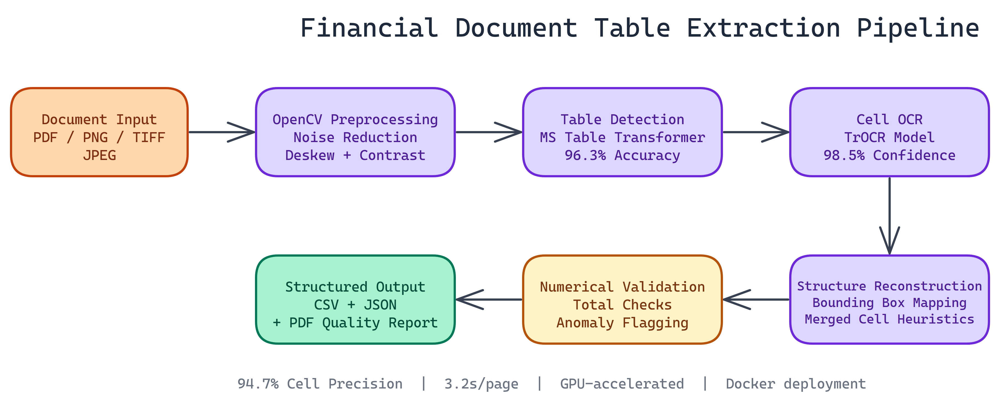

# Automated Table Extraction from Financial Documents Using Transformer Models

## The Problem

> Financial documents are dense with tabular data — balance sheets, income statements, cash flow tables, broker confirmations. Getting that data into a usable format has historically required either manual entry or brittle template-based parsers that break whenever a vendor changes their invoice format. A misread number in a financial document isn't an inconvenience; it's a compliance risk or an accounting error.

NEO autonomously built a pipeline that handles this automatically. It detects tables, extracts cell-level text, reconstructs the structure, and validates the output with explicit uncertainty signaling.

## The Challenge with Financial Tables

Financial tables are harder than they look. You're dealing with scanned documents at varying resolutions, PDFs generated from different software systems, rotated pages, header rows spanning multiple columns, and cells containing formatted numbers with thousands separators, currency symbols, and parenthetical negatives.

The system handles this complexity while being explicit about uncertainty. Every output includes confidence scores, and anomalies are flagged rather than silently passed through.

## Pipeline Architecture

The extraction process runs through six stages, each handling a specific part of the problem.

### Document Preprocessing with OpenCV

Before any ML model sees the document, the pipeline cleans it up. OpenCV handles noise reduction, contrast enhancement, and deskewing. Documents scanned at a slight angle get rotated back. Documents with speckling or compression artifacts get smoothed.

This preprocessing step has a significant effect on downstream accuracy. A table detector trained on clean images will underperform on degraded scans without input normalization.

### Table Detection with Microsoft Table Transformer

The pipeline uses Microsoft's Table Transformer model to locate table boundaries within the document. This model was trained specifically on document images and understands the visual structure of tables including borders, ruling lines, and the absence of explicit borders in borderless tables.

The model outputs bounding boxes for each detected table and classifies structural elements: column headers, row headers, and data cells. This structural understanding is what lets us reconstruct tables correctly rather than extracting text in reading order.

The pipeline achieves **96.3% table detection accuracy** across the documents NEO has tested.

### Cell-Level OCR with TrOCR

Once the table structure is identified, the pipeline crops each cell and runs TrOCR against it. TrOCR is a transformer-based OCR model that handles handwriting, printed text, and the mixed-quality text common in scanned financial documents.

The pipeline achieves **98.5% average OCR confidence** across tested datasets. The cell-by-cell approach keeps OCR errors isolated: a bad read on one cell doesn't corrupt adjacent cells.

### Data Reconstruction and Validation

After OCR, the pipeline reconstructs the full table structure using bounding box coordinates from the Table Transformer output. Row and column assignments are computed from spatial overlap, with light heuristics to handle merged cells.

The validation layer checks for numerical consistency. Totals should equal the sum of their rows. Year-over-year columns should have the same number of rows. Percentage columns should stay within expected ranges. When something fails validation, the pipeline flags it with a specific error type rather than passing bad output downstream.

Cell extraction precision is **94.7%**, with average processing speed at **3.2 seconds per page**.

## Output Formats

The pipeline writes results in three formats:

- **CSV** for direct import into spreadsheets or databases
- **JSON** with full metadata including confidence scores and cell coordinates
- **PDF quality report** with annotated visualizations showing detection results and flagged anomalies

The JSON output is particularly useful for downstream applications. You get the extracted data plus spatial metadata, so you can trace any value back to its exact location in the source document.

## Multi-Format Input Support

The pipeline handles PDFs, scanned document images, and raster formats (PNG, TIFF, JPEG). PDFs with embedded text layers get text extracted directly for cells where possible, using OCR only as a fallback for image-only PDFs. This improves accuracy and speed for digitally-generated documents.

## Deployment

The system ships as a Docker container for consistent deployment across environments. Scaling is straightforward: run multiple container instances behind a load balancer, with a job queue feeding documents to each worker.

For organizations processing high volumes of documents, GPU acceleration cuts per-page processing time significantly. The TrOCR inference step is the main bottleneck and scales well with GPU parallelism.

## Where This Gets Useful

The immediate use case is financial statement analysis: pulling tables from annual reports, earnings releases, SEC filings, and audit documents into structured databases. The same pipeline handles regulatory submissions, insurance schedules, and any domain where tabular data appears in PDF or scanned form.

Analysts who previously spent hours manually transcribing tables can run this pipeline in minutes and focus on the actual analysis.

---

NEO built a financial table extraction pipeline where Microsoft Table Transformer detection, TrOCR cell-level OCR, and numerical consistency validation together deliver 96%+ accuracy on PDFs and scanned documents with explicit uncertainty signaling rather than silent errors. See what else NEO ships at [heyneo.so](https://heyneo.so/).

---

## Try NEO in Your IDE

Install the NEO extension to bring AI-powered development directly into your workflow:

- **VS Code**: [NEO in VS Code](https://marketplace.visualstudio.com/items?itemName=NeoResearchInc.heyneo)
- **Cursor**: [**Install NEO for Cursor →**](cursor://extension/NeoResearchInc.heyneo)
