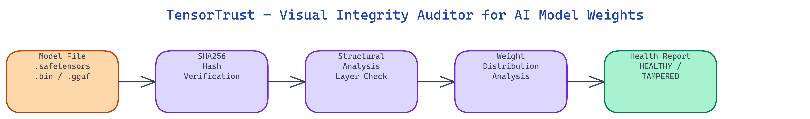

# TensorTrust — Visual Integrity Auditor for AI Model Weights

[](https://github.com/dakshjain-1616/tensortrust)



## The Problem

> Every time you download a model from HuggingFace, a torrent, or a third-party mirror, you are running an untrusted binary on your hardware. Model weights can be backdoored, silently modified to trigger specific outputs on specific inputs, or corrupted during transfer. There is no standard tooling to verify a model file before loading it.

NEO built TensorTrust to give you a verifiable answer before you run the model. It computes SHA256 hashes, validates layer counts, scans for hidden parameters, and produces a structured health report, all locally, without uploading your weights anywhere.

## Hash Verification

The first check TensorTrust runs is **SHA256 hash verification**. Each file in the model directory gets a computed hash that is compared against a registry of known-good checksums. A single bit flip anywhere in the weights file will produce a completely different hash, so this check catches both intentional tampering and silent data corruption from failed downloads.

The registry ships as `mock_registry.json` for offline testing. In a production setup you populate it with hashes from the original model publisher's release notes or the HuggingFace model card. Any mismatch produces a `TAMPERED` status with the list of affected files.

## Structural Analysis

Hash verification catches file-level tampering, but a modified model can still pass a hash check if the attacker controls the published hash. **Structural analysis** provides a second independent check.

TensorTrust validates the layer count and tensor shapes against the declared architecture. It knows expected tensor counts for common model families and flags deviations as suspicious. It also scans for unexpected tensor names that don't match the declared architecture, which is the pattern used by most backdoor injection techniques: an attacker adds hidden weight tensors that activate on specific trigger inputs.

```python
from auditor import ModelAuditor

auditor = ModelAuditor()
report = auditor.scan("mistral-7b-instruct-v0.1.Q4_K_M.safetensors")
print(report.get_health_status())
# → "HEALTHY"
```

The scan returns a structured report with tensor-level detail: name, shape, dtype, parameter count, and whether the tensor is flagged as suspicious.

## Weight Distribution Analysis

Even a structurally correct model can carry a backdoor through unusual weight magnitudes. **Weight distribution visualization** plots per-layer histograms and computes basic statistics: mean, standard deviation, min, max, NaN count, and infinity count.

Normal transformer weights follow approximately Gaussian distributions centered near zero. Injected backdoor triggers often appear as isolated weight clusters far from zero, or as NaN/infinity values that cause specific numerical behaviors. The visualizer flags layers where the distribution is a statistical outlier compared to the rest of the model.

## Format Support and the Gradio Dashboard

TensorTrust handles `.safetensors`, `.bin` (PyTorch), and `.gguf` files through the same `ModelAuditor` interface. The scan logic is format-aware and extracts tensors correctly from each container format.

For users who prefer a visual workflow, the **Gradio dashboard** provides a browser-based interface at `http://127.0.0.1:7860`. Upload any supported file and get an interactive health report with per-tensor details, status indicators, and weight distribution plots.

```bash
python app.py
# Running on http://127.0.0.1:7860
```

Status values are explicit:

| Status | Meaning |
|:-------|:--------|
| `HEALTHY` | Hash matches, architecture correct, no anomalies |
| `SUSPICIOUS` | Architecture deviates or weight distribution is unusual |
| `TAMPERED` | SHA256 mismatch or hidden parameters detected |

## How to Build This with NEO

Open NEO in VS Code or Cursor and describe what you want to build. A good starting prompt for this project:

> "Build a Python model integrity auditing tool that verifies AI weight files before loading. For each file, compute SHA256 hashes and compare against a known-good registry. Parse .safetensors, .bin, and .gguf formats via a unified ModelAuditor interface. Validate tensor counts and shapes against expected architecture profiles. Scan for unexpected tensor names that don't match the declared architecture. Plot per-layer weight distribution histograms and flag layers with NaN, infinity, or statistical outlier values. Return a structured report with HEALTHY, SUSPICIOUS, or TAMPERED status. Add a Gradio browser UI at port 7860 for drag-and-drop file scanning."

<a href="https://heyneo.com/dashboard?section=new-chat&prompt=Build%20a%20Python%20model%20integrity%20auditing%20tool%20that%20verifies%20AI%20weight%20files%20before%20loading.%20For%20each%20file%2C%20compute%20SHA256%20hashes%20and%20compare%20against%20a%20known-good%20registry.%20Parse%20.safetensors%2C%20.bin%2C%20and%20.gguf%20formats%20via%20a%20unified%20ModelAuditor%20interface.%20Validate%20tensor%20counts%20and%20shapes%20against%20expected%20architecture%20profiles.%20Scan%20for%20unexpected%20tensor%20names%20that%20don%27t%20match%20the%20declared%20architecture.%20Plot%20per-layer%20weight%20distribution%20histograms%20and%20flag%20layers%20with%20NaN%2C%20infinity%2C%20or%20statistical%20outlier%20values.%20Return%20a%20structured%20report%20with%20HEALTHY%2C%20SUSPICIOUS%2C%20or%20TAMPERED%20status.%20Add%20a%20Gradio%20browser%20UI%20at%20port%207860%20for%20drag-and-drop%20file%20scanning." style="display:inline-block;background:#1e40af;color:#ffffff;padding:10px 22px;border-radius:6px;text-decoration:none;font-weight:600;font-size:14px;">Build with NEO →</a>

NEO generates the ModelAuditor, format parsers, hash registry, and Gradio dashboard. From there you iterate -- ask it to add architecture profiles for Mistral, LLaMA, and Qwen model families so structural validation works without manual configuration, add a batch scanning mode for entire model directories, or add a `mock_registry.json` populated with known HuggingFace model checksums for out-of-the-box use.

To run the finished project:

```bash
git clone https://github.com/dakshjain-1616/tensortrust
cd tensortrust
pip install -r requirements.txt
python app.py
```

The Gradio dashboard opens at `http://127.0.0.1:7860` -- drop any `.safetensors`, `.bin`, or `.gguf` file on it to get a full integrity report with hash status, tensor-level details, and weight distribution plots in seconds.

NEO built TensorTrust as a local-first model integrity auditor that catches backdoored, tampered, or corrupted weights before they reach your hardware. See what else NEO ships at [heyneo.com](https://heyneo.com/).

---

## Try NEO in Your IDE

Install the NEO extension to bring AI-powered development directly into your workflow:

- **VS Code**: [NEO in VS Code](https://marketplace.visualstudio.com/items?itemName=NeoResearchInc.heyneo)
- **Cursor**: <a href="cursor://extension/NeoResearchInc.heyneo" style="color:#0066FF;font-weight:bold;">Install NEO for Cursor →</a>

---
