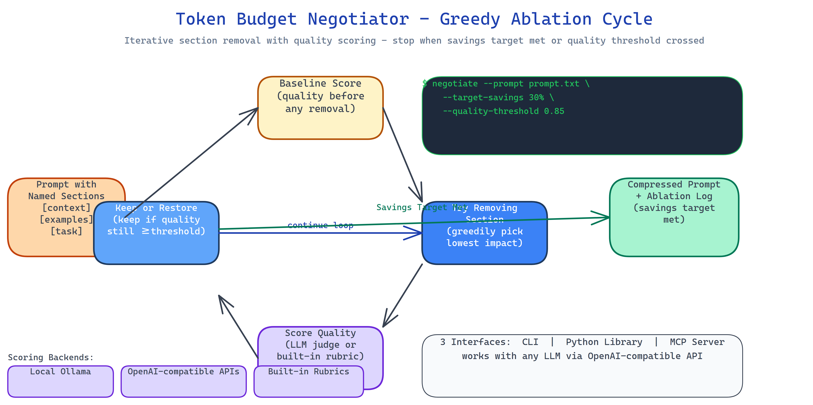

# Token Budget Negotiator: Greedy Ablation Prompt Compression with Quality Gating

[](https://github.com/dakshjain-1616/Token-Budget-Negotiator)



## The Problem

> You have a prompt that costs 4,000 tokens. Some sections are essential, the task definition, the constraints, the examples. Others are redundant, context you added months ago for a use case that no longer applies, verbose instructions that could be a sentence, boilerplate you copied from a template. You know it could be shorter. You don't know which parts to cut, and you don't want to spend an afternoon running ablations by hand.

NEO built Token Budget Negotiator to run those ablations automatically, with a quality floor that stops it from cutting things that actually matter.

## Greedy Ablation Strategy

The negotiator splits your prompt into named sections and tests removing each one:

1. **Baseline**: score the complete prompt using your chosen scoring backend (Ollama or OpenRouter).
2. **Ablate**: try removing each section in order of estimated priority.
3. **Score**: check if quality stays above your threshold after removal.
4. **Decide**: if quality holds, the section stays removed. If quality drops below threshold, it gets restored.
5. **Stop**: halt when token savings reach your minimum target, or when removing any remaining section would breach the quality floor.

The result is the shortest prompt that passes your quality bar, with a log of every ablation decision.

## Three Scoring Backends

Quality is measured by the scoring backend you configure:

- **Local Ollama**: no API cost, runs offline, uses whichever model you have pulled.
- **OpenAI-compatible APIs**: OpenRouter, Together, any endpoint with the OpenAI SDK.
- **Built-in rubrics**: the tool ships rubrics for QA, coding, and summarization tasks so you can score without running a second model for simple use cases.

Token counting uses `tiktoken` for GPT-family models with fallback estimation for others.

## Three Interfaces

**CLI**: point it at a prompt file, set your targets, get back the compressed prompt and an ablation log:

```bash
negotiate --prompt system_prompt.txt --target-savings 30% --quality-threshold 0.85
negotiate --prompt prompt.txt --backend ollama --model llama3.2:3b
```

**Python library**: integrate into your prompt management pipeline:

```python
from token_budget_negotiator import Negotiator

n = Negotiator(backend="openrouter", quality_threshold=0.85, target_savings=0.30)
result = n.negotiate(prompt)
print(result.compressed_prompt, result.savings_pct, result.ablation_log)
```

**MCP server**: expose the negotiator as a tool to Claude Code and other agents. The agent calls `negotiate_prompt` with the prompt text and gets back the compressed version with savings metadata.

## How to Build This with NEO

Open NEO in VS Code or Cursor and describe what you want to build. A good starting prompt for this project:

> "Build a prompt compression tool that uses greedy ablation to remove sections that don't meaningfully impact quality. Split prompts into named sections, score the full prompt as a baseline, then iteratively try removing each section and rescoring, restoring sections where quality drops below a threshold, keeping removals where it holds. Stop when token savings reach the minimum target. Support Ollama and OpenAI-compatible APIs as scoring backends. Count tokens via tiktoken with fallback estimation. Ship three interfaces: a CLI tool, a Python library, and an MCP server. Include built-in rubrics for QA, coding, and summarization scoring tasks. Add caching and verbose logging."

<a href="https://heyneo.com/dashboard?section=new-chat&prompt=Build%20a%20prompt%20compression%20tool%20that%20uses%20greedy%20ablation%20to%20remove%20sections%20that%20don%27t%20impact%20quality.%20Split%20prompts%20into%20named%20sections%2C%20score%20as%20baseline%2C%20then%20iteratively%20try%20removing%20each%20and%20rescoring.%20Restore%20sections%20where%20quality%20drops%20below%20threshold.%20Stop%20when%20savings%20reach%20minimum%20target.%20Support%20Ollama%20and%20OpenAI-compatible%20APIs.%20Count%20tokens%20via%20tiktoken.%20Ship%20CLI%2C%20Python%20library%2C%20and%20MCP%20server%20interfaces." style="display:inline-block;background:#1e40af;color:#ffffff;padding:10px 22px;border-radius:6px;text-decoration:none;font-weight:600;font-size:14px;">Build with NEO →</a>

NEO scaffolds the section parser, the greedy ablation loop, the quality gating logic, the three scoring backends, the tiktoken integration, and all three interfaces. From there you iterate: add a budget cap that stops compression once you hit a target token count rather than a percentage, add a second-pass optimizer that tries recombining retained sections for further savings, or pipe the MCP tool into a CI job that automatically audits new prompts before they ship.

To run the finished project:

```bash
git clone https://github.com/dakshjain-1616/Token-Budget-Negotiator
cd Token-Budget-Negotiator
pip install -r requirements.txt

negotiate --prompt my_prompt.txt --target-savings 30% --quality-threshold 0.85
negotiate --prompt my_prompt.txt --backend ollama --model llama3.2:3b
negotiate --prompt my_prompt.txt --verbose  # see every ablation decision
```

NEO built a greedy ablation prompt compressor with quality gating, three scoring backends, and CLI/library/MCP interfaces, so shrinking overlong prompts is a one-command operation with a quality floor. See what else NEO ships at [heyneo.com](https://heyneo.com/).

---

## Try NEO in Your IDE

Install the NEO extension to bring AI-powered development directly into your workflow:

- **VS Code**: [NEO in VS Code](https://marketplace.visualstudio.com/items?itemName=NeoResearchInc.heyneo)
- **Cursor**: <a href="cursor://extension/NeoResearchInc.heyneo" style="color:#0066FF;font-weight:bold;">Install NEO for Cursor →</a>

---
