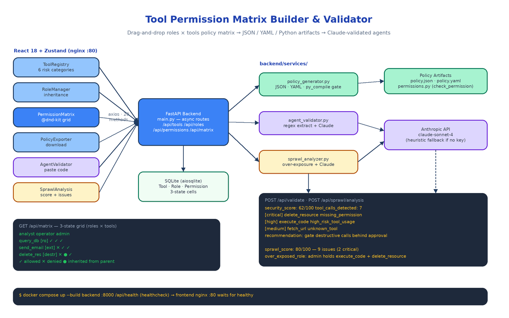

# Tool Permission Matrix Builder: Drag-and-Drop Governance for AI Agent Tool Access

[](https://github.com/dakshjain-1616/Tool-Permission-Matrix-Builder-Validator)



## The Problem

> An agent goes to production with `delete_resource` in its tool list because that's what the demo needed. Three months later there are eleven agents, forty tools, and the only record of who can call what is a dict in a config file that four people have edited and nobody owns. Then someone asks the compliance question: "which agents can move money?" — and the honest answer is a grep.

AI agents in production touch tools that range from harmless read-only queries to irreversible destructive operations. Most teams manage that access with ad-hoc scripts and tribal knowledge. The Tool Permission Matrix Builder & Validator replaces that with a visual policy system: register tools, classify their risk, define roles, drag permissions onto a roles × tools grid, then export a machine-readable policy artifact — or paste in an agent's actual code and let Claude tell you whether it complies.

## Tools, Roles, and a Six-Level Risk Taxonomy

Everything starts in the **ToolRegistry** tab. Each tool gets a name, description, optional endpoint, tags, and — the load-bearing field — a risk category. Six categories are implemented as a Python Enum and stored on the `Tool` row in SQLite:

| Category | Meaning |
|----------|---------|
| `read-only` | Read/query data, no mutations |
| `internal-write` | Modify internal state or files |
| `external-api` | Call external APIs or services |
| `financial` | Handle money, payments, or financial data |
| `destructive` | Delete or overwrite data irreversibly |
| `administrative` | Modify system configuration or permissions |

The **RoleManager** tab defines your agent archetypes — analyst, operator, admin, readonly-bot — each with an `allowed_risk_levels` list and an optional `parent_role_id` for inheritance. The backend rejects a role that names itself as its own parent and validates that the parent exists, so the hierarchy stays a tree.

## The Matrix: Three States, Not Two

The **PermissionMatrix** component renders the roles × tools grid with @dnd-kit. You can drag a tool badge onto a role to grant it, or click a cell to cycle its state. Each cell is one of three things, not two:

- **ALLOWED** (✓) — explicit grant
- **DENIED** (✕) — explicit denial, the default for any pair without a row
- **INHERITED** (●) — the permission comes from the role's parent; the UI refuses to toggle these directly

Three-state cells are what make role hierarchies work: a base role defines conservative defaults, derived roles override specific tools, and the matrix shows you which grants are local decisions versus inherited ones. State lives in three Zustand stores (`toolStore`, `roleStore`, `matrixStore`) and syncs through an axios client with 20 methods against the FastAPI backend. Toggling a whole column of cells doesn't fire twenty requests — `POST /api/permissions/bulk` upserts every (tool, role) pair in one call, keyed on the database's `UniqueConstraint("tool_id", "role_id")`.

The matrix also validates as you edit: if a role is granted a tool whose risk category exceeds the role's `allowed_risk_levels`, a warning appears on the cell immediately, before anything is exported.

## Export: JSON, YAML, or an Importable Python Module

A matrix you can only look at is not a policy. `POST /api/policy/generate` takes a list of tool IDs and role IDs and returns the same matrix in three formats from `policy_generator.py`: a JSON document for machine consumption, YAML for GitOps review flows, and a complete Python module you import into your agent runtime:

```python
from permissions import check_permission, get_tools_for_role, TOOLS

if not check_permission(role_id=2, tool_id=7):
    raise PermissionError("operator may not call delete_resource")

dangerous = [t for t in TOOLS.values() if t.is_dangerous()]
```

The generated module contains `RiskCategory`, `ToolDefinition`, `RoleDefinition`, and `PermissionEntry` dataclasses plus the full `PERMISSIONS[role_id][tool_id]` matrix as literal data — no runtime dependency on the platform. Before the backend returns it, the module is compiled with `py_compile` as a hard gate. A `permissions.py` that fails to import would be worse than no policy at all, so a syntax error in generation is a server error, never a broken download.

## Validating Real Agent Code with Claude

The **AgentValidator** tab closes the loop between the policy you designed and the agents you actually run. Paste (or upload) an agent's source code, and `POST /api/validate` does two passes.

First, a regex extractor pulls candidate tool calls out of the code — bare `tool_name(...)` invocations plus the common framework conventions: `use_tool("name")`, `call_tool("name")`, `run_tool("name")`, `execute_tool("name")`, and `tool="name"` kwargs — then filters Python keywords and builtins out of the candidate set.

Second, if an API key is configured, the code, the policy JSON, and the extracted call list go to Claude with a security-analyst system prompt that returns structured findings: a 0–100 security score, issues typed as `missing_permission`, `excessive_access`, `unknown_tool`, or `high_risk_tool_usage`, each with a severity and a concrete recommendation. Issues come back sorted critical-first.

No API key? The validator still works. The heuristic path checks every extracted call against the policy itself: calls to unregistered tools, calls to tools no role has allowed, and any use of `destructive`, `administrative`, or `financial` tools all become issues, and the security score is computed from the failure ratio. Claude is an enhancement, not a dependency — which matters in exactly the restricted environments where a permission auditor is most needed.

## Sprawl Analysis: Finding Over-Exposure Before It Bites

Compliance is per-agent; sprawl is systemic. `POST /api/sprawl/analysis` looks at the whole matrix and flags the patterns that accumulate silently: roles with excessive access, roles holding too many high-risk tools (`over_exposed_role`), tools granted to too many roles (`over_exposed_tool`), and grants nothing uses (`unused_tool`). The numeric metrics are computed heuristically; when Claude is available its narrative analysis is merged on top, deduplicated by issue type, and the model's sprawl score takes precedence.

In a verified run against a three-role matrix (admin, developer, viewer) with six tools spanning read, write, and destructive categories, the analyzer returned a sprawl score of 80/100 and nine issues — two critical, including the admin role holding both `execute_code` and `delete_resource` with no approval gate. That is the kind of finding that is obvious in hindsight and invisible in a config file.

## Async Backend, Two Containers

The backend is FastAPI with every route `async def` over an `aiosqlite`-backed SQLAlchemy session. That choice is about the AI endpoints: a Claude call during validation can take 5–15 seconds, and a synchronous backend would head-of-line block every other user for the duration. The CRUD surface is small and predictable — `/api/tools`, `/api/roles`, `/api/permissions` (plus `/bulk`), `/api/matrix` for the resolved grid, the three analysis endpoints, and `/api/health`.

```bash
cp .env.example .env      # optionally add ANTHROPIC_API_KEY
docker compose up --build
```

The backend container exposes port 8000 with a curl-based health check against `/api/health`; the frontend builds with Vite, serves via nginx on port 80, and declares `depends_on: condition: service_healthy` so it never starts against a dead API. Twenty-two pytest tests cover policy generation in all three formats, tool-call extraction across calling conventions, and the heuristic analysis paths — they run in under a second.

## How to Build This with NEO

Open NEO in VS Code or Cursor and describe what you want to build. A good starting prompt for this project:

> "Build a web platform called Tool Permission Matrix Builder & Validator for governing AI agent tool access. Backend: FastAPI with fully async routes over SQLite via aiosqlite and SQLAlchemy, with Tool, Role, and Permission models. Tools have one of six risk categories as a Python Enum: read-only, internal-write, external-api, financial, destructive, administrative. Roles support parent-role inheritance and allowed risk levels. Permissions are three-state: allowed, denied, or inherited, with a unique constraint per tool-role pair and a bulk upsert endpoint. Add GET /api/matrix for the full resolved grid. Build a policy generator that exports the matrix as JSON, YAML, and a standalone Python module with a check_permission(role_id, tool_id) function, syntax-verified with py_compile before returning. Add POST /api/validate that extracts tool calls from pasted agent code via regex (use_tool, call_tool, run_tool, execute_tool conventions) and sends code plus policy to Claude for a security score and sorted issues, with a heuristic fallback when no API key is set. Add POST /api/sprawl/analysis that detects over-exposed roles, over-exposed tools, and unused grants. Frontend: React 18 + TypeScript with Vite, Zustand stores for tools/roles/matrix, a @dnd-kit drag-and-drop permission grid with real-time risk warnings, and tabs for Tool Registry, Role Manager, Permission Matrix, Policy Exporter, Agent Validator, and Sprawl Analysis. Ship docker-compose with a health-checked backend and an nginx-served frontend that waits for it, plus pytest coverage for the policy generator and validator."

<a href="https://heyneo.com/dashboard?section=new-chat&prompt=Build%20a%20web%20platform%20called%20Tool%20Permission%20Matrix%20Builder%20%26%20Validator%20for%20governing%20AI%20agent%20tool%20access.%20FastAPI%20async%20backend%20with%20SQLite%20via%20aiosqlite%3A%20Tool%2C%20Role%2C%20Permission%20models%2C%20six%20risk%20categories%20(read-only%20to%20administrative)%2C%20role%20inheritance%2C%20three-state%20permissions%20(allowed%2Fdenied%2Finherited)%20with%20bulk%20upsert.%20Export%20the%20matrix%20as%20JSON%2C%20YAML%2C%20or%20a%20py_compile-verified%20Python%20module%20with%20check_permission().%20Claude-powered%20agent%20code%20validation%20with%20regex%20heuristic%20fallback%2C%20plus%20sprawl%20analysis%20for%20over-exposed%20roles%20and%20tools.%20React%2018%20%2B%20Zustand%20%2B%20%40dnd-kit%20drag-and-drop%20matrix%20UI%20with%20six%20tabs.%20Docker-compose%20with%20health-checked%20backend%20and%20nginx%20frontend." style="display:inline-block;background:#1e40af;color:#ffffff;padding:10px 22px;border-radius:6px;text-decoration:none;font-weight:600;font-size:14px;">Build with NEO →</a>

NEO scaffolds the ORM models, the async route surface, the three-format policy generator with its compile gate, the Claude and heuristic analysis paths, the drag-and-drop matrix UI, and the docker-compose wiring. From there you load your real tool inventory, define the roles your agents actually run as, and drop the generated `permissions.py` into your agent runtime so the matrix on screen is the policy in production.

NEO built the governance layer that turns "which agents can move money?" from a grep into a query. See what else NEO ships at [heyneo.com](https://heyneo.com/).

---

## Try NEO in Your IDE

Install the NEO extension to bring AI-powered development directly into your workflow:

- **VS Code**: [NEO in VS Code](https://marketplace.visualstudio.com/items?itemName=NeoResearchInc.heyneo)
- **Cursor**: <a href="cursor://extension/NeoResearchInc.heyneo" style="color:#0066FF;font-weight:bold;">Install NEO for Cursor →</a>

---
