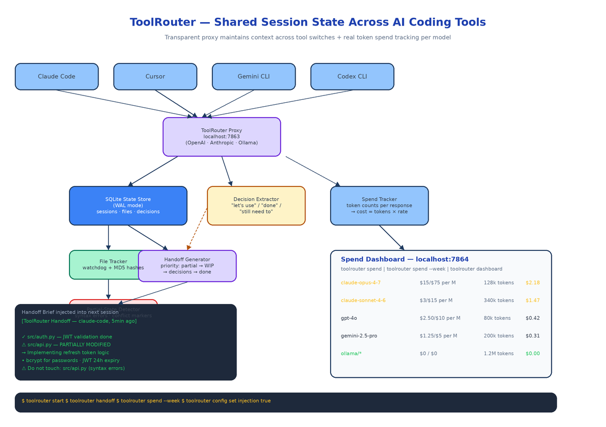

# ToolRouter: Switch AI Coding Tools Freely Without Losing Context or Losing Track of Spend

[](https://github.com/dakshjain-1616/Tool-Router)



## The Problem

> You're deep in a Claude Code session. Files changed, decisions made, a task half-finished. You switch to Cursor for an inline edit. When you return to Claude Code — or open any new chat anywhere — all of that is gone. The AI you're talking to has no idea what just happened.

Different AI coding tools have different strengths. Claude Code handles deep architectural work, Cursor shines for inline edits, Gemini CLI is fast for quick questions, Codex has its own niche. A good developer reaches for the right tool for each task. The problem is that every switch resets the AI to zero context. You re-explain what was in progress, re-establish which files changed, re-state the decisions you just made. And at the end of the week, you have no idea which tool cost what or which was actually efficient.

ToolRouter solves both problems with a transparent local proxy that every AI tool routes through.

## The Proxy and the Handoff

ToolRouter runs on port 7863. You point each AI tool's API base URL at it:

```bash
toolrouter start

# Claude Code
export ANTHROPIC_API_URL=http://localhost:7863/v1
# Cursor: Settings → AI → set OpenAI API base to http://localhost:7863/v1
# Gemini CLI
export OPENAI_API_BASE=http://localhost:7863/v1
# Ollama
export OLLAMA_HOST=http://localhost:7863/api
```

Every request is forwarded unchanged. As a side effect, ToolRouter records session state — file changes tracked by a watchdog, decisions extracted from AI responses, tasks identified as complete or in-progress — all linked to the current project.

When you switch tools on the same project, ToolRouter detects the new session, queries the state store, and prepends a Handoff Brief into the first message:

```
[ToolRouter Handoff — from claude-code, 5 minutes ago]

Files changed this session:
✓ src/auth.py — implemented JWT token validation
✓ src/models.py — added User model
⚠ src/api.py — PARTIALLY MODIFIED, do not use as-is

Completed:
✓ Set up authentication middleware
✓ Created database schema

In progress:
→ Implementing refresh token logic
→ Writing API documentation

Decisions made:
• Using bcrypt for password hashing
• JWT tokens expire after 24 hours
• Refresh tokens stored in Redis

⚠ Do not touch:
• src/api.py (has syntax errors)
```

The brief is generated from real data: file hashes computed before and after each session, partial-state detection via syntax error scanning and merge-conflict marker detection, and pattern matching over AI responses to extract decisions and task states.

## Spend Tracking

ToolRouter reads token counts from every proxied response and calculates cost using current model pricing:

```bash
toolrouter spend           # Today's report
toolrouter spend --week    # This week
toolrouter spend --month   # This month
```

The dashboard at `http://localhost:7864` (`toolrouter dashboard`) shows daily spend bar charts per tool, per-session costs, per-project breakdowns, and which tool is most cost-efficient measured by cost per file changed — the metric that actually tells you whether paying more per token is buying you faster progress. Projected monthly costs are updated each day based on current pace.

Model pricing is built in for Claude Opus/Sonnet/Haiku, GPT-4o, Gemini 2.5 Pro, DeepSeek, and Ollama (free). Local models show zero spend with real usage, so the comparison stays honest.

## Commands

| Command | What it does |
|---------|-------------|
| `toolrouter start` | Start the proxy daemon and dashboard |
| `toolrouter stop` | Stop the daemon |
| `toolrouter status` | Daemon health, active sessions, proxy ports |
| `toolrouter spend` | Today's token spend report |
| `toolrouter spend --week / --month` | Weekly or monthly report |
| `toolrouter sessions` | List sessions for the current project |
| `toolrouter handoff` | Preview the handoff brief for the current project |
| `toolrouter dashboard` | Open the spend dashboard |
| `toolrouter config set injection true/false` | Enable or disable handoff injection |
| `toolrouter logs` | Stream daemon logs |

Configuration lives at `~/.toolrouter/config.json`. Use `toolrouter config set <key> <value>` to change any setting without editing the file directly.

## Architecture

**State Store** — SQLite with WAL mode for concurrent read/write. Stores sessions, per-session file changes with MD5 hashes, extracted decisions and tasks, and generated handoff briefs. Every record links back to a session ID so the full history is queryable.

**File Tracker** — Watchdog-based monitoring of project directories. Computes file hashes before and after each session to produce an accurate change list, not a guess. Detects partial states by scanning for syntax errors, merge conflict markers, and unresolved TODOs.

**Decision Extractor** — Pattern matching over AI responses classifies statements into: decisions ("let's use", "we'll go with"), completed tasks ("done", "implemented", "✓"), in-progress work ("I've started", "still need to"), and blockers.

**Handoff Generator** — Assembles the brief from state store data, ordering by priority: partial files first (highest risk), then in-progress tasks, then decisions and completed items.

## How to Build This with NEO

Open NEO in VS Code or Cursor:

> "Build a Python proxy daemon called ToolRouter that runs on port 7863 and acts as a transparent proxy for OpenAI, Anthropic, and Ollama API calls. Track session state in SQLite: file changes via watchdog (MD5 hashes), decisions and task states extracted from AI responses via pattern matching, partial-file detection via syntax error scanning and merge-conflict markers. When a new session starts on the same project, generate and inject a Handoff Brief summarizing files changed, completed tasks, in-progress tasks, decisions, and partial-file warnings. Also track token counts from every proxied response and calculate real spend per model using current pricing. Serve a dashboard on port 7864 with daily spend charts per tool, per-session costs, cost-per-file-changed efficiency metric, and projected monthly costs. Commands: start, stop, status, spend, sessions, handoff, dashboard, config, logs."

<a href="https://heyneo.com/dashboard?section=new-chat&prompt=Build%20a%20Python%20proxy%20daemon%20called%20ToolRouter%20that%20maintains%20shared%20session%20state%20across%20Claude%20Code%2C%20Cursor%2C%20Gemini%20CLI%2C%20and%20Codex%20via%20a%20transparent%20local%20proxy%2C%20generates%20Handoff%20Briefs%20on%20tool%20switch%20(file%20changes%2C%20decisions%2C%20partial%20states)%2C%20and%20tracks%20real%20token%20spend%20per%20tool%20with%20a%20cost-per-file-changed%20efficiency%20metric%20on%20a%20local%20dashboard." style="display:inline-block;background:#1e40af;color:#ffffff;padding:10px 22px;border-radius:6px;text-decoration:none;font-weight:600;font-size:14px;">Build with NEO →</a>

NEO scaffolds the full proxy layer for all three API providers, the SQLite state store schema, the watchdog file tracker, the decision extractor, the partial-file detector, the handoff generator, the spend calculator with current model pricing, and the dashboard web UI. From there you tune the decision extraction patterns to match how your team talks in AI sessions and adjust pricing tables as models update.

```bash
git clone https://github.com/dakshjain-1616/Tool-Router
cd Tool-Router
pip install -e .

toolrouter start
# configure your AI tools to route through localhost:7863
toolrouter handoff    # preview what a handoff brief looks like
toolrouter dashboard  # open spend dashboard at localhost:7864
```

The freedom to switch AI tools without penalty — no lost context, no mystery spend — is what ToolRouter is for. See what else NEO ships at [heyneo.com](https://heyneo.com/).

---

## Try NEO in Your IDE

Install the NEO extension to bring AI-powered development directly into your workflow:

- **VS Code**: [NEO in VS Code](https://marketplace.visualstudio.com/items?itemName=NeoResearchInc.heyneo)
- **Cursor**: <a href="cursor://extension/NeoResearchInc.heyneo" style="color:#0066FF;font-weight:bold;">Install NEO for Cursor →</a>

---
