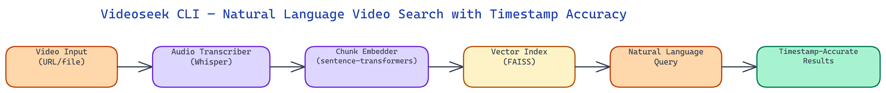

# Videoseek CLI: Semantic Search Across Video Content With Timestamp Precision

[](https://github.com/dakshjain-1616/videoseek-cli)



## The Problem

> Long-form video is a knowledge silo. A two-hour conference talk, a recorded architecture review, a weekly all-hands recording — they all contain valuable information that is completely unsearchable. You cannot Ctrl+F a video. You either watch the whole thing, scrub through hoping to find the right moment, or rely on whoever wrote the description to have mentioned the topic you care about. None of these scale.

NEO built Videoseek CLI to make video as searchable as text. Transcribe once, then ask natural language questions and get back the exact timestamps where the answer lives.

## Transcription Pipeline

The first stage converts audio to text. Videoseek CLI supports two input types: YouTube URLs (the tool downloads the audio track using yt-dlp) and local video files in any format that ffmpeg can decode (mp4, mkv, webm, mov, avi, and more).

Audio extraction strips the video track and produces a mono 16kHz WAV, which is the standard input format for speech recognition models. Transcription runs through Whisper — either OpenAI's API or a local model (tiny, base, small, medium, large) depending on your configuration. For most use cases, the `small` model running locally provides an excellent balance of speed and accuracy. The `large` model is available for content with heavy technical jargon, non-standard accents, or low audio quality.

Whisper's output is word-level timestamped text: every word in the transcript carries a start time and end time in seconds. Videoseek CLI preserves this granularity throughout the pipeline. The final search results will point to a specific second in the video, not a vague "somewhere around 45 minutes."

The raw transcript is segmented into chunks for embedding. Each chunk is a semantically coherent passage — typically 3-5 sentences or 30-60 seconds of speech, whichever boundary comes first. Chunking at sentence boundaries rather than fixed time windows is important: a fixed 30-second window might split a sentence mid-thought, degrading the coherence of the embedded passage and reducing retrieval accuracy.

## Embedding and Indexing

Each transcript chunk is embedded using a sentence-level embedding model. The default is `text-embedding-3-small` from OpenAI, which provides strong semantic representations at low cost. The tool also supports local embedding models via sentence-transformers (all-MiniLM-L6-v2, all-mpnet-base-v2) for fully offline operation.

The embedding for each chunk is stored in a vector index alongside its metadata: the source video identifier, the start timestamp in seconds, the end timestamp in seconds, the chunk text, and the speaker label if speaker diarization was run. The vector index defaults to FAISS (in-memory, fast, no external dependencies). For persistent indexes that survive process restarts and support incremental addition of new videos, a ChromaDB backend is available.

Indexing a two-hour video with the `small` Whisper model and local embeddings takes roughly 4-8 minutes on a modern CPU, or 1-2 minutes with a GPU. The resulting index is a few megabytes — small enough to commit to a repository or attach to a project directory.

## Semantic Search

The query interface is a single command: `videoseek search "the part where they discuss deployment architecture"`. The query string is embedded using the same model used during indexing, and the embedding is compared to all chunk embeddings in the index using cosine similarity. The top-k most similar chunks are returned as results.

Each result includes the timestamp as both a human-readable string (`1:23:47`) and a raw second count, the similarity score, and the chunk text. For YouTube videos, the result also includes a direct URL with a `?t=` parameter that jumps to the exact moment.

The semantic nature of the search means queries do not need to use the exact words spoken in the video. "How did they handle database migrations" will match a passage where someone talks about "schema changes" and "running Alembic on deploy." The embedding captures meaning, not surface form. This is the key difference from transcript text search, which would miss synonyms and paraphrases.

Hybrid search is available as an option: the tool runs both semantic search and BM25 keyword search on the transcript text, then merges the results using reciprocal rank fusion. Hybrid search outperforms pure semantic search for queries that contain specific technical terms, proper nouns, or exact phrases — cases where the semantic embedding might spread similarity across many loosely related passages.

## Multi-Video Collections

Videoseek CLI supports indexing multiple videos into a shared collection. After indexing several videos, a search query returns results from across the entire collection, each result tagged with its source video.

This is the feature that makes Videoseek genuinely useful for knowledge management. Index all recordings from a conference track, all episodes of a technical podcast, or all onboarding videos for a new team member. Then search the entire collection with a single query. "What did the speakers say about rate limiting" returns the best matches from any video in the collection, with timestamps pointing to the exact moment in the right video.

Collection metadata is stored in a lightweight SQLite database alongside the vector index. Adding a new video to an existing collection is incremental — only the new video is transcribed and embedded; the existing index is not rebuilt.

## Speaker Diarization

An optional speaker diarization step labels each transcript segment with a speaker identifier (Speaker 1, Speaker 2, etc.) using pyannote.audio. When diarization is enabled, search results include the speaker label for each matching chunk.

This adds a useful filter dimension: `videoseek search "deployment concerns" --speaker "Speaker 2"` restricts results to segments where the second identified speaker is talking. In a recorded meeting with known participants, you can map speaker labels to names after diarization and search by speaker name.

## CLI Interface and Output Formats

Videoseek CLI is driven by three commands. `videoseek index <source>` transcribes and indexes a video or URL. `videoseek search <query>` searches the current collection. `videoseek list` shows all indexed videos with their duration and chunk count.

Output defaults to a human-readable table in the terminal. The `--json` flag emits structured JSON for piping into other tools. The `--open` flag on macOS and Linux attempts to open the video at the matching timestamp directly in the default media player or browser.

## How to Build This

Clone the repo and install dependencies:

```bash
git clone https://github.com/dakshjain-1616/videoseek-cli
cd videoseek-cli
pip install -r requirements.txt
```

You also need `ffmpeg` installed on your system for audio extraction from local video files:

```bash
# Ubuntu/Debian
sudo apt-get install ffmpeg

# macOS
brew install ffmpeg
```

For YouTube downloads, `yt-dlp` is included in the requirements.

Set your embedding API key if using OpenAI embeddings (the default):

```bash
export OPENAI_API_KEY=sk-...
```

To use local embeddings instead, pass `--embedder local` when indexing — this uses `all-MiniLM-L6-v2` via sentence-transformers and requires no API key.

Index a YouTube video:

```bash
videoseek index https://www.youtube.com/watch?v=dQw4w9WgXcQ
```

Index a local file:

```bash
videoseek index ./recordings/architecture-review.mp4
```

Indexing a two-hour video takes 4 to 8 minutes on CPU with local embeddings, or 1 to 2 minutes with a GPU.

Search your indexed collection:

```bash
videoseek search "how did they handle database migrations"
```

Results print to the terminal as a table showing timestamps, similarity scores, and matching text. For YouTube-sourced videos, results include a direct URL with a `?t=` parameter that jumps to the matching moment.

List all indexed videos:

```bash
videoseek list
```

Use `--json` on any command to get structured output for piping into other tools.

NEO built Videoseek CLI so that long-form video stops being a knowledge silo — one index command and every recording in your collection becomes instantly searchable with timestamp-accurate results. See what else NEO ships at [heyneo.so](https://heyneo.so/).

---

## Try NEO in Your IDE

Install the NEO extension to bring AI-powered development directly into your workflow:

- **VS Code**: [NEO in VS Code](https://marketplace.visualstudio.com/items?itemName=NeoResearchInc.heyneo)
- **Cursor**: <a href="cursor://extension/NeoResearchInc.heyneo" style="color:#0066FF;font-weight:bold;">Install NEO for Cursor →</a>

---
