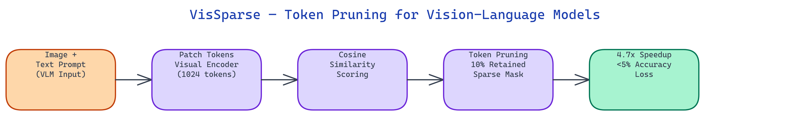

# VisSparse — Token Pruning Toolkit for Vision-Language Models

[](https://github.com/dakshjain-1616/vissparse)



## The Problem

> Vision-language models like Qwen2-VL and LLaVA process images by converting them into hundreds of patch tokens. A 448x448 image produces 1024 tokens at standard patch size. Every one of those tokens participates in every attention computation, even the tokens representing uniform sky, blank margins, or other low-information regions. The compute cost scales quadratically with token count.

NEO built VisSparse to cut that token count aggressively while preserving the tokens that actually matter for the task. At 10% token retention, models achieve a 4.7x inference speedup with less than 5% accuracy loss.

## Cosine-Similarity Token Scoring

The core mechanism is **cosine-similarity token selection**. Each image patch token is compared against a query representation derived from the text prompt. Tokens with high cosine similarity to the query are semantically relevant to the current task. Tokens with low similarity represent image regions that don't relate to what the model is being asked.

VisSparse computes these similarity scores at inference time, before the expensive cross-attention computation runs. Tokens below the score threshold are masked out. The model then runs cross-attention over only the retained tokens, which is where the compute savings come from.

This approach requires no model retraining. The scoring and masking happen as a wrapper around the existing model's attention mechanism, which means it works with any HuggingFace vision-language model that exposes standard attention interfaces.

## The keep_ratio Parameter

The **`keep_ratio`** parameter controls what fraction of image tokens survive pruning. It accepts values between 0.05 and 1.0. At 1.0, all tokens are kept and the model behaves identically to baseline. At 0.1, only the top 10% most query-relevant tokens are kept.

The right value depends on the task. Tasks that require reading text in images need higher ratios because text is distributed across many patches. Tasks about a single prominent object can use aggressive ratios because the object occupies a small fraction of the image.

```python
from vissparse import VisSparse

model = VisSparse(base_model="Qwen/Qwen2-VL-7B", keep_ratio=0.10)
output = model.generate(image=img, prompt="What color is the car?")
```

At `keep_ratio=0.10`, the benchmark shows 4.7x speedup. At `keep_ratio=0.25`, the accuracy gap shrinks to under 2% while still delivering a 2.5x speedup.

## Sparse Attention Masks

Token selection produces a **sparse attention mask** that marks which tokens are active and which are pruned. This mask is built once per forward pass and applied to all attention layers. The mask is a boolean tensor with the same length as the image token sequence.

The sparse mask integrates with HuggingFace's `attention_mask` parameter, which means standard model code paths handle it correctly without modification. Pruned tokens receive zero attention weight and do not contribute to the key-value computations that dominate transformer inference time.

Building the mask at inference time means the sparsity pattern adapts to each image-prompt pair. The same image processed with two different prompts will produce different masks, because different regions of the image are relevant to different questions.

## Performance Monitoring

VisSparse records three metrics for each inference call: accuracy (compared against a reference model or ground truth), latency in milliseconds, and speedup relative to the un-pruned baseline. These are logged per call and aggregated across a benchmark run.

The toolkit includes a **mock testing mode** that generates synthetic image tokens and produces realistic metric outputs without requiring a GPU. This makes it possible to verify the scoring and masking logic on any hardware.

```python
from vissparse import VisSparse

model = VisSparse(base_model="mock", keep_ratio=0.10, mock=True)
results = model.benchmark(n_samples=100)
print(f"Speedup: {results['speedup']:.1f}x, Accuracy delta: {results['accuracy_delta']:.2%}")
```

## How to Build This with NEO

Open NEO in VS Code or Cursor and describe what you want to build. A good starting prompt for this project:

> "Build a Python token pruning toolkit for vision-language models called VisSparse. At inference time, compute cosine similarity between each image patch token and a query representation derived from the text prompt. Mask out tokens below a keep_ratio threshold (0.05 to 1.0) using a sparse boolean attention mask that integrates with HuggingFace's attention_mask parameter. Apply this as a wrapper around [Qwen2-VL-7B](https://huggingface.co/Qwen/Qwen2-VL-7B-Instruct) and LLaVA without retraining. Record accuracy, latency in milliseconds, and speedup vs unpruned baseline for each inference call. Include a mock testing mode that generates synthetic tokens and produces realistic benchmark outputs without requiring a GPU."

<a href="https://heyneo.com/dashboard?section=new-chat&prompt=Build%20a%20Python%20token%20pruning%20toolkit%20for%20vision-language%20models%20called%20VisSparse.%20At%20inference%20time%2C%20compute%20cosine%20similarity%20between%20each%20image%20patch%20token%20and%20a%20query%20representation%20derived%20from%20the%20text%20prompt.%20Mask%20out%20tokens%20below%20a%20keep_ratio%20threshold%20%280.05%20to%201.0%29%20using%20a%20sparse%20boolean%20attention%20mask%20that%20integrates%20with%20HuggingFace%27s%20attention_mask%20parameter.%20Apply%20this%20as%20a%20wrapper%20around%20Qwen2-VL-7B%20and%20LLaVA%20without%20retraining.%20Record%20accuracy%2C%20latency%20in%20milliseconds%2C%20and%20speedup%20vs%20unpruned%20baseline%20for%20each%20inference%20call.%20Include%20a%20mock%20testing%20mode%20that%20generates%20synthetic%20tokens%20and%20produces%20realistic%20benchmark%20outputs%20without%20requiring%20a%20GPU." style="display:inline-block;background:#1e40af;color:#ffffff;padding:10px 22px;border-radius:6px;text-decoration:none;font-weight:600;font-size:14px;">Build with NEO →</a>

NEO generates the cosine similarity scorer, sparse mask builder, HuggingFace model wrapper, and mock benchmark mode. From there you iterate -- ask it to add a `benchmark` method that runs n_samples and reports mean speedup and accuracy delta across a range of keep_ratio values, add automatic keep_ratio tuning that targets a user-specified speedup goal while minimizing accuracy loss, or add support for LLaVA-1.5 alongside Qwen2-VL.

To run the finished project:

```bash
git clone https://github.com/dakshjain-1616/vissparse
cd vissparse
pip install -r requirements.txt
```

Test immediately in mock mode without a GPU:

```python
from vissparse import VisSparse
model = VisSparse(base_model="mock", keep_ratio=0.10, mock=True)
results = model.benchmark(n_samples=50)
print(results)  # speedup, accuracy_delta
```

At keep_ratio=0.10 on real Qwen2-VL-7B, you get 4.7x inference speedup with less than 5% accuracy loss -- no retraining required.

NEO built VisSparse as a zero-retraining token pruning toolkit that delivers up to 4.7x inference speedup on vision-language models by discarding image tokens that are irrelevant to the prompt. See what else NEO ships at [heyneo.com](https://heyneo.com/).

---

## Try NEO in Your IDE

Install the NEO extension to bring AI-powered development directly into your workflow:

- **VS Code**: [NEO in VS Code](https://marketplace.visualstudio.com/items?itemName=NeoResearchInc.heyneo)
- **Cursor**: <a href="cursor://extension/NeoResearchInc.heyneo" style="color:#0066FF;font-weight:bold;">Install NEO for Cursor →</a>

---
