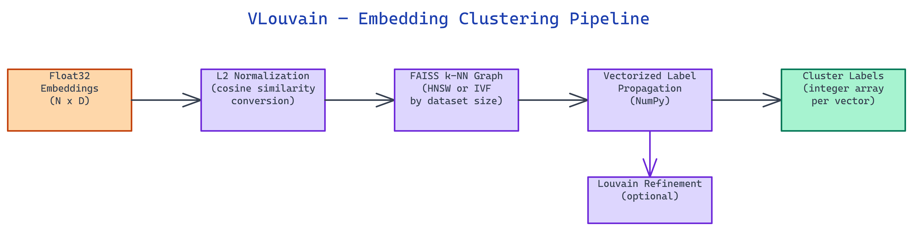

# VLouvain: Fast Scalable Clustering for High-Dimensional Embeddings

[](https://github.com/dakshjain-1616/vlouvain)



## The Problem

> Clustering millions of high-dimensional embeddings with UMAP and HDBSCAN takes minutes to hours and becomes impractical above 100,000 vectors. Traditional Louvain clustering builds the full graph on CPU, which bottlenecks on large datasets. Most production systems need clustering results in seconds, not minutes, and without requiring specialized hardware.

NEO built VLouvain to cluster embeddings at scale using a four-stage pipeline that stays in pure Python. It handles 10,000 vectors in 33 milliseconds and 1 million vectors in 12 seconds, with memory usage that stays bounded around 2 GB.

## Four-Stage Pipeline

VLouvain runs four sequential stages to transform raw embeddings into cluster assignments.

The first stage is **L2 normalization**. Every input vector is normalized to unit length, which converts inner product similarity into cosine similarity. This matters because FAISS's IndexFlatIP (inner product index) becomes equivalent to cosine similarity after normalization, giving consistent distance semantics across all downstream steps.

The second stage builds a **k-NN graph** using FAISS. For datasets up to 500,000 points, VLouvain uses the HNSW (Hierarchical Navigable Small World) index, which provides approximate nearest neighbor search in O(log n) time with excellent recall. For larger datasets, it switches to the IVF (Inverted File Index) structure, which trades a small amount of recall for dramatically reduced memory usage. The k-NN graph stores only the k nearest neighbors for each point, represented as a sparse adjacency structure.

The third stage runs **vectorized label propagation** using NumPy operations. Each node is assigned its own label initially. The algorithm then iterates, updating each node's label to the most frequent label among its k neighbors. NumPy broadcasting lets this run over the entire graph in each iteration without Python-level loops, making it orders of magnitude faster than naive label propagation implementations.

The fourth stage, optional, applies **Louvain refinement**. For smaller datasets where modularity optimization is feasible, VLouvain runs the standard Louvain algorithm to split or merge communities based on the modularity objective. This produces tighter, more semantically meaningful clusters at a higher compute cost.

## Speed Comparison

The performance gap over UMAP + HDBSCAN widens sharply with dataset size.

At 10,000 vectors in 128 dimensions, VLouvain completes in roughly 33 milliseconds. UMAP + HDBSCAN takes about 60 seconds on the same dataset. At 100,000 vectors, VLouvain takes 0.8 seconds. UMAP becomes impractical at that scale. At 1 million vectors, VLouvain completes in 12 seconds with around 2 GB peak RAM. HDBSCAN cannot run on that input without distributed infrastructure.

The speed advantage comes from two decisions: using FAISS's approximate nearest neighbor search instead of exact search, and replacing graph-level modularity optimization (which is O(n log n) at best) with vectorized label propagation, which runs in fixed NumPy array operations per iteration.

## Configuration Options

VLouvain exposes its key parameters through constructor arguments, CLI flags, or environment variables.

**`k`** controls the number of nearest neighbors in the k-NN graph. Higher k produces coarser clusters with more inter-cluster connectivity. Lower k produces finer-grained clusters that may fragment sparse regions. The default is 15.

**`resolution`** tunes cluster granularity during optional Louvain refinement. Values above 1.0 favor more, smaller clusters. Values below 1.0 favor fewer, larger clusters.

**`similarity_threshold`** filters weak edges from the k-NN graph before label propagation. Setting this to 0.5 removes all edges with cosine similarity below 0.5, which reduces noise in sparse embedding regions but may disconnect some valid communities.

Environment variable names follow the `VLOUVAIN_` prefix convention: `VLOUVAIN_K`, `VLOUVAIN_RANDOM_STATE`, and so on.

## How to Build This with NEO

Open NEO in VS Code or Cursor and describe what you want to build. A good starting prompt for this project:

> "Build a Python clustering library called VLouvain for high-dimensional float32 embeddings at scale. Implement a four-stage pipeline: L2 normalize all vectors, build a k-NN graph using FAISS HNSW index for datasets under 500k points and IVF index for larger ones, run vectorized label propagation with NumPy broadcasting to avoid Python-level loops, then optionally apply Louvain modularity refinement. Expose a CLI command `vlouvain cluster --input embeddings.npy --output labels.npy --k 15` and a Python API with `VLouvain(k, resolution, similarity_threshold).fit_predict(embeddings)`. Target 33ms for 10k vectors and 12 seconds for 1M vectors."

<a href="https://heyneo.com/dashboard?section=new-chat&prompt=Build%20a%20Python%20clustering%20library%20called%20VLouvain%20for%20high-dimensional%20float32%20embeddings%20at%20scale.%20Implement%20a%20four-stage%20pipeline%3A%20L2%20normalize%20all%20vectors%2C%20build%20a%20k-NN%20graph%20using%20FAISS%20HNSW%20index%20for%20datasets%20under%20500k%20points%20and%20IVF%20index%20for%20larger%20ones%2C%20run%20vectorized%20label%20propagation%20with%20NumPy%20broadcasting%20to%20avoid%20Python-level%20loops%2C%20then%20optionally%20apply%20Louvain%20modularity%20refinement.%20Expose%20a%20CLI%20command%20%60vlouvain%20cluster%20--input%20embeddings.npy%20--output%20labels.npy%20--k%2015%60%20and%20a%20Python%20API%20with%20%60VLouvain%28k%2C%20resolution%2C%20similarity_threshold%29.fit_predict%28embeddings%29%60.%20Target%2033ms%20for%2010k%20vectors%20and%2012%20seconds%20for%201M%20vectors." style="display:inline-block;background:#1e40af;color:#ffffff;padding:10px 22px;border-radius:6px;text-decoration:none;font-weight:600;font-size:14px;">Build with NEO →</a>

NEO generates the four-stage pipeline, FAISS index selection logic, vectorized label propagation, and CLI. From there you iterate -- ask it to add environment variable configuration with a `VLOUVAIN_` prefix, add a `--resolution` flag for tuning cluster granularity during Louvain refinement, or add cluster quality metrics like silhouette score computed on a sample for large datasets.

To run the finished project:

```bash
git clone https://github.com/dakshjain-1616/vlouvain
cd vlouvain
pip install -r requirements.txt
vlouvain cluster --input embeddings.npy --output labels.npy --k 15
```

Pass any float32 NumPy array of shape (N, D) and get back a 1D integer cluster label array -- 10k vectors in 33ms, 1M vectors in 12 seconds, no GPU required.

NEO built VLouvain to cluster millions of embeddings in seconds without GPU acceleration, combining FAISS-powered k-NN graph construction with vectorized label propagation. See what else NEO ships at [heyneo.com](https://heyneo.com/).

---

## Try NEO in Your IDE

Install the NEO extension to bring AI-powered development directly into your workflow:

- **VS Code**: [NEO in VS Code](https://marketplace.visualstudio.com/items?itemName=NeoResearchInc.heyneo)
- **Cursor**: <a href="cursor://extension/NeoResearchInc.heyneo" style="color:#0066FF;font-weight:bold;">Install NEO for Cursor →</a>

---
