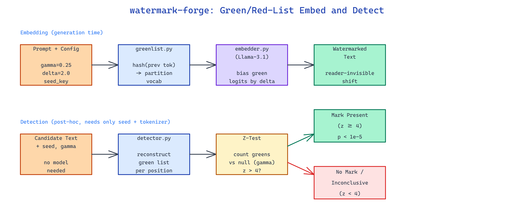

# watermark-forge: Green/Red-List Watermarking and Detection for LLM-Generated Text

[](https://github.com/dakshjain-1616/watermark-forge)



## The Problem

> Teams ship LLM-generated content at scale and have no reliable way to verify provenance after the fact — classifier-based detectors are brittle and adversaries paraphrase around them in one pass.

NEO built watermark-forge as a clean reference implementation of statistical watermarking: a scheme that is invisible to readers, survives common edits, and can be detected by anyone holding the seed without needing the original model.

## Green/Red-List Embedding at Sampling Time

**watermark-forge** ships three focused modules — `greenlist.py`, `embedder.py`, and `detector.py` — implementing the Kirchenbauer et al. scheme. During generation, each step hashes the previous token into a pseudorandom seed, partitions the vocabulary into a "green list" (γ fraction, typically 0.25) and a "red list" (1−γ), and adds a bias δ to the logits of green-list tokens before sampling. Over hundreds of tokens this shifts the distribution of emitted tokens toward the green list by a statistically detectable amount without producing reader-visible artifacts.

```python
from watermark_forge import WatermarkEmbedder

embedder = WatermarkEmbedder(
    model="meta-llama/Llama-3.1-8B-Instruct",
    gamma=0.25,
    delta=2.0,
    seed_key=0xDEADBEEF,
)
watermarked_text = embedder.generate("Summarize the attached policy.", max_tokens=400)
```

The seed key, γ, and δ form the "watermark configuration" — detection requires only these plus the tokenizer, not the original model.

## One-Sided Z-Test Detection

The detector walks the token stream, reconstructs the green list at each position using the same seed, counts green-token hits, and computes a one-sided z-score against the null hypothesis of unwatermarked text (expected green fraction = γ). A z-score above 4 typically corresponds to a p-value below 1e-5, which is strong enough to act on in most pipelines.

| Scenario | Green fraction | Z-score | Verdict |
|---|---|---|---|
| Unwatermarked human text | ~0.25 | ~0 | No mark |
| Fully watermarked (δ=2) | ~0.55 | 12-18 | Strong mark |
| Paraphrased watermarked | ~0.35 | 4-7 | Mark present |
| Mixed (50% edited) | ~0.30 | 2-3 | Inconclusive |

Detection operates at the token level, so short snippets (under ~100 tokens) can produce inconclusive verdicts by design.

## CLI Workflow

```bash
python embedder.py \
  --model meta-llama/Llama-3.1-8B-Instruct \
  --prompt prompts/policy.txt \
  --gamma 0.25 --delta 2.0 --seed 0xDEADBEEF \
  --out watermarked.txt

python detector.py \
  --text watermarked.txt \
  --gamma 0.25 --seed 0xDEADBEEF \
  --threshold 4.0
```

The detector emits the z-score, p-value, green-token fraction, and a verdict string suitable for logging or gating downstream use.

## How to Build This with NEO

Open NEO in VS Code or Cursor and describe what you want to build. A good starting prompt for this project:

> "Build a reference implementation of Kirchenbauer green/red-list watermarking for LLM text. At each generation step, hash the previous token to seed a vocabulary partition, bias green-list logits by delta before sampling, and record the configuration. Build a separate detector that walks any text and computes a one-sided z-score against the green-fraction null hypothesis, emitting p-value and verdict. Package as three clean modules (greenlist, embedder, detector) with CLI entrypoints."

<a href="https://heyneo.com/dashboard?section=new-chat&prompt=Build%20a%20reference%20implementation%20of%20Kirchenbauer%20green%2Fred-list%20watermarking%20for%20LLM%20text.%20At%20each%20generation%20step%2C%20hash%20the%20previous%20token%20to%20seed%20a%20vocabulary%20partition%2C%20bias%20green-list%20logits%20by%20delta%20before%20sampling%2C%20and%20record%20the%20configuration.%20Build%20a%20separate%20detector%20that%20walks%20any%20text%20and%20computes%20a%20one-sided%20z-score%20against%20the%20green-fraction%20null%20hypothesis%2C%20emitting%20p-value%20and%20verdict.%20Package%20as%20three%20clean%20modules%20%28greenlist%2C%20embedder%2C%20detector%29%20with%20CLI%20entrypoints." style="display:inline-block;background:#1e40af;color:#ffffff;padding:10px 22px;border-radius:6px;text-decoration:none;font-weight:600;font-size:14px;">Build with NEO →</a>

NEO generates the project structure and core implementation. From there you iterate — add the Aaronson scheme for a second style comparison, benchmark robustness under paraphrase attacks, or package the detector as a FastAPI service for post-hoc provenance checks. Each request builds on what's already there.

To run the finished project:

```bash
git clone https://github.com/dakshjain-1616/watermark-forge
cd watermark-forge
pip install -r requirements.txt
python embedder.py --model meta-llama/Llama-3.1-8B-Instruct --prompt "Write a short essay on..." --out out.txt
python detector.py --text out.txt --seed 0xDEADBEEF
```

The detector returns a z-score and verdict that downstream pipelines can use to gate, log, or label content.

NEO built a compact, inspectable watermarking reference that makes the Kirchenbauer scheme easy to plug into experiments and provenance pipelines. See what else NEO ships at [heyneo.com](https://heyneo.com/).

---

## Try NEO in Your IDE

Install the NEO extension to bring AI-powered development directly into your workflow:

- **VS Code**: [NEO in VS Code](https://marketplace.visualstudio.com/items?itemName=NeoResearchInc.heyneo)
- **Cursor**: <a href="cursor://extension/NeoResearchInc.heyneo" style="color:#0066FF;font-weight:bold;">Install NEO for Cursor →</a>

---
