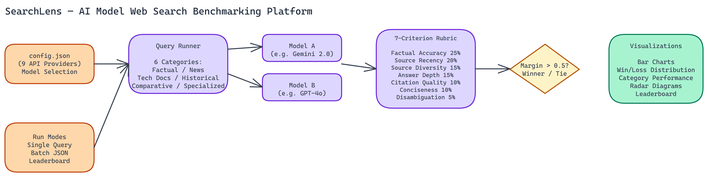

# Comparing AI Models on Web Search Tasks: A Systematic Benchmarking Approach

## The Problem

> Which AI model is better at answering search queries? The question sounds simple, but the answer depends entirely on what you mean by "better" — faster, more accurate, more recent, better cited, more concise? Different models have different strengths, and a handful of manual tests can't reveal them. Without structured comparison across multiple quality dimensions, teams building search applications are making model selection decisions based on intuition rather than evidence.

NEO built SearchLens to make that comparison systematic and reproducible.

## The Benchmarking Framework

SearchLens evaluates any two models against each other on web search tasks using a **seven-criterion weighted rubric**. The criteria and their weights are:

- **Factual Accuracy (25%)** - Is the answer correct?
- **Source Recency (20%)** - Does it reflect current information?
- **Source Diversity (15%)** - Does it draw from multiple independent sources?
- **Answer Depth (15%)** - Does it cover the topic adequately?
- **Citation Quality (10%)** - Are claims properly attributed?
- **Conciseness (10%)** - Is the answer appropriately brief?
- **Disambiguation (5%)** - Does it handle ambiguous queries well?

The weighting reflects the relative importance of these criteria for search applications. Factual accuracy is the most important single dimension. Source recency matters especially for queries about current events. Citation quality and conciseness are real factors but less critical than accuracy and coverage.

Results with a margin above **0.5 points** declare a winner. Smaller margins are recorded as ties. This prevents false confidence when models are genuinely close on a task.

## Nine API Providers, One Configuration File

The platform supports nine API providers. Google and OpenAI have native web search capabilities built into their APIs. The other providers go through standard chat completions endpoints. All nine are configured through a single `config.json` file where you specify the model names, providers, and model IDs you want to compare.

This design means you can compare any two models regardless of provider, as long as you have the relevant API keys. Want to compare Gemini 2.0 Flash against Claude 3.5 Sonnet on technical documentation queries? Configure both in `config.json`, add both API keys to `.env`, and run it.

The configuration-first approach also makes comparisons reproducible. Save your config file alongside your results and you can re-run the same comparison after model updates to see whether performance changed.

## Task Categories

The platform runs comparisons across six query categories:

- **Factual recency** - Questions about recent events or current data
- **Current news** - Live news queries where source freshness matters most
- **Technical documentation** - Code, API, and technical reference queries
- **Historical facts** - Knowledge-based queries where recency is irrelevant
- **Comparative analysis** - Queries requiring synthesis across multiple sources
- **Specialized knowledge** - Domain-specific queries in medicine, law, science

Running across all six categories reveals patterns that single-category testing misses. A model might dominate on technical documentation but struggle with current news. Knowing this shapes how you deploy it.

## Three Ways to Run It

**Single queries.** Pass a query string via CLI and get a head-to-head comparison immediately. Good for spot-checking specific questions you care about.

**Batch processing.** Provide a JSON file containing multiple tasks and run all of them in sequence. This is the right approach for systematic comparisons where you want statistically meaningful results across many queries.

**Leaderboard mode.** Track cumulative rankings across multiple benchmark runs. Run the benchmark weekly and build a historical record of how models compare on your specific query distribution.

## Reading the Output

Results include several visualization types:

- **Bar charts** for overall weighted scores
- **Win/loss distribution** charts showing which model wins more often and by how much
- **Category performance comparisons** showing per-category scores for both models
- **Radar diagrams** showing rubric criterion performance across all seven dimensions

The radar diagram is particularly useful for understanding each model's performance profile. A model that scores high on factual accuracy and citation quality but low on conciseness has a different profile than one that scores evenly across all dimensions. These profiles translate directly into deployment decisions.

## Why This Kind of Comparison Matters

Frontier model providers publish benchmark results, but those benchmarks are designed by the providers and tested on their preferred evaluation sets. They're useful signals, not ground truth for your specific use case.

Your application has a specific query distribution, specific accuracy requirements, specific recency requirements. A generic benchmark won't tell you how the models behave on your queries. A comparison tool that runs on your actual queries, evaluated on criteria you weight by importance, gives you more actionable information.

This is especially true for search applications, where the definition of a "good answer" is highly context-dependent. A news aggregator and a technical documentation site have different optimal models even if both are doing something that could be called "web search."

## Choosing Models for Search Applications

The patterns we've observed running these comparisons:

Models with native web search (Google, OpenAI) tend to win on source recency and current news categories. Their retrieval pipeline is tighter. For time-sensitive queries, this advantage is often decisive.

Larger models with strong reasoning tend to win on technical documentation and comparative analysis. They synthesize across sources better.

On factual recency, the gap between models with and without web search is large. On historical facts, it narrows considerably. Choosing a model without native search for a fact-heavy application might be a reasonable cost tradeoff if your questions don't require current information.

## Build Search-Aware AI Systems

NEO built a web search model benchmarking platform where a seven-criterion weighted rubric across nine API providers replaces gut-feel model selection with reproducible, task-specific evidence. See what else NEO ships at [heyneo.so](https://heyneo.so/).

---

## Try NEO in Your IDE

Install the NEO extension to bring AI-powered development directly into your workflow:

- **VS Code**: [NEO in VS Code](https://marketplace.visualstudio.com/items?itemName=NeoResearchInc.heyneo)
- **Cursor**: [**Install NEO for Cursor →**](cursor:extension/NeoResearchInc.heyneo)

---
