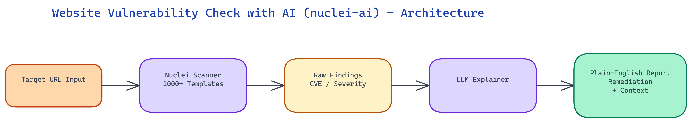

# nuclei-ai: Security Scanning with LLM-Powered Vulnerability Explanations

[](https://github.com/dakshjain-1616/nuclei-ai)



[Watch the demo](https://drive.google.com/file/d/1D3987098q4QV94gIYKeKHA6HqBWnEYH6/view?usp=sharing)

## The Problem

> Nuclei is one of the most powerful open-source security scanners available — a template-based vulnerability scanner with thousands of community-maintained templates covering CVEs, misconfigurations, exposed credentials, and application-layer vulnerabilities. The output is accurate, comprehensive, and completely opaque to anyone who isn't already a security engineer. A finding like "CVE-2021-44228 [critical] matched at /api/lookup?q=..." tells an expert exactly what's happening. It tells a backend engineer or a product manager essentially nothing: not what the vulnerability is, not how exploitable it is in context, not what to do about it.

NEO built nuclei-ai to close the interpretation gap. Nuclei does what it does best — fast, reliable, template-based vulnerability detection. An LLM layer takes each finding and produces a plain-language explanation, contextual severity assessment, and concrete remediation steps that any engineer can act on.

## How Nuclei Works

Nuclei is a template-driven dynamic application security testing (DAST) scanner built by ProjectDiscovery. Each template describes a specific vulnerability check: what request to send, what response pattern indicates the vulnerability is present, and metadata about the vulnerability (CVE ID, severity, CVSS score, affected software).

The template library covers an enormous range: CVE-specific checks for known vulnerabilities in popular software, misconfiguration checks (exposed admin panels, directory listings, default credentials), exposure checks (API keys, cloud credentials, internal documentation), and fuzzing templates for common vulnerability classes (SQL injection, XSS, path traversal, SSRF).

Running `nuclei -target https://example.com -t cves/ -t misconfigurations/` triggers hundreds or thousands of probes against the target, each checking for a specific issue. The output is a list of findings with template IDs, severity ratings, matched response fragments, and URLs. It's machine-readable and very fast — Nuclei is built for speed, scanning a typical web application in minutes.

The limitation is the output format. Template IDs and CVE numbers are meaningful to security professionals with the context to interpret them. They're not meaningful to the people who often need to act on them: the backend engineers who own the vulnerable service, the platform team responsible for configuration, or the engineering manager trying to prioritize remediation work.

## The LLM Explanation Layer

For each Nuclei finding, nuclei-ai constructs a detailed LLM prompt that includes: the full template metadata (name, description, severity, CVE data if applicable), the matched request and response (sanitized), the target URL and relevant context, and a request for a structured explanation.

The LLM produces a structured output covering five sections:

**Plain-language explanation**: What is this vulnerability? Explained without assuming security background. What does it mean that this specific issue is present in this specific context? Not a generic CVE description copied from NVD, but an explanation calibrated to what was actually detected.

**Exploitability context**: How hard is this to exploit? What does an attacker need to exploit it — network access, authentication, specific conditions? Is this a theoretical vulnerability or one that's actively exploited in the wild? Severity ratings from CVSS scores are useful starting points but don't capture contextual exploitability.

**Business impact**: If this is exploited, what's the impact? Data exposure? Service disruption? Privilege escalation? The LLM maps from technical vulnerability class to business consequence, which is the framing that non-security stakeholders need to make prioritization decisions.

**Remediation steps**: Concrete, actionable steps to fix or mitigate the issue. Not "apply the vendor patch" but "update the nginx version in your Docker base image from 1.21 to 1.25.3, which is the minimum version containing the fix for this CVE. Here's the specific Dockerfile line to change." The specificity is important — vague remediation guidance creates just as much friction as no guidance.

**Verification steps**: How to confirm the fix was applied correctly. A rescan with the specific template that triggered the finding is the obvious answer, but the LLM can also describe manual verification approaches.

## Severity Contextualization

One of the most valuable functions of the LLM layer is severity contextualization. A raw CVSS score of 9.8 (Critical) describes the theoretical worst case. The actual risk depends heavily on context that CVSS doesn't capture: whether the vulnerable endpoint is internet-facing or internal, whether authentication is required to reach it, whether compensating controls are in place, and whether the target application is a production system or a staging environment.

nuclei-ai prompts the LLM to reason about contextual severity based on the URL, the matched request/response, and any application context you provide. A critical CVE on an internal-only endpoint with no external access is a much lower actual risk than the same CVE on a public-facing endpoint. A misconfiguration that exposes staging environment credentials is severe; the same misconfiguration exposing a publicly documented read-only API key is not.

The contextualized severity assessment gives engineering teams a risk-adjusted view of their findings — not just a list of everything that fired, sorted by theoretical CVSS score, but a prioritized view that accounts for what's actually exposed and exploitable in their specific environment.

## Report Generation

nuclei-ai produces findings reports in several formats targeting different audiences.

**Engineering report** (Markdown): Full findings list with detailed explanations, exploitability context, and remediation steps. Designed for the engineers who will actually do the fix work. Includes code snippets and configuration examples where relevant.

**Management summary** (Markdown or HTML): Executive-level summary showing vulnerability count by severity tier, estimated remediation effort, and business impact framing. No technical jargon. Designed for engineering managers and product leaders making prioritization decisions.

**Ticket-ready format**: Individual findings formatted as JIRA or Linear ticket descriptions, with title, description, severity label, and acceptance criteria for the fix. Paste-ready for teams that track security work in their standard issue tracker.

**Diff-able JSON**: Full structured output of all findings with LLM-generated fields for programmatic processing, deduplication across scans, and trend analysis.

## Integration with CI/CD and Developer Workflows

nuclei-ai can be integrated into CI/CD pipelines for automated security feedback during development. In a PR check workflow, the tool runs a subset of high-signal templates against a PR's changes (via a staging deployment), generates a findings report, and posts the summarized results as a PR comment. Developers see plain-English security feedback as part of their normal code review flow.

The GitHub integration mode produces comments that look like code review feedback rather than security scan output: "This PR introduces an endpoint at `/api/files` that may be vulnerable to path traversal. The request handler doesn't sanitize the `path` parameter before passing it to `fs.readFile`. An attacker could read files outside the intended directory. Here's how to fix it: [specific code example]." This format makes security findings actionable in the developer workflow where they have the most context.

## How to Build This with NEO

Open NEO in VS Code or Cursor and describe what you want to build. A good starting prompt for this project:

> "Build a Python wrapper around the Nuclei security scanner that takes each raw finding and generates a structured LLM explanation covering five sections: plain-language description, exploitability context including attack prerequisites and in-the-wild status, business impact mapping from technical vulnerability class to data/service/privilege consequences, concrete remediation steps with specific version numbers and code examples, and verification steps for confirming the fix. Support three output formats: a full engineering Markdown report with remediation steps, a management summary with severity counts and business impact framing, and JIRA-ready ticket descriptions. Accept --target URL, --templates paths, and --severity filter flags."

<a href="https://heyneo.com/dashboard?section=new-chat&prompt=Build%20a%20Python%20wrapper%20around%20the%20Nuclei%20security%20scanner%20that%20takes%20each%20raw%20finding%20and%20generates%20a%20structured%20LLM%20explanation%20covering%20five%20sections%3A%20plain-language%20description%2C%20exploitability%20context%20including%20attack%20prerequisites%20and%20in-the-wild%20status%2C%20business%20impact%20mapping%20from%20technical%20vulnerability%20class%20to%20data%2Fservice%2Fprivilege%20consequences%2C%20concrete%20remediation%20steps%20with%20specific%20version%20numbers%20and%20code%20examples%2C%20and%20verification%20steps%20for%20confirming%20the%20fix.%20Support%20three%20output%20formats%3A%20a%20full%20engineering%20Markdown%20report%20with%20remediation%20steps%2C%20a%20management%20summary%20with%20severity%20counts%20and%20business%20impact%20framing%2C%20and%20JIRA-ready%20ticket%20descriptions.%20Accept%20--target%20URL%2C%20--templates%20paths%2C%20and%20--severity%20filter%20flags." style="display:inline-block;background:#1e40af;color:#ffffff;padding:10px 22px;border-radius:6px;text-decoration:none;font-weight:600;font-size:14px;">Build with NEO →</a>

NEO generates the Nuclei subprocess wrapper, LLM prompt templates for each of the five explanation sections, and the three report format emitters. From there you iterate -- ask it to add contextual severity adjustment that downgrades CVSS scores for internal-only endpoints, add a GitHub PR comment integration mode that posts findings as code review feedback, or add a `--format ticket` mode that outputs JIRA-paste-ready descriptions with severity labels and fix acceptance criteria.

To run the finished project:

```bash
# Install Nuclei binary first
go install -v github.com/projectdiscovery/nuclei/v3/cmd/nuclei@latest

git clone https://github.com/dakshjain-1616/nuclei-ai
cd nuclei-ai
pip install -r requirements.txt
export OPENAI_API_KEY=sk-...
python nuclei_ai.py --target https://example.com --templates cves/ misconfigurations/
```

Reports land in `./reports/` -- an engineering Markdown file with full remediation steps, a management summary, and structured JSON -- turning raw scanner output into actionable intelligence any engineer can act on.

NEO built nuclei-ai so that security scanning output is useful to the full engineering team, not just security specialists -- turning raw scanner output into actionable intelligence that any engineer can act on. See what else NEO ships at [heyneo.com](https://heyneo.com/).

---

## Try NEO in Your IDE

Install the NEO extension to bring AI-powered development directly into your workflow:

- **VS Code**: [NEO in VS Code](https://marketplace.visualstudio.com/items?itemName=NeoResearchInc.heyneo)
- **Cursor**: <a href="cursor://extension/NeoResearchInc.heyneo" style="color:#0066FF;font-weight:bold;">Install NEO for Cursor →</a>

---
