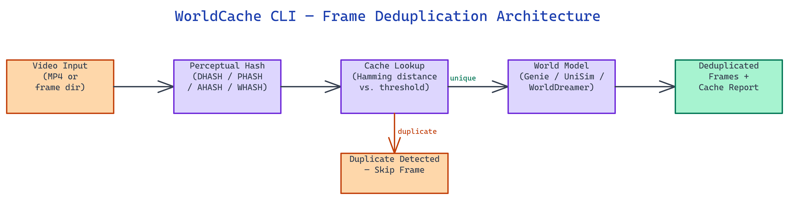

# WorldCache CLI: Perceptual Frame Deduplication for World Models

[](https://github.com/dakshjain-1616/worldcache-cli)



## The Problem

> World models like Genie, UniSim, and WorldDreamer are computationally expensive to run. Real video footage is brutally redundant — consecutive frames in a static scene can differ by less than 1% of pixels. Running every frame through a world model wastes resources on information that hasn't changed.

NEO built WorldCache CLI to filter out duplicate and near-duplicate frames before they hit the model. It sits in front of your inference pipeline as a perceptual cache layer, requiring no GPU and no model modifications.

## How Perceptual Hashing Works

**Perceptual hashing** converts an image into a compact fingerprint that stays stable across minor pixel-level noise but changes when the image content changes meaningfully. Unlike cryptographic hashes, two frames that look nearly identical to a human eye will produce similar perceptual hashes with a small Hamming distance.

WorldCache computes a hash for each incoming frame and checks it against a cache of previously seen hashes. If the Hamming distance between the new frame's hash and the closest cached hash falls below a configurable threshold, the frame is classified as a duplicate and skipped. This single comparison replaces a full model forward pass.

The threshold you set determines the trade-off between deduplication aggressiveness and recall. A low threshold only skips frames that are pixel-for-pixel identical. A higher threshold skips frames that are perceptually similar, which is useful for slow-moving scenes but may miss subtle motion in fast-action sequences.

## Four Hash Algorithms

WorldCache ships four **hash algorithms**, each with different performance and sensitivity characteristics.

**DHASH** (difference hash) is the default. It encodes horizontal gradient information, making it robust to lighting changes and minor color shifts. It runs fast and handles general motion detection well. **PHASH** (perceptual hash) uses a discrete cosine transform over a downsampled grayscale image, giving it more resistance to JPEG artifacts and noise at the cost of slightly higher compute. **AHASH** (average hash) is the simplest: it averages pixel values and encodes which pixels are above the mean. It is the fastest option but most sensitive to global brightness changes. **WHASH** (wavelet hash) applies a Haar wavelet decomposition and captures multi-scale frequency content, making it best suited for scenes with high-frequency texture detail.

Run `benchmark` to compare all four on your specific video content before committing to one algorithm for production.

## CLI Commands

WorldCache exposes four commands through its CLI.

`process` is the primary command. It takes a directory of frame images or an MP4 file and outputs a deduplicated set of frames, along with a JSON report of which frames were skipped and why.

`demo` generates a synthetic frame sequence and runs deduplication against it. Use this to verify installation and get a feel for threshold behavior without needing real footage.

`inspect` reads the JSON output from a previous `process` run and prints a human-readable summary: total frames, frames skipped, deduplication rate, and the hash algorithm used.

`benchmark` runs all four hash algorithms over the same input and reports throughput (frames per second) and cache hit rate for each. This is the right starting point when tuning for a new video domain.

## Python API Integration

For embedding WorldCache directly into an inference loop, the **Python API** gives you fine-grained control. You instantiate a `WorldCache` object with your chosen algorithm and threshold, then call `.is_duplicate(frame)` on each frame before passing it to the model.

```python
from worldcache import WorldCache

cache = WorldCache(algorithm="dhash", threshold=10)

for frame in video_frames:
    if not cache.is_duplicate(frame):
        world_model.predict(frame)
```

This pattern integrates cleanly with any existing pipeline. The cache stores only the hash fingerprints, not the full frame data, so memory usage stays flat regardless of how much footage you process.

## How to Build This with NEO

Open NEO in VS Code or Cursor and describe what you want to build. A good starting prompt for this project:

> "Build a Python CLI tool called worldcache that sits in front of world model inference pipelines and deduplicates redundant video frames using perceptual hashing. Implement four hash algorithms: dhash (horizontal gradient, default), phash (DCT-based), ahash (average pixel), and whash (Haar wavelet). For each incoming frame, compute its hash and check Hamming distance against all cached hashes. Skip the frame if the distance falls below a configurable threshold. Expose four CLI commands: process (deduplicate a directory or MP4 file), demo (synthetic frame test), inspect (summarize a previous run's cache_report.json), and benchmark (compare all four algorithms on throughput and cache hit rate). Provide a Python API with WorldCache(algorithm, threshold).is_duplicate(frame) for inline pipeline integration."

<a href="https://heyneo.so/dashboard?section=new-chat&prompt=Build%20a%20Python%20CLI%20tool%20called%20worldcache%20that%20sits%20in%20front%20of%20world%20model%20inference%20pipelines%20and%20deduplicates%20redundant%20video%20frames%20using%20perceptual%20hashing.%20Implement%20four%20hash%20algorithms%3A%20dhash%20%28horizontal%20gradient%2C%20default%29%2C%20phash%20%28DCT-based%29%2C%20ahash%20%28average%20pixel%29%2C%20and%20whash%20%28Haar%20wavelet%29.%20For%20each%20incoming%20frame%2C%20compute%20its%20hash%20and%20check%20Hamming%20distance%20against%20all%20cached%20hashes.%20Skip%20the%20frame%20if%20the%20distance%20falls%20below%20a%20configurable%20threshold.%20Expose%20four%20CLI%20commands%3A%20process%20%28deduplicate%20a%20directory%20or%20MP4%20file%29%2C%20demo%20%28synthetic%20frame%20test%29%2C%20inspect%20%28summarize%20a%20previous%20run%27s%20cache_report.json%29%2C%20and%20benchmark%20%28compare%20all%20four%20algorithms%20on%20throughput%20and%20cache%20hit%20rate%29.%20Provide%20a%20Python%20API%20with%20WorldCache%28algorithm%2C%20threshold%29.is_duplicate%28frame%29%20for%20inline%20pipeline%20integration." style="display:inline-block;background:#1e40af;color:#ffffff;padding:10px 22px;border-radius:6px;text-decoration:none;font-weight:600;font-size:14px;">Build with NEO →</a>

NEO generates the four hash algorithm implementations, Hamming distance cache, CLI commands, and Python API. From there you iterate -- ask it to add an MP4 input mode using OpenCV for frame extraction, add a live progress bar during processing with frames-per-second display, or add a `cache_report.json` output that records every skipped frame index and its Hamming distance for inspection.

To run the finished project:

```bash
git clone https://github.com/dakshjain-1616/worldcache-cli
cd worldcache-cli
pip install -r requirements.txt
python -m worldcache demo
python -m worldcache process --input ./frames/ --algorithm dhash --threshold 10 --output ./deduplicated/
```

The tool prints a live progress bar and writes `cache_report.json` to the output directory -- showing deduplication rate, skipped frame indices, and Hamming distances for every filtered frame.

NEO built WorldCache CLI to cut redundant frame processing in world model pipelines by up to 90%, using perceptual hashing instead of expensive model inference. See what else NEO ships at [heyneo.so](https://heyneo.so/).

---

## Try NEO in Your IDE

Install the NEO extension to bring AI-powered development directly into your workflow:

- **VS Code**: [NEO in VS Code](https://marketplace.visualstudio.com/items?itemName=NeoResearchInc.heyneo)
- **Cursor**: <a href="cursor://extension/NeoResearchInc.heyneo" style="color:#0066FF;font-weight:bold;">Install NEO for Cursor →</a>

---
